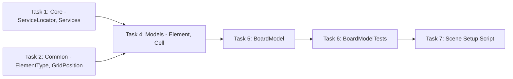

# Step 1: Core + Grid Infrastructure

## Overview
Базовая инфраструктура: ServiceLocator, типы данных, модели сетки. Чистый C# без визуала.

## Prerequisites
- Проект создан
- Game.asmdef, Tests.EditMode.asmdef настроены
- NSubstitute доступен

---

## 0. Parallel Execution Plan

### Task Dependency Graph


### Parallel Groups
| Group | Tasks | Can Run In Parallel |
|-------|-------|---------------------|
| Group A | Task 1, Task 2 | Yes |
| Group B | Task 4 | After Group A |
| Group C | Task 5 | After Group B |
| Group D | Task 6, Task 7 | After Group C |

### Task Assignments
- **Task 1**: Core (ServiceLocator.cs, Services.cs) - independent
- **Task 2**: Common (ElementType.cs, GridPosition.cs) - independent
- **Task 4**: Models (Element.cs, Cell.cs) - depends on Task 2
- **Task 5**: BoardModel.cs - depends on Task 4
- **Task 6**: BoardModelTests.cs - depends on Task 5
- **Task 7**: Step1SceneSetup.cs - depends on Task 5

---

## 1. Components

### 1.1 ServiceLocator
**Type:** Service (Pure C#)
**Responsibility:** Регистрация и получение сервисов
**Dependencies:** None

### 1.2 Services
**Type:** Static accessor (Pure C#)
**Responsibility:** Глобальный доступ к ServiceLocator
**Dependencies:** ServiceLocator

### 1.3 ElementType
**Type:** Enum
**Responsibility:** Типы элементов матч-3
**Dependencies:** None

### 1.4 GridPosition
**Type:** Struct (Pure C#)
**Responsibility:** Координаты на сетке
**Dependencies:** None

### 1.5 Element
**Type:** Model (Pure C#)
**Responsibility:** Один элемент на сетке
**Dependencies:** ElementType

### 1.6 Cell
**Type:** Model (Pure C#)
**Responsibility:** Одна ячейка сетки, содержит Element
**Dependencies:** GridPosition, Element

### 1.7 BoardModel
**Type:** Model (Pure C#)
**Responsibility:** Состояние сетки 8x8, CRUD элементов
**Dependencies:** Cell, Element, GridPosition, ElementType

---

## 2. Interfaces

Step 1 не требует интерфейсов - только чистые модели данных.

---

## 3. Implementation Specs

### 3.1 Core/ServiceLocator.cs

```csharp
// ServiceLocator.cs
using System;
using System.Collections.Generic;

namespace Core
{
    public class ServiceLocator
    {
        private readonly Dictionary<Type, object> _services = new();

        public void Register<T>(T service) where T : class
        {
            _services[typeof(T)] = service;
        }

        public T Get<T>() where T : class
        {
            if (_services.TryGetValue(typeof(T), out var service))
                return (T)service;

            throw new InvalidOperationException($"Service {typeof(T).Name} not registered!");
        }

        public bool TryGet<T>(out T service) where T : class
        {
            if (_services.TryGetValue(typeof(T), out var obj))
            {
                service = (T)obj;
                return true;
            }
            service = null;
            return false;
        }

        public void Clear() => _services.Clear();
    }
}
```

### 3.2 Core/Services.cs

```csharp
// Services.cs
namespace Core
{
    public static class Services
    {
        private static ServiceLocator _locator;

        public static void Initialize(ServiceLocator locator) => _locator = locator;
        public static T Get<T>() where T : class => _locator.Get<T>();
        public static bool TryGet<T>(out T service) where T : class => _locator.TryGet(out service);
        public static void Reset() => _locator = null;
    }
}
```

### 3.3 Common/ElementType.cs

```csharp
// ElementType.cs
namespace Common
{
    public enum ElementType
    {
        None = 0,
        Red = 1,
        Blue = 2,
        Green = 3,
        Yellow = 4,
        Purple = 5
    }
}
```

### 3.4 Common/GridPosition.cs

```csharp
// GridPosition.cs
using System;

namespace Common
{
    public readonly struct GridPosition : IEquatable<GridPosition>
    {
        public readonly int X;
        public readonly int Y;

        public GridPosition(int x, int y)
        {
            X = x;
            Y = y;
        }

        public static GridPosition Invalid => new(-1, -1);
        public bool IsValid => X >= 0 && Y >= 0;

        public bool Equals(GridPosition other) => X == other.X && Y == other.Y;
        public override bool Equals(object obj) => obj is GridPosition other && Equals(other);
        public override int GetHashCode() => HashCode.Combine(X, Y);
        public override string ToString() => $"({X}, {Y})";

        public static bool operator ==(GridPosition a, GridPosition b) => a.Equals(b);
        public static bool operator !=(GridPosition a, GridPosition b) => !a.Equals(b);
    }
}
```

### 3.5 Features/Board/Models/Element.cs

```csharp
// Element.cs
using Common;

namespace Features.Board.Models
{
    public class Element
    {
        public ElementType Type { get; }

        public Element(ElementType type)
        {
            Type = type;
        }

        public bool CanMatch => Type != ElementType.None;

        public bool Matches(Element other)
        {
            return other != null && Type == other.Type && CanMatch;
        }
    }
}
```

### 3.6 Features/Board/Models/Cell.cs

```csharp
// Cell.cs
using Common;

namespace Features.Board.Models
{
    public class Cell
    {
        public GridPosition Position { get; }
        public Element Element { get; private set; }

        public Cell(GridPosition position)
        {
            Position = position;
        }

        public bool IsEmpty => Element == null;

        public void SetElement(Element element)
        {
            Element = element;
        }

        public Element RemoveElement()
        {
            var element = Element;
            Element = null;
            return element;
        }
    }
}
```

### 3.7 Features/Board/Models/BoardModel.cs

```csharp
// BoardModel.cs
using System;
using Common;

namespace Features.Board.Models
{
    public class BoardModel
    {
        public int Width { get; }
        public int Height { get; }

        private readonly Cell[,] _cells;

        public event Action<GridPosition, ElementType> OnElementAdded;
        public event Action<GridPosition> OnElementRemoved;
        public event Action<GridPosition, GridPosition> OnElementsSwapped;

        public BoardModel(int width, int height)
        {
            Width = width;
            Height = height;
            _cells = new Cell[width, height];
            InitializeCells();
        }

        private void InitializeCells()
        {
            for (int x = 0; x < Width; x++)
            {
                for (int y = 0; y < Height; y++)
                {
                    _cells[x, y] = new Cell(new GridPosition(x, y));
                }
            }
        }

        public bool IsValidPosition(GridPosition pos)
        {
            return pos.X >= 0 && pos.X < Width && pos.Y >= 0 && pos.Y < Height;
        }

        public Cell GetCell(GridPosition pos)
        {
            return IsValidPosition(pos) ? _cells[pos.X, pos.Y] : null;
        }

        public Element GetElement(GridPosition pos)
        {
            return GetCell(pos)?.Element;
        }

        public void SetElement(GridPosition pos, Element element)
        {
            var cell = GetCell(pos);
            if (cell == null) return;

            cell.SetElement(element);
            OnElementAdded?.Invoke(pos, element?.Type ?? ElementType.None);
        }

        public void RemoveElement(GridPosition pos)
        {
            var cell = GetCell(pos);
            if (cell == null || cell.IsEmpty) return;

            cell.RemoveElement();
            OnElementRemoved?.Invoke(pos);
        }

        public void SwapElements(GridPosition a, GridPosition b)
        {
            var cellA = GetCell(a);
            var cellB = GetCell(b);
            if (cellA == null || cellB == null) return;

            var elementA = cellA.RemoveElement();
            var elementB = cellB.RemoveElement();

            cellA.SetElement(elementB);
            cellB.SetElement(elementA);

            OnElementsSwapped?.Invoke(a, b);
        }
    }
}
```

---

## 4. Test Specs

### 4.1 BoardModelTests.cs

```csharp
// Tests/EditMode/Features/Board/BoardModelTests.cs
using NUnit.Framework;
using Common;
using Features.Board.Models;

namespace Features.Board.Models
{
    [TestFixture]
    public class BoardModelTests
    {
        private BoardModel _board;
        private const int Width = 8;
        private const int Height = 8;

        [SetUp]
        public void SetUp()
        {
            _board = new BoardModel(Width, Height);
        }

        // Constructor tests
        [Test]
        public void Constructor_CreatesGridWithCorrectDimensions()
        {
            Assert.AreEqual(Width, _board.Width);
            Assert.AreEqual(Height, _board.Height);
        }

        [Test]
        public void Constructor_AllCellsAreEmpty()
        {
            for (int x = 0; x < Width; x++)
            {
                for (int y = 0; y < Height; y++)
                {
                    var cell = _board.GetCell(new GridPosition(x, y));
                    Assert.IsTrue(cell.IsEmpty);
                }
            }
        }

        // IsValidPosition tests
        [Test]
        public void IsValidPosition_ValidPosition_ReturnsTrue()
        {
            Assert.IsTrue(_board.IsValidPosition(new GridPosition(0, 0)));
            Assert.IsTrue(_board.IsValidPosition(new GridPosition(7, 7)));
            Assert.IsTrue(_board.IsValidPosition(new GridPosition(4, 4)));
        }

        [Test]
        public void IsValidPosition_InvalidPosition_ReturnsFalse()
        {
            Assert.IsFalse(_board.IsValidPosition(new GridPosition(-1, 0)));
            Assert.IsFalse(_board.IsValidPosition(new GridPosition(0, -1)));
            Assert.IsFalse(_board.IsValidPosition(new GridPosition(8, 0)));
            Assert.IsFalse(_board.IsValidPosition(new GridPosition(0, 8)));
        }

        // GetCell tests
        [Test]
        public void GetCell_ValidPosition_ReturnsCell()
        {
            var pos = new GridPosition(3, 4);
            var cell = _board.GetCell(pos);

            Assert.IsNotNull(cell);
            Assert.AreEqual(pos, cell.Position);
        }

        [Test]
        public void GetCell_InvalidPosition_ReturnsNull()
        {
            var cell = _board.GetCell(new GridPosition(-1, 0));
            Assert.IsNull(cell);
        }

        // SetElement tests
        [Test]
        public void SetElement_ValidPosition_SetsElement()
        {
            var pos = new GridPosition(2, 3);
            var element = new Element(ElementType.Red);

            _board.SetElement(pos, element);

            var result = _board.GetElement(pos);
            Assert.AreEqual(ElementType.Red, result.Type);
        }

        [Test]
        public void SetElement_RaisesOnElementAdded()
        {
            var pos = new GridPosition(2, 3);
            var element = new Element(ElementType.Blue);
            GridPosition receivedPos = GridPosition.Invalid;
            ElementType receivedType = ElementType.None;

            _board.OnElementAdded += (p, t) =>
            {
                receivedPos = p;
                receivedType = t;
            };

            _board.SetElement(pos, element);

            Assert.AreEqual(pos, receivedPos);
            Assert.AreEqual(ElementType.Blue, receivedType);
        }

        [Test]
        public void SetElement_InvalidPosition_DoesNothing()
        {
            var pos = new GridPosition(-1, 0);
            var element = new Element(ElementType.Red);
            bool eventRaised = false;

            _board.OnElementAdded += (p, t) => eventRaised = true;

            _board.SetElement(pos, element);

            Assert.IsFalse(eventRaised);
        }

        // RemoveElement tests
        [Test]
        public void RemoveElement_ExistingElement_RemovesIt()
        {
            var pos = new GridPosition(2, 3);
            _board.SetElement(pos, new Element(ElementType.Green));

            _board.RemoveElement(pos);

            Assert.IsNull(_board.GetElement(pos));
        }

        [Test]
        public void RemoveElement_RaisesOnElementRemoved()
        {
            var pos = new GridPosition(2, 3);
            _board.SetElement(pos, new Element(ElementType.Yellow));
            GridPosition receivedPos = GridPosition.Invalid;

            _board.OnElementRemoved += p => receivedPos = p;

            _board.RemoveElement(pos);

            Assert.AreEqual(pos, receivedPos);
        }

        [Test]
        public void RemoveElement_EmptyCell_DoesNotRaiseEvent()
        {
            var pos = new GridPosition(2, 3);
            bool eventRaised = false;

            _board.OnElementRemoved += p => eventRaised = true;

            _board.RemoveElement(pos);

            Assert.IsFalse(eventRaised);
        }

        // SwapElements tests
        [Test]
        public void SwapElements_SwapsCorrectly()
        {
            var posA = new GridPosition(0, 0);
            var posB = new GridPosition(1, 0);
            var elementA = new Element(ElementType.Red);
            var elementB = new Element(ElementType.Blue);

            _board.SetElement(posA, elementA);
            _board.SetElement(posB, elementB);

            _board.SwapElements(posA, posB);

            Assert.AreEqual(ElementType.Blue, _board.GetElement(posA).Type);
            Assert.AreEqual(ElementType.Red, _board.GetElement(posB).Type);
        }

        [Test]
        public void SwapElements_RaisesOnElementsSwapped()
        {
            var posA = new GridPosition(0, 0);
            var posB = new GridPosition(1, 0);
            _board.SetElement(posA, new Element(ElementType.Red));
            _board.SetElement(posB, new Element(ElementType.Blue));

            GridPosition receivedA = GridPosition.Invalid;
            GridPosition receivedB = GridPosition.Invalid;

            _board.OnElementsSwapped += (a, b) =>
            {
                receivedA = a;
                receivedB = b;
            };

            _board.SwapElements(posA, posB);

            Assert.AreEqual(posA, receivedA);
            Assert.AreEqual(posB, receivedB);
        }

        [Test]
        public void SwapElements_WithEmptyCell_SwapsCorrectly()
        {
            var posA = new GridPosition(0, 0);
            var posB = new GridPosition(1, 0);
            _board.SetElement(posA, new Element(ElementType.Red));
            // posB is empty

            _board.SwapElements(posA, posB);

            Assert.IsNull(_board.GetElement(posA));
            Assert.AreEqual(ElementType.Red, _board.GetElement(posB).Type);
        }
    }

    [TestFixture]
    public class ElementTests
    {
        [Test]
        public void Constructor_SetsType()
        {
            var element = new Element(ElementType.Red);
            Assert.AreEqual(ElementType.Red, element.Type);
        }

        [Test]
        public void CanMatch_NotNone_ReturnsTrue()
        {
            var element = new Element(ElementType.Blue);
            Assert.IsTrue(element.CanMatch);
        }

        [Test]
        public void CanMatch_None_ReturnsFalse()
        {
            var element = new Element(ElementType.None);
            Assert.IsFalse(element.CanMatch);
        }

        [Test]
        public void Matches_SameType_ReturnsTrue()
        {
            var a = new Element(ElementType.Green);
            var b = new Element(ElementType.Green);
            Assert.IsTrue(a.Matches(b));
        }

        [Test]
        public void Matches_DifferentType_ReturnsFalse()
        {
            var a = new Element(ElementType.Green);
            var b = new Element(ElementType.Yellow);
            Assert.IsFalse(a.Matches(b));
        }

        [Test]
        public void Matches_Null_ReturnsFalse()
        {
            var a = new Element(ElementType.Red);
            Assert.IsFalse(a.Matches(null));
        }

        [Test]
        public void Matches_BothNone_ReturnsFalse()
        {
            var a = new Element(ElementType.None);
            var b = new Element(ElementType.None);
            Assert.IsFalse(a.Matches(b));
        }
    }

    [TestFixture]
    public class CellTests
    {
        [Test]
        public void Constructor_SetsPosition()
        {
            var pos = new GridPosition(3, 5);
            var cell = new Cell(pos);
            Assert.AreEqual(pos, cell.Position);
        }

        [Test]
        public void IsEmpty_NoElement_ReturnsTrue()
        {
            var cell = new Cell(new GridPosition(0, 0));
            Assert.IsTrue(cell.IsEmpty);
        }

        [Test]
        public void IsEmpty_HasElement_ReturnsFalse()
        {
            var cell = new Cell(new GridPosition(0, 0));
            cell.SetElement(new Element(ElementType.Red));
            Assert.IsFalse(cell.IsEmpty);
        }

        [Test]
        public void SetElement_SetsElement()
        {
            var cell = new Cell(new GridPosition(0, 0));
            var element = new Element(ElementType.Blue);

            cell.SetElement(element);

            Assert.AreEqual(element, cell.Element);
        }

        [Test]
        public void RemoveElement_ReturnsAndRemoves()
        {
            var cell = new Cell(new GridPosition(0, 0));
            var element = new Element(ElementType.Purple);
            cell.SetElement(element);

            var removed = cell.RemoveElement();

            Assert.AreEqual(element, removed);
            Assert.IsTrue(cell.IsEmpty);
        }
    }

    [TestFixture]
    public class GridPositionTests
    {
        [Test]
        public void Constructor_SetsCoordinates()
        {
            var pos = new GridPosition(3, 7);
            Assert.AreEqual(3, pos.X);
            Assert.AreEqual(7, pos.Y);
        }

        [Test]
        public void Invalid_ReturnsNegativeCoordinates()
        {
            var invalid = GridPosition.Invalid;
            Assert.AreEqual(-1, invalid.X);
            Assert.AreEqual(-1, invalid.Y);
        }

        [Test]
        public void IsValid_ValidPosition_ReturnsTrue()
        {
            var pos = new GridPosition(0, 0);
            Assert.IsTrue(pos.IsValid);
        }

        [Test]
        public void IsValid_InvalidPosition_ReturnsFalse()
        {
            Assert.IsFalse(GridPosition.Invalid.IsValid);
            Assert.IsFalse(new GridPosition(-1, 0).IsValid);
            Assert.IsFalse(new GridPosition(0, -1).IsValid);
        }

        [Test]
        public void Equals_SameCoordinates_ReturnsTrue()
        {
            var a = new GridPosition(2, 3);
            var b = new GridPosition(2, 3);
            Assert.IsTrue(a.Equals(b));
            Assert.IsTrue(a == b);
        }

        [Test]
        public void Equals_DifferentCoordinates_ReturnsFalse()
        {
            var a = new GridPosition(2, 3);
            var b = new GridPosition(3, 2);
            Assert.IsFalse(a.Equals(b));
            Assert.IsTrue(a != b);
        }
    }
}
```

---

## 5. Scene Setup Script

### 5.1 Editor/Step1SceneSetup.cs

```csharp
// Editor/Step1SceneSetup.cs
using UnityEngine;
using UnityEditor;
using Features.Board.Models;
using Common;

namespace Editor
{
    public static class Step1SceneSetup
    {
        [MenuItem("Setup/Step 1 - Core + Grid Infrastructure")]
        public static void Setup()
        {
            // Step 1 is pure C# - no scene objects needed
            // Just validate that BoardModel works

            var board = new BoardModel(8, 8);

            // Test basic operations
            var pos = new GridPosition(0, 0);
            board.SetElement(pos, new Element(ElementType.Red));
            var element = board.GetElement(pos);

            if (element != null && element.Type == ElementType.Red)
            {
                Debug.Log("[Step 1] BoardModel validation PASSED");
                Debug.Log($"  - Grid size: {board.Width}x{board.Height}");
                Debug.Log($"  - Element at (0,0): {element.Type}");
            }
            else
            {
                Debug.LogError("[Step 1] BoardModel validation FAILED");
            }
        }
    }
}
```

---

## 6. Validation Checklist

- [ ] All .cs files compile without errors
- [ ] All tests pass (run_tests EditMode)
- [ ] Scene Setup executes successfully (Menu -> Setup -> Step 1)
- [ ] ServiceLocator registers and retrieves services
- [ ] GridPosition equality works correctly
- [ ] Element.Matches works correctly
- [ ] Cell stores and removes elements
- [ ] BoardModel creates correct grid size
- [ ] BoardModel.SetElement works and fires event
- [ ] BoardModel.RemoveElement works and fires event
- [ ] BoardModel.SwapElements works and fires event
- [ ] No Unity dependencies in Models

---

## 7. Files to Create

| File | Path | Type |
|------|------|------|
| ServiceLocator.cs | Assets/Scripts/Core/ | Service |
| Services.cs | Assets/Scripts/Core/ | Static |
| ElementType.cs | Assets/Scripts/Common/ | Enum |
| GridPosition.cs | Assets/Scripts/Common/ | Struct |
| Element.cs | Assets/Scripts/Features/Board/Models/ | Model |
| Cell.cs | Assets/Scripts/Features/Board/Models/ | Model |
| BoardModel.cs | Assets/Scripts/Features/Board/Models/ | Model |
| BoardModelTests.cs | Assets/Tests/EditMode/Features/Board/ | Tests |
| Step1SceneSetup.cs | Assets/Scripts/Editor/ | Setup |

---

## 8. Folder Structure After Step 1

```
Assets/
├── Scripts/
│   ├── Game.asmdef
│   ├── Core/
│   │   ├── ServiceLocator.cs
│   │   └── Services.cs
│   ├── Common/
│   │   ├── ElementType.cs
│   │   └── GridPosition.cs
│   ├── Features/
│   │   └── Board/
│   │       └── Models/
│   │           ├── Element.cs
│   │           ├── Cell.cs
│   │           └── BoardModel.cs
│   └── Editor/
│       ├── Editor.asmdef
│       └── Step1SceneSetup.cs
└── Tests/
    └── EditMode/
        ├── Tests.EditMode.asmdef
        └── Features/
            └── Board/
                └── BoardModelTests.cs
```
