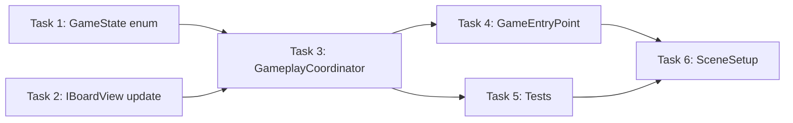

# Step 10: GameplayCoordinator Integration

## Overview
Full Game Loop implementation via GameplayCoordinator - a state machine that coordinates all services to create the complete Match3 cycle: Input -> Swap -> Match -> Destroy -> Fall -> Refill -> Input.

## Prerequisites
- Step 1-9 completed
- BoardModel, BoardPresenter, BoardView working
- All services implemented: IMatchService, IFallService, ISpawnService, IInputService

---

## 0. Parallel Execution Plan

### Task Dependency Graph


### Parallel Groups
| Group | Tasks | Can Run In Parallel |
|-------|-------|---------------------|
| Group A | Task 1, Task 2 | Yes |
| Group B | Task 3 | After Group A |
| Group C | Task 4, Task 5 | After Group B, can run in parallel |
| Group D | Task 6 | After Group C |

### Task Assignments
- **Task 1**: GameState.cs - simple enum, no deps
- **Task 2**: Update IBoardView/BoardView with SpawnElement method
- **Task 3**: GameplayCoordinator - main state machine
- **Task 4**: GameEntryPoint - MonoBehaviour entry point
- **Task 5**: GameplayCoordinatorTests - unit tests with mocks
- **Task 6**: SceneSetup - Editor menu script

---

## 1. Components

### 1.1 GameState
**Type:** Enum (Pure C#)
**Responsibility:** Define all possible states of the game loop
**File:** `Assets/Scripts/Gameplay/GameState.cs`

### 1.2 GameplayCoordinator
**Type:** Coordinator (Pure C#)
**Responsibility:** State machine managing the game loop, coordinates all services
**Dependencies:** BoardModel, IBoardView, IInputService, IMatchService, IFallService, ISpawnService
**File:** `Assets/Scripts/Gameplay/GameplayCoordinator.cs`

### 1.3 GameEntryPoint
**Type:** MonoBehaviour (Unity)
**Responsibility:** Bootstrap the game - register services, create objects, start game
**Dependencies:** GameConfig, all services, Views
**File:** `Assets/Scripts/Core/GameEntryPoint.cs`

### 1.4 IBoardView (Update)
**Type:** Interface
**Responsibility:** Add SpawnElement method for refill phase
**File:** `Assets/Scripts/Features/Board/Views/IBoardView.cs` (update)

### 1.5 BoardView (Update)
**Type:** View (MonoBehaviour)
**Responsibility:** Implement SpawnElement with animation
**File:** `Assets/Scripts/Features/Board/Views/BoardView.cs` (update)

---

## 2. Interfaces

### 2.1 IBoardView Update

```csharp
// Add to existing IBoardView.cs
/// <summary>
/// Spawn a new element at position with fall-in animation from above.
/// Used during refill phase after falls complete.
/// </summary>
void SpawnElement(GridPosition pos, ElementType type, Action onComplete);

/// <summary>
/// Spawn multiple elements simultaneously.
/// Calls onComplete when ALL spawn animations finish.
/// </summary>
void SpawnElements(List<(GridPosition pos, ElementType type)> spawns, Action onComplete);
```

---

## 3. Implementation Specs

### 3.1 GameState.cs

```csharp
// Assets/Scripts/Gameplay/GameState.cs
namespace Gameplay
{
    /// <summary>
    /// States of the game loop state machine.
    /// </summary>
    public enum GameState
    {
        /// <summary>
        /// Waiting for player input (drag & drop).
        /// </summary>
        WaitingForInput,

        /// <summary>
        /// Swap animation in progress.
        /// </summary>
        Swapping,

        /// <summary>
        /// Checking for matches after swap.
        /// </summary>
        Matching,

        /// <summary>
        /// Destroy animation in progress.
        /// </summary>
        Destroying,

        /// <summary>
        /// Fall animation in progress.
        /// </summary>
        Falling,

        /// <summary>
        /// Spawning new elements to fill empty spaces.
        /// </summary>
        Refilling
    }
}
```

### 3.2 GameplayCoordinator.cs

```csharp
// Assets/Scripts/Gameplay/GameplayCoordinator.cs
using System;
using System.Collections.Generic;
using Common;
using Features.Board.Models;
using Features.Board.Views;
using Features.Board.Services;

namespace Gameplay
{
    /// <summary>
    /// State machine coordinating the full game loop.
    /// Pure C# - testable without Unity.
    /// </summary>
    public class GameplayCoordinator : IDisposable
    {
        private GameState _state = GameState.WaitingForInput;

        private readonly BoardModel _board;
        private readonly IBoardView _view;
        private readonly IInputService _input;
        private readonly IMatchService _matcher;
        private readonly IFallService _faller;
        private readonly ISpawnService _spawner;

        public GameState CurrentState => _state;
        public event Action<GameState> OnStateChanged;

        public GameplayCoordinator(
            BoardModel board,
            IBoardView view,
            IInputService input,
            IMatchService matcher,
            IFallService faller,
            ISpawnService spawner)
        {
            _board = board ?? throw new ArgumentNullException(nameof(board));
            _view = view ?? throw new ArgumentNullException(nameof(view));
            _input = input ?? throw new ArgumentNullException(nameof(input));
            _matcher = matcher ?? throw new ArgumentNullException(nameof(matcher));
            _faller = faller ?? throw new ArgumentNullException(nameof(faller));
            _spawner = spawner ?? throw new ArgumentNullException(nameof(spawner));

            _input.OnSwapRequested += HandleSwapRequested;
        }

        private void SetState(GameState newState)
        {
            if (_state == newState) return;
            _state = newState;
            OnStateChanged?.Invoke(_state);
        }

        private void HandleSwapRequested(GridPosition from, GridPosition to)
        {
            if (_state != GameState.WaitingForInput) return;

            var elementFrom = _board.GetElement(from);
            var elementTo = _board.GetElement(to);

            if (elementFrom == null || elementTo == null) return;

            ProcessSwap(from, to);
        }

        private void ProcessSwap(GridPosition from, GridPosition to)
        {
            SetState(GameState.Swapping);
            _input.SetInputEnabled(false);

            _board.SwapElements(from, to);
            _view.SwapElements(from, to, () => OnSwapComplete(from, to));
        }

        private void OnSwapComplete(GridPosition from, GridPosition to)
        {
            SetState(GameState.Matching);

            var matchesFrom = _matcher.FindMatchesAt(_board, from);
            var matchesTo = _matcher.FindMatchesAt(_board, to);

            var allMatches = CombineMatches(matchesFrom, matchesTo);

            if (allMatches.Count == 0)
            {
                // Invalid swap - rollback
                _board.SwapElements(from, to);
                _view.SwapElements(from, to, OnRollbackComplete);
            }
            else
            {
                ProcessDestroy(allMatches);
            }
        }

        private List<GridPosition> CombineMatches(List<GridPosition> a, List<GridPosition> b)
        {
            var result = new List<GridPosition>();
            foreach (var pos in a)
                if (!result.Contains(pos)) result.Add(pos);
            foreach (var pos in b)
                if (!result.Contains(pos)) result.Add(pos);
            return result;
        }

        private void OnRollbackComplete()
        {
            SetState(GameState.WaitingForInput);
            _input.SetInputEnabled(true);
        }

        private void ProcessDestroy(List<GridPosition> matches)
        {
            SetState(GameState.Destroying);

            _view.DestroyElements(matches, () =>
            {
                _board.RemoveElements(matches);
                ProcessFall();
            });
        }

        private void ProcessFall()
        {
            SetState(GameState.Falling);

            var falls = _faller.CalculateFalls(_board);

            if (falls.Count == 0)
            {
                ProcessRefill();
                return;
            }

            _board.ApplyMoves(ToTupleList(falls));
            _view.MoveElements(falls, OnFallComplete);
        }

        private List<(GridPosition from, GridPosition to)> ToTupleList(List<FallMove> falls)
        {
            var result = new List<(GridPosition, GridPosition)>();
            foreach (var fall in falls)
                result.Add((fall.From, fall.To));
            return result;
        }

        private void OnFallComplete()
        {
            ProcessRefill();
        }

        private void ProcessRefill()
        {
            SetState(GameState.Refilling);

            var emptyPositions = _faller.GetEmptyTopPositions(_board);

            if (emptyPositions.Count == 0)
            {
                CheckForCascade();
                return;
            }

            var spawns = new List<(GridPosition pos, ElementType type)>();
            foreach (var pos in emptyPositions)
            {
                var type = _spawner.GetRandomElement();
                var element = new Element(type);
                _board.SetElement(pos, element);
                spawns.Add((pos, type));
            }

            _view.SpawnElements(spawns, OnRefillComplete);
        }

        private void OnRefillComplete()
        {
            CheckForCascade();
        }

        private void CheckForCascade()
        {
            SetState(GameState.Matching);

            var matches = _matcher.FindAllMatches(_board);

            if (matches.Count > 0)
            {
                ProcessDestroy(matches);
            }
            else
            {
                SetState(GameState.WaitingForInput);
                _input.SetInputEnabled(true);
            }
        }

        public void Dispose()
        {
            _input.OnSwapRequested -= HandleSwapRequested;
        }
    }
}
```

### 3.3 IBoardView.cs (Updated)

```csharp
// Assets/Scripts/Features/Board/Views/IBoardView.cs
using System;
using System.Collections.Generic;
using Common;
using Features.Board.Services;

namespace Features.Board.Views
{
    public interface IBoardView
    {
        void Initialize(int width, int height, float cellSize);
        void CreateElement(GridPosition pos, ElementType type);
        void RemoveElement(GridPosition pos);
        void Clear();

        /// <summary>
        /// Swap two elements visually with animation.
        /// Calls onComplete when both elements finish moving.
        /// </summary>
        void SwapElements(GridPosition from, GridPosition to, Action onComplete);

        /// <summary>
        /// Destroy multiple elements with animation.
        /// Calls onComplete when ALL animations finish.
        /// </summary>
        void DestroyElements(List<GridPosition> positions, Action onComplete);

        /// <summary>
        /// Move element from one position to another with fall animation.
        /// Updates internal tracking after animation completes.
        /// </summary>
        void MoveElement(GridPosition from, GridPosition to, Action onComplete);

        /// <summary>
        /// Move multiple elements simultaneously (all falls in parallel).
        /// Calls onComplete when ALL movements finish.
        /// </summary>
        void MoveElements(List<FallMove> moves, Action onComplete);

        /// <summary>
        /// Spawn a new element at position with fall-in animation from above.
        /// Used during refill phase after falls complete.
        /// </summary>
        void SpawnElement(GridPosition pos, ElementType type, Action onComplete);

        /// <summary>
        /// Spawn multiple elements simultaneously.
        /// Calls onComplete when ALL spawn animations finish.
        /// </summary>
        void SpawnElements(List<(GridPosition pos, ElementType type)> spawns, Action onComplete);

        event Action<GridPosition> OnCellClicked;
        event Action<GridPosition, GridPosition> OnSwapAttempted;
    }
}
```

### 3.4 BoardView.cs (Add SpawnElement methods)

Add these methods to existing BoardView.cs:

```csharp
// Add to BoardView.cs

public void SpawnElement(GridPosition pos, ElementType type, Action onComplete)
{
    var sprite = GetSpriteForType(type);
    if (sprite == null)
    {
        onComplete?.Invoke();
        return;
    }

    var elementGO = new GameObject($"Element_{pos.X}_{pos.Y}");
    elementGO.transform.SetParent(transform);

    var elementView = elementGO.AddComponent<ElementView>();
    elementView.Initialize(pos, type, sprite);

    // Start above the board
    var targetPos = GridToWorld(pos);
    var startPos = targetPos + Vector3.up * _cellSize * 2;
    elementView.UpdatePosition(startPos);

    elementView.OnDragStart += HandleElementDragStart;
    elementView.OnDragEnd += HandleElementDragEnd;
    elementView.OnClicked += HandleElementClicked;

    _elementViews[pos] = elementView;

    float duration = _config != null ? _config.FallDuration : 0.2f;
    elementView.MoveTo(targetPos, duration, onComplete);
}

public void SpawnElements(List<(GridPosition pos, ElementType type)> spawns, Action onComplete)
{
    if (spawns == null || spawns.Count == 0)
    {
        onComplete?.Invoke();
        return;
    }

    int totalToSpawn = spawns.Count;
    int spawnedCount = 0;

    foreach (var (pos, type) in spawns)
    {
        SpawnElement(pos, type, () =>
        {
            spawnedCount++;
            if (spawnedCount >= totalToSpawn)
                onComplete?.Invoke();
        });
    }
}

public void MoveElement(GridPosition from, GridPosition to, Action onComplete)
{
    if (!_elementViews.TryGetValue(from, out var view))
    {
        onComplete?.Invoke();
        return;
    }

    float duration = _config != null ? _config.FallDuration : 0.2f;
    var targetPos = GridToWorld(to);

    view.MoveTo(targetPos, duration, () =>
    {
        _elementViews.Remove(from);
        view.SetGridPosition(to);
        _elementViews[to] = view;
        onComplete?.Invoke();
    });
}

public void MoveElements(List<FallMove> moves, Action onComplete)
{
    if (moves == null || moves.Count == 0)
    {
        onComplete?.Invoke();
        return;
    }

    int totalMoves = moves.Count;
    int completedMoves = 0;

    // First, remove all source positions from dictionary
    var viewsToMove = new Dictionary<FallMove, ElementView>();
    foreach (var move in moves)
    {
        if (_elementViews.TryGetValue(move.From, out var view))
        {
            viewsToMove[move] = view;
            _elementViews.Remove(move.From);
        }
    }

    if (viewsToMove.Count == 0)
    {
        onComplete?.Invoke();
        return;
    }

    totalMoves = viewsToMove.Count;
    float duration = _config != null ? _config.FallDuration : 0.2f;

    foreach (var kvp in viewsToMove)
    {
        var move = kvp.Key;
        var view = kvp.Value;
        var targetPos = GridToWorld(move.To);

        view.MoveTo(targetPos, duration, () =>
        {
            view.SetGridPosition(move.To);
            _elementViews[move.To] = view;
            completedMoves++;
            if (completedMoves >= totalMoves)
                onComplete?.Invoke();
        });
    }
}
```

### 3.5 GameEntryPoint.cs

```csharp
// Assets/Scripts/Core/GameEntryPoint.cs
using UnityEngine;
using Configs;
using Common;
using Features.Board.Models;
using Features.Board.Views;
using Features.Board.Services;
using Gameplay;

namespace Core
{
    /// <summary>
    /// Game bootstrap - creates and wires all components.
    /// Script Execution Order: -100
    /// </summary>
    [DefaultExecutionOrder(-100)]
    public class GameEntryPoint : MonoBehaviour
    {
        [Header("Config")]
        [SerializeField] private GameConfig _config;

        [Header("Views")]
        [SerializeField] private BoardView _boardView;

        private ServiceLocator _locator;
        private BoardModel _boardModel;
        private GameplayCoordinator _coordinator;
        private IInputService _inputService;
        private IMatchService _matchService;
        private IFallService _fallService;
        private ISpawnService _spawnService;

        private void Awake()
        {
            SetupServices();
            SetupGame();
        }

        private void SetupServices()
        {
            _locator = new ServiceLocator();
            Services.Initialize(_locator);

            _spawnService = new SpawnService(_config.ElementTypeCount);
            _matchService = new MatchService();
            _fallService = new FallService();
            _inputService = new InputService();

            _locator.Register<ISpawnService>(_spawnService);
            _locator.Register<IMatchService>(_matchService);
            _locator.Register<IFallService>(_fallService);
            _locator.Register<IInputService>(_inputService);
            _locator.Register<GameConfig>(_config);
        }

        private void SetupGame()
        {
            // Create model
            _boardModel = new BoardModel(_config.GridWidth, _config.GridHeight);

            // Initialize view
            _boardView.SetConfig(_config);
            _boardView.Initialize(_config.GridWidth, _config.GridHeight, _config.CellSize);

            // Wire view events to input service
            _boardView.OnSwapAttempted += (from, to) => _inputService.RequestSwap(from, to);

            // Create coordinator
            _coordinator = new GameplayCoordinator(
                _boardModel,
                _boardView,
                _inputService,
                _matchService,
                _fallService,
                _spawnService);

            // Fill initial board
            FillBoard();
        }

        private void FillBoard()
        {
            for (int y = 0; y < _config.GridHeight; y++)
            {
                for (int x = 0; x < _config.GridWidth; x++)
                {
                    var pos = new GridPosition(x, y);
                    var type = GetSafeElementType(pos);
                    var element = new Element(type);
                    _boardModel.SetElement(pos, element);
                    _boardView.CreateElement(pos, type);
                }
            }
        }

        private ElementType GetSafeElementType(GridPosition pos)
        {
            // Avoid initial matches
            for (int attempt = 0; attempt < 100; attempt++)
            {
                var type = _spawnService.GetRandomElement();
                if (!_matchService.WouldCreateMatch(_boardModel, pos, type))
                    return type;
            }
            return _spawnService.GetRandomElement();
        }

        private void OnDestroy()
        {
            _coordinator?.Dispose();
            Services.Reset();
        }
    }
}
```

### 3.6 FallService.cs (Create if missing)

```csharp
// Assets/Scripts/Features/Board/Services/FallService.cs
using System.Collections.Generic;
using Common;
using Features.Board.Models;

namespace Features.Board.Services
{
    /// <summary>
    /// Calculates fall movements after elements are destroyed.
    /// Pure C# - testable without Unity.
    /// </summary>
    public class FallService : IFallService
    {
        public List<FallMove> CalculateFalls(BoardModel board)
        {
            var moves = new List<FallMove>();

            // Process each column from left to right
            for (int x = 0; x < board.Width; x++)
            {
                // Process from bottom to top
                for (int y = 0; y < board.Height; y++)
                {
                    var pos = new GridPosition(x, y);
                    if (board.GetElement(pos) != null) continue;

                    // Find element above to fall into this empty cell
                    for (int above = y + 1; above < board.Height; above++)
                    {
                        var abovePos = new GridPosition(x, above);
                        if (board.GetElement(abovePos) != null)
                        {
                            moves.Add(new FallMove(abovePos, pos));
                            break;
                        }
                    }
                }
            }

            return moves;
        }

        public List<GridPosition> GetEmptyTopPositions(BoardModel board)
        {
            var emptyPositions = new List<GridPosition>();

            for (int x = 0; x < board.Width; x++)
            {
                // Count empty cells in this column
                int emptyCount = 0;
                for (int y = 0; y < board.Height; y++)
                {
                    var pos = new GridPosition(x, y);
                    if (board.GetElement(pos) == null)
                        emptyCount++;
                }

                // Add top N positions as empty (where N = emptyCount)
                for (int i = 0; i < emptyCount; i++)
                {
                    int y = board.Height - 1 - i;
                    emptyPositions.Add(new GridPosition(x, y));
                }
            }

            return emptyPositions;
        }
    }
}
```

---

## 4. Test Specs

### 4.1 GameplayCoordinatorTests.cs

```csharp
// Assets/Tests/EditMode/Gameplay/GameplayCoordinatorTests.cs
using System;
using System.Collections.Generic;
using NUnit.Framework;
using NSubstitute;
using Common;
using Features.Board.Models;
using Features.Board.Views;
using Features.Board.Services;
using Gameplay;

namespace Gameplay
{
    [TestFixture]
    public class GameplayCoordinatorTests
    {
        private BoardModel _board;
        private IBoardView _view;
        private IInputService _input;
        private IMatchService _matcher;
        private IFallService _faller;
        private ISpawnService _spawner;
        private GameplayCoordinator _coordinator;

        private const int Width = 8;
        private const int Height = 8;

        [SetUp]
        public void SetUp()
        {
            _board = new BoardModel(Width, Height);
            _view = Substitute.For<IBoardView>();
            _input = Substitute.For<IInputService>();
            _matcher = Substitute.For<IMatchService>();
            _faller = Substitute.For<IFallService>();
            _spawner = Substitute.For<ISpawnService>();

            _coordinator = new GameplayCoordinator(
                _board, _view, _input, _matcher, _faller, _spawner);
        }

        [TearDown]
        public void TearDown()
        {
            _coordinator.Dispose();
        }

        // === Initial State Tests ===

        [Test]
        public void Constructor_StartsInWaitingForInputState()
        {
            Assert.AreEqual(GameState.WaitingForInput, _coordinator.CurrentState);
        }

        [Test]
        public void Constructor_SubscribesToInputService()
        {
            var posA = new GridPosition(0, 0);
            var posB = new GridPosition(1, 0);
            _board.SetElement(posA, new Element(ElementType.Red));
            _board.SetElement(posB, new Element(ElementType.Blue));

            _input.OnSwapRequested += Raise.Event<Action<GridPosition, GridPosition>>(posA, posB);

            _view.Received(1).SwapElements(posA, posB, Arg.Any<Action>());
        }

        // === Swap Flow Tests ===

        [Test]
        public void SwapRequested_ChangesStateToSwapping()
        {
            var posA = new GridPosition(0, 0);
            var posB = new GridPosition(1, 0);
            _board.SetElement(posA, new Element(ElementType.Red));
            _board.SetElement(posB, new Element(ElementType.Blue));

            _input.OnSwapRequested += Raise.Event<Action<GridPosition, GridPosition>>(posA, posB);

            Assert.AreEqual(GameState.Swapping, _coordinator.CurrentState);
        }

        [Test]
        public void SwapRequested_DisablesInput()
        {
            var posA = new GridPosition(0, 0);
            var posB = new GridPosition(1, 0);
            _board.SetElement(posA, new Element(ElementType.Red));
            _board.SetElement(posB, new Element(ElementType.Blue));

            _input.OnSwapRequested += Raise.Event<Action<GridPosition, GridPosition>>(posA, posB);

            _input.Received(1).SetInputEnabled(false);
        }

        [Test]
        public void SwapRequested_SwapsInModel()
        {
            var posA = new GridPosition(0, 0);
            var posB = new GridPosition(1, 0);
            var elementA = new Element(ElementType.Red);
            var elementB = new Element(ElementType.Blue);
            _board.SetElement(posA, elementA);
            _board.SetElement(posB, elementB);

            _input.OnSwapRequested += Raise.Event<Action<GridPosition, GridPosition>>(posA, posB);

            Assert.AreEqual(elementB, _board.GetElement(posA));
            Assert.AreEqual(elementA, _board.GetElement(posB));
        }

        [Test]
        public void SwapRequested_WhenNotWaitingForInput_IsIgnored()
        {
            var posA = new GridPosition(0, 0);
            var posB = new GridPosition(1, 0);
            _board.SetElement(posA, new Element(ElementType.Red));
            _board.SetElement(posB, new Element(ElementType.Blue));

            // Trigger first swap
            _input.OnSwapRequested += Raise.Event<Action<GridPosition, GridPosition>>(posA, posB);

            _view.ClearReceivedCalls();

            // Try second swap while first is processing
            var posC = new GridPosition(2, 0);
            var posD = new GridPosition(3, 0);
            _board.SetElement(posC, new Element(ElementType.Green));
            _board.SetElement(posD, new Element(ElementType.Yellow));

            _input.OnSwapRequested += Raise.Event<Action<GridPosition, GridPosition>>(posC, posD);

            _view.DidNotReceive().SwapElements(posC, posD, Arg.Any<Action>());
        }

        [Test]
        public void SwapRequested_WithEmptyPosition_IsIgnored()
        {
            var posA = new GridPosition(0, 0);
            var posB = new GridPosition(1, 0);
            _board.SetElement(posA, new Element(ElementType.Red));
            // posB is empty

            _input.OnSwapRequested += Raise.Event<Action<GridPosition, GridPosition>>(posA, posB);

            _view.DidNotReceive().SwapElements(Arg.Any<GridPosition>(), Arg.Any<GridPosition>(), Arg.Any<Action>());
        }

        // === Match Validation Tests ===

        [Test]
        public void SwapComplete_WithNoMatches_RollsBack()
        {
            var posA = new GridPosition(0, 0);
            var posB = new GridPosition(1, 0);
            _board.SetElement(posA, new Element(ElementType.Red));
            _board.SetElement(posB, new Element(ElementType.Blue));

            _matcher.FindMatchesAt(_board, Arg.Any<GridPosition>())
                .Returns(new List<GridPosition>());

            Action swapCallback = null;
            _view.SwapElements(posA, posB, Arg.Do<Action>(cb => swapCallback = cb));

            _input.OnSwapRequested += Raise.Event<Action<GridPosition, GridPosition>>(posA, posB);
            swapCallback?.Invoke();

            // Should call swap again for rollback
            _view.Received(2).SwapElements(Arg.Any<GridPosition>(), Arg.Any<GridPosition>(), Arg.Any<Action>());
        }

        [Test]
        public void RollbackComplete_ReturnsToWaitingForInput()
        {
            var posA = new GridPosition(0, 0);
            var posB = new GridPosition(1, 0);
            _board.SetElement(posA, new Element(ElementType.Red));
            _board.SetElement(posB, new Element(ElementType.Blue));

            _matcher.FindMatchesAt(_board, Arg.Any<GridPosition>())
                .Returns(new List<GridPosition>());

            Action swapCallback = null;
            Action rollbackCallback = null;
            int callCount = 0;

            _view.SwapElements(Arg.Any<GridPosition>(), Arg.Any<GridPosition>(),
                Arg.Do<Action>(cb =>
                {
                    if (callCount == 0) swapCallback = cb;
                    else rollbackCallback = cb;
                    callCount++;
                }));

            _input.OnSwapRequested += Raise.Event<Action<GridPosition, GridPosition>>(posA, posB);
            swapCallback?.Invoke();
            rollbackCallback?.Invoke();

            Assert.AreEqual(GameState.WaitingForInput, _coordinator.CurrentState);
        }

        [Test]
        public void RollbackComplete_ReEnablesInput()
        {
            var posA = new GridPosition(0, 0);
            var posB = new GridPosition(1, 0);
            _board.SetElement(posA, new Element(ElementType.Red));
            _board.SetElement(posB, new Element(ElementType.Blue));

            _matcher.FindMatchesAt(_board, Arg.Any<GridPosition>())
                .Returns(new List<GridPosition>());

            Action swapCallback = null;
            Action rollbackCallback = null;
            int callCount = 0;

            _view.SwapElements(Arg.Any<GridPosition>(), Arg.Any<GridPosition>(),
                Arg.Do<Action>(cb =>
                {
                    if (callCount == 0) swapCallback = cb;
                    else rollbackCallback = cb;
                    callCount++;
                }));

            _input.OnSwapRequested += Raise.Event<Action<GridPosition, GridPosition>>(posA, posB);
            _input.ClearReceivedCalls();

            swapCallback?.Invoke();
            rollbackCallback?.Invoke();

            _input.Received(1).SetInputEnabled(true);
        }

        // === Destroy Flow Tests ===

        [Test]
        public void SwapComplete_WithMatches_ChangesStateToDestroying()
        {
            var posA = new GridPosition(0, 0);
            var posB = new GridPosition(1, 0);
            _board.SetElement(posA, new Element(ElementType.Red));
            _board.SetElement(posB, new Element(ElementType.Blue));

            _matcher.FindMatchesAt(_board, posA)
                .Returns(new List<GridPosition> { posA, new GridPosition(0, 1), new GridPosition(0, 2) });
            _matcher.FindMatchesAt(_board, posB)
                .Returns(new List<GridPosition>());

            Action swapCallback = null;
            _view.SwapElements(posA, posB, Arg.Do<Action>(cb => swapCallback = cb));

            _input.OnSwapRequested += Raise.Event<Action<GridPosition, GridPosition>>(posA, posB);
            swapCallback?.Invoke();

            Assert.AreEqual(GameState.Destroying, _coordinator.CurrentState);
        }

        [Test]
        public void SwapComplete_WithMatches_CallsDestroyElements()
        {
            var posA = new GridPosition(0, 0);
            var posB = new GridPosition(1, 0);
            _board.SetElement(posA, new Element(ElementType.Red));
            _board.SetElement(posB, new Element(ElementType.Blue));

            var matches = new List<GridPosition> { posA, new GridPosition(0, 1), new GridPosition(0, 2) };
            _matcher.FindMatchesAt(_board, posA).Returns(matches);
            _matcher.FindMatchesAt(_board, posB).Returns(new List<GridPosition>());

            Action swapCallback = null;
            _view.SwapElements(posA, posB, Arg.Do<Action>(cb => swapCallback = cb));

            _input.OnSwapRequested += Raise.Event<Action<GridPosition, GridPosition>>(posA, posB);
            swapCallback?.Invoke();

            _view.Received(1).DestroyElements(
                Arg.Is<List<GridPosition>>(list => list.Count == 3),
                Arg.Any<Action>());
        }

        // === Fall Flow Tests ===

        [Test]
        public void DestroyComplete_ChangesStateToFalling()
        {
            var posA = new GridPosition(0, 0);
            var posB = new GridPosition(1, 0);
            _board.SetElement(posA, new Element(ElementType.Red));
            _board.SetElement(posB, new Element(ElementType.Blue));

            _matcher.FindMatchesAt(_board, posA)
                .Returns(new List<GridPosition> { posA });
            _matcher.FindMatchesAt(_board, posB)
                .Returns(new List<GridPosition>());
            _faller.CalculateFalls(_board)
                .Returns(new List<FallMove>());
            _faller.GetEmptyTopPositions(_board)
                .Returns(new List<GridPosition>());
            _matcher.FindAllMatches(_board)
                .Returns(new List<GridPosition>());

            Action swapCallback = null;
            Action destroyCallback = null;

            _view.SwapElements(posA, posB, Arg.Do<Action>(cb => swapCallback = cb));
            _view.DestroyElements(Arg.Any<List<GridPosition>>(), Arg.Do<Action>(cb => destroyCallback = cb));

            _input.OnSwapRequested += Raise.Event<Action<GridPosition, GridPosition>>(posA, posB);
            swapCallback?.Invoke();

            // State should be Destroying before callback
            Assert.AreEqual(GameState.Destroying, _coordinator.CurrentState);

            destroyCallback?.Invoke();

            // After destroy, should proceed to Falling
            // (but since no falls, it goes to Refilling, then back to WaitingForInput)
        }

        [Test]
        public void DestroyComplete_RemovesElementsFromModel()
        {
            var posA = new GridPosition(0, 0);
            var posB = new GridPosition(1, 0);
            _board.SetElement(posA, new Element(ElementType.Red));
            _board.SetElement(posB, new Element(ElementType.Blue));

            _matcher.FindMatchesAt(_board, posA)
                .Returns(new List<GridPosition> { posA });
            _matcher.FindMatchesAt(_board, posB)
                .Returns(new List<GridPosition>());
            _faller.CalculateFalls(_board)
                .Returns(new List<FallMove>());
            _faller.GetEmptyTopPositions(_board)
                .Returns(new List<GridPosition>());
            _matcher.FindAllMatches(_board)
                .Returns(new List<GridPosition>());

            Action swapCallback = null;
            Action destroyCallback = null;

            _view.SwapElements(posA, posB, Arg.Do<Action>(cb => swapCallback = cb));
            _view.DestroyElements(Arg.Any<List<GridPosition>>(), Arg.Do<Action>(cb => destroyCallback = cb));

            _input.OnSwapRequested += Raise.Event<Action<GridPosition, GridPosition>>(posA, posB);
            swapCallback?.Invoke();
            destroyCallback?.Invoke();

            Assert.IsNull(_board.GetElement(posA));
        }

        [Test]
        public void FallPhase_CallsMoveElements()
        {
            var posA = new GridPosition(0, 0);
            var posB = new GridPosition(1, 0);
            _board.SetElement(posA, new Element(ElementType.Red));
            _board.SetElement(posB, new Element(ElementType.Blue));

            var falls = new List<FallMove>
            {
                new FallMove(new GridPosition(0, 1), new GridPosition(0, 0))
            };

            _matcher.FindMatchesAt(_board, posA)
                .Returns(new List<GridPosition> { posA });
            _matcher.FindMatchesAt(_board, posB)
                .Returns(new List<GridPosition>());
            _faller.CalculateFalls(_board).Returns(falls);
            _faller.GetEmptyTopPositions(_board)
                .Returns(new List<GridPosition>());
            _matcher.FindAllMatches(_board)
                .Returns(new List<GridPosition>());

            Action swapCallback = null;
            Action destroyCallback = null;

            _view.SwapElements(posA, posB, Arg.Do<Action>(cb => swapCallback = cb));
            _view.DestroyElements(Arg.Any<List<GridPosition>>(), Arg.Do<Action>(cb => destroyCallback = cb));

            _input.OnSwapRequested += Raise.Event<Action<GridPosition, GridPosition>>(posA, posB);
            swapCallback?.Invoke();
            destroyCallback?.Invoke();

            _view.Received(1).MoveElements(
                Arg.Is<List<FallMove>>(list => list.Count == 1),
                Arg.Any<Action>());
        }

        // === Refill Flow Tests ===

        [Test]
        public void RefillPhase_SpawnsNewElements()
        {
            var posA = new GridPosition(0, 0);
            var posB = new GridPosition(1, 0);
            _board.SetElement(posA, new Element(ElementType.Red));
            _board.SetElement(posB, new Element(ElementType.Blue));

            var emptyPositions = new List<GridPosition> { new GridPosition(0, 7) };

            _matcher.FindMatchesAt(_board, posA)
                .Returns(new List<GridPosition> { posA });
            _matcher.FindMatchesAt(_board, posB)
                .Returns(new List<GridPosition>());
            _faller.CalculateFalls(_board).Returns(new List<FallMove>());
            _faller.GetEmptyTopPositions(_board).Returns(emptyPositions);
            _spawner.GetRandomElement().Returns(ElementType.Green);
            _matcher.FindAllMatches(_board).Returns(new List<GridPosition>());

            Action swapCallback = null;
            Action destroyCallback = null;

            _view.SwapElements(posA, posB, Arg.Do<Action>(cb => swapCallback = cb));
            _view.DestroyElements(Arg.Any<List<GridPosition>>(), Arg.Do<Action>(cb => destroyCallback = cb));

            _input.OnSwapRequested += Raise.Event<Action<GridPosition, GridPosition>>(posA, posB);
            swapCallback?.Invoke();
            destroyCallback?.Invoke();

            _view.Received(1).SpawnElements(
                Arg.Is<List<(GridPosition pos, ElementType type)>>(list => list.Count == 1),
                Arg.Any<Action>());
        }

        [Test]
        public void RefillPhase_AddsElementsToModel()
        {
            var posA = new GridPosition(0, 0);
            var posB = new GridPosition(1, 0);
            _board.SetElement(posA, new Element(ElementType.Red));
            _board.SetElement(posB, new Element(ElementType.Blue));

            var emptyPos = new GridPosition(2, 7);
            var emptyPositions = new List<GridPosition> { emptyPos };

            _matcher.FindMatchesAt(_board, posA)
                .Returns(new List<GridPosition> { posA });
            _matcher.FindMatchesAt(_board, posB)
                .Returns(new List<GridPosition>());
            _faller.CalculateFalls(_board).Returns(new List<FallMove>());
            _faller.GetEmptyTopPositions(_board).Returns(emptyPositions);
            _spawner.GetRandomElement().Returns(ElementType.Green);
            _matcher.FindAllMatches(_board).Returns(new List<GridPosition>());

            Action swapCallback = null;
            Action destroyCallback = null;

            _view.SwapElements(posA, posB, Arg.Do<Action>(cb => swapCallback = cb));
            _view.DestroyElements(Arg.Any<List<GridPosition>>(), Arg.Do<Action>(cb => destroyCallback = cb));

            _input.OnSwapRequested += Raise.Event<Action<GridPosition, GridPosition>>(posA, posB);
            swapCallback?.Invoke();
            destroyCallback?.Invoke();

            var element = _board.GetElement(emptyPos);
            Assert.IsNotNull(element);
            Assert.AreEqual(ElementType.Green, element.Type);
        }

        // === Cascade Tests ===

        [Test]
        public void AfterRefill_ChecksForCascade()
        {
            var posA = new GridPosition(0, 0);
            var posB = new GridPosition(1, 0);
            _board.SetElement(posA, new Element(ElementType.Red));
            _board.SetElement(posB, new Element(ElementType.Blue));

            _matcher.FindMatchesAt(_board, posA)
                .Returns(new List<GridPosition> { posA });
            _matcher.FindMatchesAt(_board, posB)
                .Returns(new List<GridPosition>());
            _faller.CalculateFalls(_board).Returns(new List<FallMove>());
            _faller.GetEmptyTopPositions(_board).Returns(new List<GridPosition>());
            _matcher.FindAllMatches(_board).Returns(new List<GridPosition>());

            Action swapCallback = null;
            Action destroyCallback = null;

            _view.SwapElements(posA, posB, Arg.Do<Action>(cb => swapCallback = cb));
            _view.DestroyElements(Arg.Any<List<GridPosition>>(), Arg.Do<Action>(cb => destroyCallback = cb));

            _input.OnSwapRequested += Raise.Event<Action<GridPosition, GridPosition>>(posA, posB);
            swapCallback?.Invoke();
            destroyCallback?.Invoke();

            _matcher.Received(1).FindAllMatches(_board);
        }

        [Test]
        public void Cascade_WhenMatchesFound_DestroysAgain()
        {
            var posA = new GridPosition(0, 0);
            var posB = new GridPosition(1, 0);
            _board.SetElement(posA, new Element(ElementType.Red));
            _board.SetElement(posB, new Element(ElementType.Blue));

            // First match from swap
            _matcher.FindMatchesAt(_board, posA)
                .Returns(new List<GridPosition> { posA });
            _matcher.FindMatchesAt(_board, posB)
                .Returns(new List<GridPosition>());

            _faller.CalculateFalls(_board).Returns(new List<FallMove>());
            _faller.GetEmptyTopPositions(_board).Returns(new List<GridPosition>());

            // Cascade match
            var cascadeMatches = new List<GridPosition> { new GridPosition(2, 0), new GridPosition(2, 1), new GridPosition(2, 2) };
            _matcher.FindAllMatches(_board).Returns(cascadeMatches);

            Action swapCallback = null;
            Action destroyCallback = null;

            _view.SwapElements(posA, posB, Arg.Do<Action>(cb => swapCallback = cb));
            _view.DestroyElements(Arg.Any<List<GridPosition>>(), Arg.Do<Action>(cb => destroyCallback = cb));

            _input.OnSwapRequested += Raise.Event<Action<GridPosition, GridPosition>>(posA, posB);
            swapCallback?.Invoke();
            destroyCallback?.Invoke();

            // Should be called twice: once for initial match, once for cascade
            _view.Received(2).DestroyElements(Arg.Any<List<GridPosition>>(), Arg.Any<Action>());
        }

        // === State Change Event Tests ===

        [Test]
        public void StateChange_FiresOnStateChangedEvent()
        {
            var posA = new GridPosition(0, 0);
            var posB = new GridPosition(1, 0);
            _board.SetElement(posA, new Element(ElementType.Red));
            _board.SetElement(posB, new Element(ElementType.Blue));

            var stateChanges = new List<GameState>();
            _coordinator.OnStateChanged += state => stateChanges.Add(state);

            _input.OnSwapRequested += Raise.Event<Action<GridPosition, GridPosition>>(posA, posB);

            Assert.Contains(GameState.Swapping, stateChanges);
        }

        // === Dispose Tests ===

        [Test]
        public void Dispose_UnsubscribesFromInputService()
        {
            var posA = new GridPosition(0, 0);
            var posB = new GridPosition(1, 0);
            _board.SetElement(posA, new Element(ElementType.Red));
            _board.SetElement(posB, new Element(ElementType.Blue));

            _coordinator.Dispose();

            _input.OnSwapRequested += Raise.Event<Action<GridPosition, GridPosition>>(posA, posB);

            _view.DidNotReceive().SwapElements(Arg.Any<GridPosition>(), Arg.Any<GridPosition>(), Arg.Any<Action>());
        }

        // === Full Cycle Test ===

        [Test]
        public void FullCycle_ReturnsToWaitingForInput()
        {
            var posA = new GridPosition(0, 0);
            var posB = new GridPosition(1, 0);
            _board.SetElement(posA, new Element(ElementType.Red));
            _board.SetElement(posB, new Element(ElementType.Blue));

            _matcher.FindMatchesAt(_board, posA)
                .Returns(new List<GridPosition> { posA });
            _matcher.FindMatchesAt(_board, posB)
                .Returns(new List<GridPosition>());
            _faller.CalculateFalls(_board).Returns(new List<FallMove>());
            _faller.GetEmptyTopPositions(_board).Returns(new List<GridPosition>());
            _matcher.FindAllMatches(_board).Returns(new List<GridPosition>());

            Action swapCallback = null;
            Action destroyCallback = null;

            _view.SwapElements(posA, posB, Arg.Do<Action>(cb => swapCallback = cb));
            _view.DestroyElements(Arg.Any<List<GridPosition>>(), Arg.Do<Action>(cb => destroyCallback = cb));

            _input.OnSwapRequested += Raise.Event<Action<GridPosition, GridPosition>>(posA, posB);
            swapCallback?.Invoke();
            destroyCallback?.Invoke();

            Assert.AreEqual(GameState.WaitingForInput, _coordinator.CurrentState);
        }

        [Test]
        public void FullCycle_ReEnablesInput()
        {
            var posA = new GridPosition(0, 0);
            var posB = new GridPosition(1, 0);
            _board.SetElement(posA, new Element(ElementType.Red));
            _board.SetElement(posB, new Element(ElementType.Blue));

            _matcher.FindMatchesAt(_board, posA)
                .Returns(new List<GridPosition> { posA });
            _matcher.FindMatchesAt(_board, posB)
                .Returns(new List<GridPosition>());
            _faller.CalculateFalls(_board).Returns(new List<FallMove>());
            _faller.GetEmptyTopPositions(_board).Returns(new List<GridPosition>());
            _matcher.FindAllMatches(_board).Returns(new List<GridPosition>());

            Action swapCallback = null;
            Action destroyCallback = null;

            _view.SwapElements(posA, posB, Arg.Do<Action>(cb => swapCallback = cb));
            _view.DestroyElements(Arg.Any<List<GridPosition>>(), Arg.Do<Action>(cb => destroyCallback = cb));

            _input.OnSwapRequested += Raise.Event<Action<GridPosition, GridPosition>>(posA, posB);
            _input.ClearReceivedCalls();

            swapCallback?.Invoke();
            destroyCallback?.Invoke();

            _input.Received(1).SetInputEnabled(true);
        }
    }
}
```

---

## 5. Scene Setup Script

### 5.1 Step10SceneSetup.cs

```csharp
// Assets/Scripts/Editor/Setup/Step10SceneSetup.cs
using UnityEngine;
using UnityEditor;
using Configs;
using Features.Board.Views;
using Core;

namespace Editor.Setup
{
    public static class Step10SceneSetup
    {
        private const string ConfigPath = "Assets/Configs/GameConfig.asset";

        [MenuItem("Setup/Step 10 - Full Game Loop")]
        public static void Setup()
        {
            ClearPreviousSetup();

            // Load or create config
            var config = AssetDatabase.LoadAssetAtPath<GameConfig>(ConfigPath);
            if (config == null)
            {
                Debug.LogError($"[Step10] GameConfig not found at {ConfigPath}. Run Step 2 setup first.");
                return;
            }

            // Create main camera if needed
            if (Camera.main == null)
            {
                var cameraGO = new GameObject("Main Camera");
                var camera = cameraGO.AddComponent<Camera>();
                camera.orthographic = true;
                camera.orthographicSize = 5f;
                camera.transform.position = new Vector3(0, 0, -10);
                cameraGO.tag = "MainCamera";
            }

            // Create game root
            var gameRoot = new GameObject("[Match3Game]");

            // Create Board View
            var boardGO = new GameObject("Board");
            boardGO.transform.SetParent(gameRoot.transform);
            var boardView = boardGO.AddComponent<BoardView>();
            boardView.SetConfig(config);

            // Create Entry Point
            var entryPointGO = new GameObject("GameEntryPoint");
            entryPointGO.transform.SetParent(gameRoot.transform);
            var entryPoint = entryPointGO.AddComponent<GameEntryPoint>();

            // Assign references via SerializedObject
            var so = new SerializedObject(entryPoint);
            so.FindProperty("_config").objectReferenceValue = config;
            so.FindProperty("_boardView").objectReferenceValue = boardView;
            so.ApplyModifiedProperties();

            // Select the entry point
            Selection.activeGameObject = entryPointGO;

            // Mark scene dirty
            EditorUtility.SetDirty(gameRoot);

            Debug.Log("[Step10] Scene setup complete. Press Play to test full game loop!");
            Debug.Log("[Step10] Drag elements to swap. Valid swaps create matches which destroy, fall, and refill.");
        }

        private static void ClearPreviousSetup()
        {
            // Remove old game root
            var existing = GameObject.Find("[Match3Game]");
            if (existing != null)
            {
                Object.DestroyImmediate(existing);
            }

            // Also clear any old step initializers
            var oldRoot = GameObject.Find("[Board]");
            if (oldRoot != null)
            {
                Object.DestroyImmediate(oldRoot);
            }

            var stepInitializers = Object.FindObjectsOfType<MonoBehaviour>();
            foreach (var mb in stepInitializers)
            {
                if (mb != null && mb.GetType().Name.Contains("Step") && mb.GetType().Name.Contains("Initializer"))
                {
                    Object.DestroyImmediate(mb.gameObject);
                }
            }
        }
    }
}
```

---

## 6. Validation Checklist

- [ ] All .cs files compile without errors
- [ ] All tests pass (`run_tests mode: EditMode`)
- [ ] Scene Setup executes successfully (Menu -> Setup -> Step 10)
- [ ] GameState enum has all 6 states
- [ ] GameplayCoordinator is Pure C# (no Unity dependencies)
- [ ] GameplayCoordinator implements IDisposable
- [ ] GameEntryPoint has `[DefaultExecutionOrder(-100)]`
- [ ] IBoardView has SpawnElement and SpawnElements methods
- [ ] BoardView implements SpawnElement with animation
- [ ] Full cycle works: Input -> Swap -> Match -> Destroy -> Fall -> Refill -> Input
- [ ] Cascade detection works (matches after refill trigger another destroy cycle)
- [ ] Input is disabled during processing
- [ ] Input is re-enabled after cycle completes
- [ ] Invalid swaps roll back correctly

---

## 7. Files to Create

| File | Path | Type |
|------|------|------|
| GameState.cs | Assets/Scripts/Gameplay/ | Enum |
| GameplayCoordinator.cs | Assets/Scripts/Gameplay/ | Coordinator |
| GameEntryPoint.cs | Assets/Scripts/Core/ | MonoBehaviour |
| FallService.cs | Assets/Scripts/Features/Board/Services/ | Service |
| Step10SceneSetup.cs | Assets/Scripts/Editor/Setup/ | Editor Script |
| GameplayCoordinatorTests.cs | Assets/Tests/EditMode/Gameplay/ | Test |

## 8. Files to Update

| File | Path | Changes |
|------|------|---------|
| IBoardView.cs | Assets/Scripts/Features/Board/Views/ | Add SpawnElement, SpawnElements |
| BoardView.cs | Assets/Scripts/Features/Board/Views/ | Implement SpawnElement, SpawnElements, MoveElement, MoveElements |

---

## Notes

1. **BoardPresenter is NOT used in this step** - GameplayCoordinator takes over the coordination role. BoardPresenter remains for backward compatibility but the full game loop is managed by GameplayCoordinator.

2. **FallService** - If not implemented in Step 8, create it as specified above.

3. **Input flow**: BoardView.OnSwapAttempted -> InputService.RequestSwap -> InputService.OnSwapRequested -> GameplayCoordinator.HandleSwapRequested

4. **Testing**: All coordinator logic is pure C# and testable with mocks. The View is mocked via IBoardView interface.
