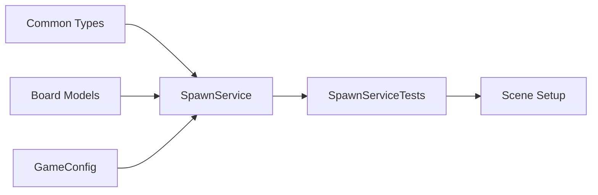

# Step 2: Spawn Service + Initial Fill

## Overview
Сервис генерации элементов без начальных матчей. Включает GameConfig для настроек.

## Prerequisites
- Step 1 НЕ выполнен — зависимости создаются в Group A

---

## 0. Parallel Execution Plan

### Task Dependency Graph


### Parallel Groups
| Group | Tasks | Can Run In Parallel |
|-------|-------|---------------------|
| Group A | Common Types, Board Models, GameConfig | Yes |
| Group B | SpawnService | After Group A |
| Group C | SpawnServiceTests | After Group B |
| Group D | Scene Setup | After Group C |

### Task Assignments
- **Group A (Parallel):**
  - Task A1: `ElementType.cs`, `GridPosition.cs` — Common types
  - Task A2: `Element.cs`, `Cell.cs`, `BoardModel.cs` — Board models (Step 1 deps)
  - Task A3: `GameConfig.cs` — ScriptableObject settings
- **Group B:** `ISpawnService.cs`, `SpawnService.cs` — depends on Group A
- **Group C:** `SpawnServiceTests.cs` — depends on Group B
- **Group D:** `Step2SceneSetup.cs` — depends on Group C

---

## 1. Components

### 1.1 ElementType (Group A)
**Type:** Enum (Pure C#)
**Responsibility:** Типы элементов
**Path:** `Assets/Scripts/Common/ElementType.cs`

### 1.2 GridPosition (Group A)
**Type:** Struct (Pure C#)
**Responsibility:** Позиция на сетке
**Path:** `Assets/Scripts/Common/GridPosition.cs`

### 1.3 Element (Group A)
**Type:** Model (Pure C#)
**Responsibility:** Элемент на сетке
**Path:** `Assets/Scripts/Features/Board/Models/Element.cs`

### 1.4 Cell (Group A)
**Type:** Model (Pure C#)
**Responsibility:** Ячейка сетки, содержит Element
**Path:** `Assets/Scripts/Features/Board/Models/Cell.cs`

### 1.5 BoardModel (Group A)
**Type:** Model (Pure C#)
**Responsibility:** Состояние сетки, CRUD элементов
**Path:** `Assets/Scripts/Features/Board/Models/BoardModel.cs`

### 1.6 GameConfig (Group A)
**Type:** ScriptableObject
**Responsibility:** Настройки игры (размер сетки, типы элементов)
**Path:** `Assets/Scripts/Configs/GameConfig.cs`

### 1.7 ISpawnService (Group B)
**Type:** Interface
**Responsibility:** Контракт для генерации элементов
**Path:** `Assets/Scripts/Features/Board/Services/ISpawnService.cs`

### 1.8 SpawnService (Group B)
**Type:** Service (Pure C#)
**Responsibility:** Генерация случайных элементов без начальных матчей
**Path:** `Assets/Scripts/Features/Board/Services/SpawnService.cs`

---

## 2. Interfaces

```csharp
// ISpawnService.cs
namespace Features.Board.Services
{
    public interface ISpawnService
    {
        ElementType GetRandomElement();
        ElementType GetRandomElementExcluding(ElementType[] excluded);
    }
}
```

---

## 3. Implementation Specs

### 3.1 ElementType.cs

```csharp
// Assets/Scripts/Common/ElementType.cs
namespace Common
{
    public enum ElementType
    {
        None = 0,
        Red = 1,
        Blue = 2,
        Green = 3,
        Yellow = 4,
        Purple = 5
    }
}
```

### 3.2 GridPosition.cs

```csharp
// Assets/Scripts/Common/GridPosition.cs
using System;

namespace Common
{
    public readonly struct GridPosition : IEquatable<GridPosition>
    {
        public readonly int X;
        public readonly int Y;

        public GridPosition(int x, int y)
        {
            X = x;
            Y = y;
        }

        public static GridPosition Invalid => new(-1, -1);
        public bool IsValid => X >= 0 && Y >= 0;

        public bool Equals(GridPosition other) => X == other.X && Y == other.Y;
        public override bool Equals(object obj) => obj is GridPosition other && Equals(other);
        public override int GetHashCode() => HashCode.Combine(X, Y);
        public static bool operator ==(GridPosition left, GridPosition right) => left.Equals(right);
        public static bool operator !=(GridPosition left, GridPosition right) => !left.Equals(right);
        public override string ToString() => $"({X}, {Y})";
    }
}
```

### 3.3 Element.cs

```csharp
// Assets/Scripts/Features/Board/Models/Element.cs
using Common;

namespace Features.Board.Models
{
    public class Element
    {
        public ElementType Type { get; }

        public Element(ElementType type)
        {
            Type = type;
        }

        public bool CanMatch => Type != ElementType.None;

        public bool Matches(Element other)
        {
            return other != null && Type == other.Type && CanMatch;
        }
    }
}
```

### 3.4 Cell.cs

```csharp
// Assets/Scripts/Features/Board/Models/Cell.cs
using Common;

namespace Features.Board.Models
{
    public class Cell
    {
        public GridPosition Position { get; }
        public Element Element { get; private set; }

        public Cell(GridPosition position)
        {
            Position = position;
        }

        public bool IsEmpty => Element == null;

        public void SetElement(Element element)
        {
            Element = element;
        }

        public Element RemoveElement()
        {
            var element = Element;
            Element = null;
            return element;
        }
    }
}
```

### 3.5 BoardModel.cs

```csharp
// Assets/Scripts/Features/Board/Models/BoardModel.cs
using System;
using Common;

namespace Features.Board.Models
{
    public class BoardModel
    {
        public int Width { get; }
        public int Height { get; }

        private readonly Cell[,] _cells;

        public event Action<GridPosition, ElementType> OnElementAdded;
        public event Action<GridPosition> OnElementRemoved;
        public event Action<GridPosition, GridPosition> OnElementsSwapped;

        public BoardModel(int width, int height)
        {
            Width = width;
            Height = height;
            _cells = new Cell[width, height];
            InitializeCells();
        }

        private void InitializeCells()
        {
            for (int x = 0; x < Width; x++)
            {
                for (int y = 0; y < Height; y++)
                {
                    _cells[x, y] = new Cell(new GridPosition(x, y));
                }
            }
        }

        public bool IsValidPosition(GridPosition pos)
        {
            return pos.X >= 0 && pos.X < Width && pos.Y >= 0 && pos.Y < Height;
        }

        public Cell GetCell(GridPosition pos)
        {
            return IsValidPosition(pos) ? _cells[pos.X, pos.Y] : null;
        }

        public Element GetElement(GridPosition pos)
        {
            return GetCell(pos)?.Element;
        }

        public void SetElement(GridPosition pos, Element element)
        {
            var cell = GetCell(pos);
            if (cell == null) return;

            cell.SetElement(element);
            OnElementAdded?.Invoke(pos, element.Type);
        }

        public void RemoveElement(GridPosition pos)
        {
            var cell = GetCell(pos);
            if (cell == null || cell.IsEmpty) return;

            cell.RemoveElement();
            OnElementRemoved?.Invoke(pos);
        }

        public void SwapElements(GridPosition a, GridPosition b)
        {
            var cellA = GetCell(a);
            var cellB = GetCell(b);
            if (cellA == null || cellB == null) return;

            var elementA = cellA.Element;
            var elementB = cellB.Element;

            cellA.SetElement(elementB);
            cellB.SetElement(elementA);

            OnElementsSwapped?.Invoke(a, b);
        }
    }
}
```

### 3.6 GameConfig.cs

```csharp
// Assets/Scripts/Configs/GameConfig.cs
using UnityEngine;

namespace Configs
{
    [CreateAssetMenu(fileName = "GameConfig", menuName = "Match3/GameConfig")]
    public class GameConfig : ScriptableObject
    {
        [Header("Grid")]
        public int GridWidth = 8;
        public int GridHeight = 8;

        [Header("Elements")]
        public int ElementTypeCount = 5;
        public Sprite[] ElementSprites;

        [Header("Matching")]
        public int MinMatchLength = 3;

        [Header("Animations")]
        public float SwapDuration = 0.3f;
        public float FallDuration = 0.2f;
        public float DestroyDuration = 0.2f;
        public float SpawnDelay = 0.1f;
    }
}
```

### 3.7 ISpawnService.cs

```csharp
// Assets/Scripts/Features/Board/Services/ISpawnService.cs
using Common;

namespace Features.Board.Services
{
    public interface ISpawnService
    {
        ElementType GetRandomElement();
        ElementType GetRandomElementExcluding(ElementType[] excluded);
    }
}
```

### 3.8 SpawnService.cs

```csharp
// Assets/Scripts/Features/Board/Services/SpawnService.cs
using System;
using System.Collections.Generic;
using Common;

namespace Features.Board.Services
{
    public class SpawnService : ISpawnService
    {
        private readonly int _elementTypeCount;
        private readonly Random _random;

        public SpawnService(int elementTypeCount, int? seed = null)
        {
            _elementTypeCount = elementTypeCount;
            _random = seed.HasValue ? new Random(seed.Value) : new Random();
        }

        public ElementType GetRandomElement()
        {
            int typeIndex = _random.Next(1, _elementTypeCount + 1);
            return (ElementType)typeIndex;
        }

        public ElementType GetRandomElementExcluding(ElementType[] excluded)
        {
            var available = GetAvailableTypes(excluded);
            if (available.Count == 0)
                return ElementType.None;

            int index = _random.Next(available.Count);
            return available[index];
        }

        private List<ElementType> GetAvailableTypes(ElementType[] excluded)
        {
            var result = new List<ElementType>();
            var excludedSet = new HashSet<ElementType>(excluded);

            for (int i = 1; i <= _elementTypeCount; i++)
            {
                var type = (ElementType)i;
                if (!excludedSet.Contains(type))
                    result.Add(type);
            }

            return result;
        }
    }
}
```

---

## 4. Test Specs

### 4.1 SpawnServiceTests.cs

```csharp
// Assets/Tests/EditMode/Features/Board/SpawnServiceTests.cs
using System.Collections.Generic;
using NUnit.Framework;
using Common;
using Features.Board.Services;

namespace Features.Board.Services
{
    [TestFixture]
    public class SpawnServiceTests
    {
        private SpawnService _service;
        private const int ElementTypeCount = 5;
        private const int TestSeed = 42;

        [SetUp]
        public void SetUp()
        {
            _service = new SpawnService(ElementTypeCount, TestSeed);
        }

        [Test]
        public void GetRandomElement_ReturnsValidType()
        {
            var result = _service.GetRandomElement();

            Assert.AreNotEqual(ElementType.None, result);
            Assert.IsTrue((int)result >= 1 && (int)result <= ElementTypeCount);
        }

        [Test]
        public void GetRandomElement_ReturnsVariousTypes()
        {
            var types = new HashSet<ElementType>();
            var service = new SpawnService(ElementTypeCount);

            for (int i = 0; i < 100; i++)
            {
                types.Add(service.GetRandomElement());
            }

            Assert.Greater(types.Count, 1, "Should return various element types");
        }

        [Test]
        public void GetRandomElementExcluding_ExcludesSpecifiedTypes()
        {
            var excluded = new[] { ElementType.Red, ElementType.Blue };

            for (int i = 0; i < 50; i++)
            {
                var result = _service.GetRandomElementExcluding(excluded);

                Assert.AreNotEqual(ElementType.Red, result);
                Assert.AreNotEqual(ElementType.Blue, result);
                Assert.AreNotEqual(ElementType.None, result);
            }
        }

        [Test]
        public void GetRandomElementExcluding_WhenAllExcluded_ReturnsNone()
        {
            var allTypes = new[]
            {
                ElementType.Red,
                ElementType.Blue,
                ElementType.Green,
                ElementType.Yellow,
                ElementType.Purple
            };

            var result = _service.GetRandomElementExcluding(allTypes);

            Assert.AreEqual(ElementType.None, result);
        }

        [Test]
        public void GetRandomElementExcluding_WhenEmptyExcluded_ReturnsValidType()
        {
            var result = _service.GetRandomElementExcluding(new ElementType[0]);

            Assert.AreNotEqual(ElementType.None, result);
        }

        [Test]
        public void Constructor_WithSeed_ProducesDeterministicResults()
        {
            var service1 = new SpawnService(ElementTypeCount, 123);
            var service2 = new SpawnService(ElementTypeCount, 123);

            for (int i = 0; i < 10; i++)
            {
                Assert.AreEqual(service1.GetRandomElement(), service2.GetRandomElement());
            }
        }

        [Test]
        public void GetRandomElement_NeverReturnsNone()
        {
            var service = new SpawnService(ElementTypeCount);

            for (int i = 0; i < 100; i++)
            {
                var result = service.GetRandomElement();
                Assert.AreNotEqual(ElementType.None, result);
            }
        }
    }
}
```

### 4.2 BoardModelTests.cs (Step 1 dependency tests)

```csharp
// Assets/Tests/EditMode/Features/Board/BoardModelTests.cs
using NUnit.Framework;
using Common;
using Features.Board.Models;

namespace Features.Board.Models
{
    [TestFixture]
    public class BoardModelTests
    {
        private BoardModel _board;
        private const int Width = 8;
        private const int Height = 8;

        [SetUp]
        public void SetUp()
        {
            _board = new BoardModel(Width, Height);
        }

        [Test]
        public void Constructor_CreatesCorrectSize()
        {
            Assert.AreEqual(Width, _board.Width);
            Assert.AreEqual(Height, _board.Height);
        }

        [Test]
        public void GetCell_ValidPosition_ReturnsCell()
        {
            var cell = _board.GetCell(new GridPosition(0, 0));

            Assert.IsNotNull(cell);
        }

        [Test]
        public void GetCell_InvalidPosition_ReturnsNull()
        {
            var cell = _board.GetCell(new GridPosition(-1, 0));

            Assert.IsNull(cell);
        }

        [Test]
        public void SetElement_AddsElementToCell()
        {
            var pos = new GridPosition(3, 3);
            var element = new Element(ElementType.Red);

            _board.SetElement(pos, element);

            Assert.AreEqual(element, _board.GetElement(pos));
        }

        [Test]
        public void SetElement_RaisesOnElementAdded()
        {
            GridPosition receivedPos = GridPosition.Invalid;
            ElementType receivedType = ElementType.None;
            _board.OnElementAdded += (pos, type) =>
            {
                receivedPos = pos;
                receivedType = type;
            };

            var position = new GridPosition(2, 2);
            _board.SetElement(position, new Element(ElementType.Blue));

            Assert.AreEqual(position, receivedPos);
            Assert.AreEqual(ElementType.Blue, receivedType);
        }

        [Test]
        public void RemoveElement_RemovesElementFromCell()
        {
            var pos = new GridPosition(1, 1);
            _board.SetElement(pos, new Element(ElementType.Green));

            _board.RemoveElement(pos);

            Assert.IsNull(_board.GetElement(pos));
        }

        [Test]
        public void RemoveElement_RaisesOnElementRemoved()
        {
            GridPosition receivedPos = GridPosition.Invalid;
            _board.OnElementRemoved += pos => receivedPos = pos;
            var position = new GridPosition(4, 4);
            _board.SetElement(position, new Element(ElementType.Yellow));

            _board.RemoveElement(position);

            Assert.AreEqual(position, receivedPos);
        }

        [Test]
        public void SwapElements_SwapsElementsBetweenCells()
        {
            var posA = new GridPosition(0, 0);
            var posB = new GridPosition(1, 0);
            var elementA = new Element(ElementType.Red);
            var elementB = new Element(ElementType.Blue);
            _board.SetElement(posA, elementA);
            _board.SetElement(posB, elementB);

            _board.SwapElements(posA, posB);

            Assert.AreEqual(elementB, _board.GetElement(posA));
            Assert.AreEqual(elementA, _board.GetElement(posB));
        }

        [Test]
        public void SwapElements_RaisesOnElementsSwapped()
        {
            GridPosition receivedA = GridPosition.Invalid;
            GridPosition receivedB = GridPosition.Invalid;
            _board.OnElementsSwapped += (a, b) =>
            {
                receivedA = a;
                receivedB = b;
            };
            var posA = new GridPosition(0, 0);
            var posB = new GridPosition(1, 0);
            _board.SetElement(posA, new Element(ElementType.Red));
            _board.SetElement(posB, new Element(ElementType.Blue));

            _board.SwapElements(posA, posB);

            Assert.AreEqual(posA, receivedA);
            Assert.AreEqual(posB, receivedB);
        }

        [Test]
        public void IsValidPosition_ValidPosition_ReturnsTrue()
        {
            Assert.IsTrue(_board.IsValidPosition(new GridPosition(0, 0)));
            Assert.IsTrue(_board.IsValidPosition(new GridPosition(Width - 1, Height - 1)));
        }

        [Test]
        public void IsValidPosition_InvalidPosition_ReturnsFalse()
        {
            Assert.IsFalse(_board.IsValidPosition(new GridPosition(-1, 0)));
            Assert.IsFalse(_board.IsValidPosition(new GridPosition(0, -1)));
            Assert.IsFalse(_board.IsValidPosition(new GridPosition(Width, 0)));
            Assert.IsFalse(_board.IsValidPosition(new GridPosition(0, Height)));
        }
    }
}
```

### 4.3 ElementTests.cs

```csharp
// Assets/Tests/EditMode/Features/Board/ElementTests.cs
using NUnit.Framework;
using Common;
using Features.Board.Models;

namespace Features.Board.Models
{
    [TestFixture]
    public class ElementTests
    {
        [Test]
        public void Constructor_SetsType()
        {
            var element = new Element(ElementType.Red);

            Assert.AreEqual(ElementType.Red, element.Type);
        }

        [Test]
        public void CanMatch_WhenNotNone_ReturnsTrue()
        {
            var element = new Element(ElementType.Blue);

            Assert.IsTrue(element.CanMatch);
        }

        [Test]
        public void CanMatch_WhenNone_ReturnsFalse()
        {
            var element = new Element(ElementType.None);

            Assert.IsFalse(element.CanMatch);
        }

        [Test]
        public void Matches_SameType_ReturnsTrue()
        {
            var element1 = new Element(ElementType.Green);
            var element2 = new Element(ElementType.Green);

            Assert.IsTrue(element1.Matches(element2));
        }

        [Test]
        public void Matches_DifferentType_ReturnsFalse()
        {
            var element1 = new Element(ElementType.Red);
            var element2 = new Element(ElementType.Blue);

            Assert.IsFalse(element1.Matches(element2));
        }

        [Test]
        public void Matches_WithNull_ReturnsFalse()
        {
            var element = new Element(ElementType.Yellow);

            Assert.IsFalse(element.Matches(null));
        }

        [Test]
        public void Matches_BothNone_ReturnsFalse()
        {
            var element1 = new Element(ElementType.None);
            var element2 = new Element(ElementType.None);

            Assert.IsFalse(element1.Matches(element2));
        }
    }
}
```

### 4.4 CellTests.cs

```csharp
// Assets/Tests/EditMode/Features/Board/CellTests.cs
using NUnit.Framework;
using Common;
using Features.Board.Models;

namespace Features.Board.Models
{
    [TestFixture]
    public class CellTests
    {
        [Test]
        public void Constructor_SetsPosition()
        {
            var pos = new GridPosition(3, 5);

            var cell = new Cell(pos);

            Assert.AreEqual(pos, cell.Position);
        }

        [Test]
        public void IsEmpty_WhenNoElement_ReturnsTrue()
        {
            var cell = new Cell(new GridPosition(0, 0));

            Assert.IsTrue(cell.IsEmpty);
        }

        [Test]
        public void IsEmpty_WhenHasElement_ReturnsFalse()
        {
            var cell = new Cell(new GridPosition(0, 0));
            cell.SetElement(new Element(ElementType.Red));

            Assert.IsFalse(cell.IsEmpty);
        }

        [Test]
        public void SetElement_SetsElement()
        {
            var cell = new Cell(new GridPosition(0, 0));
            var element = new Element(ElementType.Blue);

            cell.SetElement(element);

            Assert.AreEqual(element, cell.Element);
        }

        [Test]
        public void RemoveElement_ReturnsAndRemovesElement()
        {
            var cell = new Cell(new GridPosition(0, 0));
            var element = new Element(ElementType.Green);
            cell.SetElement(element);

            var removed = cell.RemoveElement();

            Assert.AreEqual(element, removed);
            Assert.IsTrue(cell.IsEmpty);
        }

        [Test]
        public void RemoveElement_WhenEmpty_ReturnsNull()
        {
            var cell = new Cell(new GridPosition(0, 0));

            var removed = cell.RemoveElement();

            Assert.IsNull(removed);
        }
    }
}
```

### 4.5 GridPositionTests.cs

```csharp
// Assets/Tests/EditMode/Common/GridPositionTests.cs
using NUnit.Framework;
using Common;

namespace Common
{
    [TestFixture]
    public class GridPositionTests
    {
        [Test]
        public void Constructor_SetsCoordinates()
        {
            var pos = new GridPosition(3, 5);

            Assert.AreEqual(3, pos.X);
            Assert.AreEqual(5, pos.Y);
        }

        [Test]
        public void Invalid_ReturnsNegativeCoordinates()
        {
            var invalid = GridPosition.Invalid;

            Assert.AreEqual(-1, invalid.X);
            Assert.AreEqual(-1, invalid.Y);
        }

        [Test]
        public void IsValid_WhenPositive_ReturnsTrue()
        {
            var pos = new GridPosition(0, 0);

            Assert.IsTrue(pos.IsValid);
        }

        [Test]
        public void IsValid_WhenNegative_ReturnsFalse()
        {
            Assert.IsFalse(new GridPosition(-1, 0).IsValid);
            Assert.IsFalse(new GridPosition(0, -1).IsValid);
        }

        [Test]
        public void Equals_SameCoordinates_ReturnsTrue()
        {
            var pos1 = new GridPosition(2, 3);
            var pos2 = new GridPosition(2, 3);

            Assert.IsTrue(pos1.Equals(pos2));
            Assert.IsTrue(pos1 == pos2);
        }

        [Test]
        public void Equals_DifferentCoordinates_ReturnsFalse()
        {
            var pos1 = new GridPosition(2, 3);
            var pos2 = new GridPosition(3, 2);

            Assert.IsFalse(pos1.Equals(pos2));
            Assert.IsTrue(pos1 != pos2);
        }

        [Test]
        public void ToString_ReturnsFormattedString()
        {
            var pos = new GridPosition(4, 7);

            Assert.AreEqual("(4, 7)", pos.ToString());
        }
    }
}
```

---

## 5. Scene Setup Script

```csharp
// Assets/Scripts/Editor/Setup/Step2SceneSetup.cs
using UnityEngine;
using UnityEditor;
using Configs;

namespace Editor.Setup
{
    public static class Step2SceneSetup
    {
        private const string ConfigPath = "Assets/Configs/GameConfig.asset";
        private const string ConfigFolder = "Assets/Configs";

        [MenuItem("Setup/Step 2 - Spawn Service")]
        public static void Setup()
        {
            CreateConfigFolder();
            CreateOrUpdateGameConfig();

            Debug.Log("[Step 2] Scene setup complete. GameConfig created at: " + ConfigPath);
        }

        private static void CreateConfigFolder()
        {
            if (!AssetDatabase.IsValidFolder(ConfigFolder))
            {
                AssetDatabase.CreateFolder("Assets", "Configs");
            }
        }

        private static void CreateOrUpdateGameConfig()
        {
            var existing = AssetDatabase.LoadAssetAtPath<GameConfig>(ConfigPath);

            if (existing != null)
            {
                Debug.Log("[Step 2] GameConfig already exists. Skipping creation.");
                return;
            }

            var config = ScriptableObject.CreateInstance<GameConfig>();
            config.GridWidth = 8;
            config.GridHeight = 8;
            config.ElementTypeCount = 5;
            config.MinMatchLength = 3;
            config.SwapDuration = 0.3f;
            config.FallDuration = 0.2f;
            config.DestroyDuration = 0.2f;
            config.SpawnDelay = 0.1f;

            AssetDatabase.CreateAsset(config, ConfigPath);
            AssetDatabase.SaveAssets();

            Selection.activeObject = config;
            EditorGUIUtility.PingObject(config);
        }

        [MenuItem("Setup/Step 2 - Spawn Service", validate = true)]
        private static bool ValidateSetup()
        {
            return !EditorApplication.isPlaying;
        }
    }
}
```

---

## 6. Validation Checklist

- [ ] All .cs files compile without errors
- [ ] All tests pass (`run_tests` EditMode)
- [ ] Scene Setup executes successfully (creates GameConfig.asset)
- [ ] `SpawnService` returns valid ElementTypes (not None)
- [ ] `SpawnService.GetRandomElementExcluding` correctly excludes types
- [ ] `BoardModel` stores and retrieves elements
- [ ] `BoardModel` fires events on element changes
- [ ] `GridPosition` equality works correctly
- [ ] `Element.Matches` returns correct results
- [ ] No Unity dependencies in Model classes

---

## 7. Files to Create

### Group A (Parallel - Step 1 Dependencies + Config)

| File | Path | Type |
|------|------|------|
| ElementType.cs | Assets/Scripts/Common/ | Enum |
| GridPosition.cs | Assets/Scripts/Common/ | Struct |
| Element.cs | Assets/Scripts/Features/Board/Models/ | Model |
| Cell.cs | Assets/Scripts/Features/Board/Models/ | Model |
| BoardModel.cs | Assets/Scripts/Features/Board/Models/ | Model |
| GameConfig.cs | Assets/Scripts/Configs/ | ScriptableObject |

### Group B (SpawnService)

| File | Path | Type |
|------|------|------|
| ISpawnService.cs | Assets/Scripts/Features/Board/Services/ | Interface |
| SpawnService.cs | Assets/Scripts/Features/Board/Services/ | Service |

### Group C (Tests)

| File | Path | Type |
|------|------|------|
| GridPositionTests.cs | Assets/Tests/EditMode/Common/ | Test |
| ElementTests.cs | Assets/Tests/EditMode/Features/Board/ | Test |
| CellTests.cs | Assets/Tests/EditMode/Features/Board/ | Test |
| BoardModelTests.cs | Assets/Tests/EditMode/Features/Board/ | Test |
| SpawnServiceTests.cs | Assets/Tests/EditMode/Features/Board/ | Test |

### Group D (Editor)

| File | Path | Type |
|------|------|------|
| Step2SceneSetup.cs | Assets/Scripts/Editor/Setup/ | Editor Script |

---

## 8. Directory Structure to Create

```
Assets/Scripts/
├── Common/
│   ├── ElementType.cs
│   └── GridPosition.cs
├── Configs/
│   └── GameConfig.cs
├── Features/
│   └── Board/
│       ├── Models/
│       │   ├── Element.cs
│       │   ├── Cell.cs
│       │   └── BoardModel.cs
│       └── Services/
│           ├── ISpawnService.cs
│           └── SpawnService.cs
└── Editor/
    └── Setup/
        └── Step2SceneSetup.cs

Assets/Tests/EditMode/
├── Common/
│   └── GridPositionTests.cs
└── Features/
    └── Board/
        ├── ElementTests.cs
        ├── CellTests.cs
        ├── BoardModelTests.cs
        └── SpawnServiceTests.cs
```
