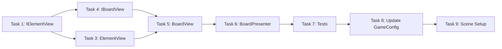

# Step 4: View + Visual Representation

## Overview
Отображение сетки через MVP паттерн. BoardPresenter связывает BoardModel с IBoardView. ElementView отображает отдельные элементы со спрайтами.

## Prerequisites
- Step 1 (BoardModel, Cell, Element, GridPosition, ElementType)
- Step 2 (SpawnService, GameConfig)
- Step 3 (MatchService)

---

## 0. Parallel Execution Plan

### Task Dependency Graph


### Parallel Groups
| Group | Tasks | Can Run In Parallel |
|-------|-------|---------------------|
| Group A | IElementView, IBoardView | Yes |
| Group B | ElementView | After IElementView |
| Group C | BoardView | After IBoardView, ElementView |
| Group D | BoardPresenter | After BoardView |
| Group E | BoardPresenterTests | After BoardPresenter |
| Group F | Update GameConfig, Scene Setup | After Tests |

### Task Assignments
- **Group A (Parallel):** Interfaces - `IElementView.cs`, `IBoardView.cs`
- **Group B:** `ElementView.cs` - implements IElementView
- **Group C:** `BoardView.cs` - implements IBoardView, uses ElementView
- **Group D:** `BoardPresenter.cs` - binds BoardModel to IBoardView
- **Group E:** `BoardPresenterTests.cs` - tests with mock view
- **Group F:** Update `GameConfig.cs` (CellSize), `Step4SceneSetup.cs`

---

## 1. Components

### 1.1 IElementView
**Type:** Interface
**Responsibility:** Contract for element visual representation
**Path:** `Assets/Scripts/Features/Board/Views/IElementView.cs`

### 1.2 ElementView
**Type:** View (MonoBehaviour)
**Responsibility:** Display single element with SpriteRenderer
**Path:** `Assets/Scripts/Features/Board/Views/ElementView.cs`
**Dependencies:** Implements IElementView

### 1.3 IBoardView
**Type:** Interface
**Responsibility:** Contract for board visual representation
**Path:** `Assets/Scripts/Features/Board/Views/IBoardView.cs`

### 1.4 BoardView
**Type:** View (MonoBehaviour)
**Responsibility:** Display grid, manage ElementViews
**Path:** `Assets/Scripts/Features/Board/Views/BoardView.cs`
**Dependencies:** Implements IBoardView, uses ElementView

### 1.5 BoardPresenter
**Type:** Presenter (Pure C#)
**Responsibility:** Binds BoardModel to IBoardView
**Path:** `Assets/Scripts/Features/Board/Presenters/BoardPresenter.cs`
**Dependencies:** BoardModel, IBoardView

---

## 2. Interfaces

### 2.1 IElementView.cs

```csharp
// Assets/Scripts/Features/Board/Views/IElementView.cs
using System;
using Common;

namespace Features.Board.Views
{
    public interface IElementView
    {
        GridPosition Position { get; }
        ElementType Type { get; }

        void Initialize(GridPosition pos, ElementType type, UnityEngine.Sprite sprite);
        void SetSprite(UnityEngine.Sprite sprite);
        void UpdatePosition(UnityEngine.Vector3 worldPosition);
        void SetActive(bool active);
        void Destroy();
    }
}
```

### 2.2 IBoardView.cs

```csharp
// Assets/Scripts/Features/Board/Views/IBoardView.cs
using System;
using Common;

namespace Features.Board.Views
{
    public interface IBoardView
    {
        void Initialize(int width, int height, float cellSize);
        void CreateElement(GridPosition pos, ElementType type);
        void RemoveElement(GridPosition pos);
        void Clear();

        event Action<GridPosition> OnCellClicked;
    }
}
```

---

## 3. Implementation Specs

### 3.1 IElementView.cs

```csharp
// Assets/Scripts/Features/Board/Views/IElementView.cs
using System;
using Common;
using UnityEngine;

namespace Features.Board.Views
{
    public interface IElementView
    {
        GridPosition Position { get; }
        ElementType Type { get; }

        void Initialize(GridPosition pos, ElementType type, Sprite sprite);
        void SetSprite(Sprite sprite);
        void UpdatePosition(Vector3 worldPosition);
        void SetActive(bool active);
        void Destroy();
    }
}
```

### 3.2 ElementView.cs

```csharp
// Assets/Scripts/Features/Board/Views/ElementView.cs
using Common;
using UnityEngine;

namespace Features.Board.Views
{
    [RequireComponent(typeof(SpriteRenderer))]
    public class ElementView : MonoBehaviour, IElementView
    {
        private SpriteRenderer _spriteRenderer;

        public GridPosition Position { get; private set; }
        public ElementType Type { get; private set; }

        private void Awake()
        {
            _spriteRenderer = GetComponent<SpriteRenderer>();
        }

        public void Initialize(GridPosition pos, ElementType type, Sprite sprite)
        {
            Position = pos;
            Type = type;
            SetSprite(sprite);
            gameObject.name = $"Element_{pos.X}_{pos.Y}_{type}";
        }

        public void SetSprite(Sprite sprite)
        {
            if (_spriteRenderer == null)
                _spriteRenderer = GetComponent<SpriteRenderer>();

            _spriteRenderer.sprite = sprite;
        }

        public void UpdatePosition(Vector3 worldPosition)
        {
            transform.position = worldPosition;
        }

        public void SetActive(bool active)
        {
            gameObject.SetActive(active);
        }

        public void Destroy()
        {
            if (Application.isPlaying)
                Object.Destroy(gameObject);
            else
                Object.DestroyImmediate(gameObject);
        }
    }
}
```

### 3.3 IBoardView.cs

```csharp
// Assets/Scripts/Features/Board/Views/IBoardView.cs
using System;
using Common;

namespace Features.Board.Views
{
    public interface IBoardView
    {
        void Initialize(int width, int height, float cellSize);
        void CreateElement(GridPosition pos, ElementType type);
        void RemoveElement(GridPosition pos);
        void Clear();

        event Action<GridPosition> OnCellClicked;
    }
}
```

### 3.4 BoardView.cs

```csharp
// Assets/Scripts/Features/Board/Views/BoardView.cs
using System;
using System.Collections.Generic;
using Common;
using Configs;
using UnityEngine;

namespace Features.Board.Views
{
    public class BoardView : MonoBehaviour, IBoardView
    {
        [SerializeField] private GameConfig _config;

        private int _width;
        private int _height;
        private float _cellSize;
        private Vector3 _originOffset;

        private readonly Dictionary<GridPosition, ElementView> _elementViews = new();

        public event Action<GridPosition> OnCellClicked;

        public void Initialize(int width, int height, float cellSize)
        {
            _width = width;
            _height = height;
            _cellSize = cellSize;

            // Center the grid
            _originOffset = new Vector3(
                -(_width - 1) * _cellSize * 0.5f,
                -(_height - 1) * _cellSize * 0.5f,
                0f
            );
        }

        public void CreateElement(GridPosition pos, ElementType type)
        {
            if (_elementViews.ContainsKey(pos))
            {
                RemoveElement(pos);
            }

            var sprite = GetSpriteForType(type);
            if (sprite == null) return;

            var elementGO = new GameObject($"Element_{pos.X}_{pos.Y}");
            elementGO.transform.SetParent(transform);

            var elementView = elementGO.AddComponent<ElementView>();
            elementView.Initialize(pos, type, sprite);
            elementView.UpdatePosition(GridToWorld(pos));

            _elementViews[pos] = elementView;
        }

        public void RemoveElement(GridPosition pos)
        {
            if (_elementViews.TryGetValue(pos, out var view))
            {
                view.Destroy();
                _elementViews.Remove(pos);
            }
        }

        public void Clear()
        {
            foreach (var view in _elementViews.Values)
            {
                view.Destroy();
            }
            _elementViews.Clear();
        }

        private Vector3 GridToWorld(GridPosition pos)
        {
            return transform.position + _originOffset + new Vector3(
                pos.X * _cellSize,
                pos.Y * _cellSize,
                0f
            );
        }

        private Sprite GetSpriteForType(ElementType type)
        {
            if (_config == null || _config.ElementSprites == null)
                return null;

            int index = (int)type - 1; // ElementType starts from 1
            if (index >= 0 && index < _config.ElementSprites.Length)
                return _config.ElementSprites[index];

            return null;
        }

        public void SetConfig(GameConfig config)
        {
            _config = config;
        }

        private void OnDestroy()
        {
            Clear();
        }
    }
}
```

### 3.5 BoardPresenter.cs

```csharp
// Assets/Scripts/Features/Board/Presenters/BoardPresenter.cs
using System;
using Common;
using Features.Board.Models;
using Features.Board.Views;

namespace Features.Board.Presenters
{
    public class BoardPresenter : IDisposable
    {
        private readonly BoardModel _model;
        private readonly IBoardView _view;

        public BoardPresenter(BoardModel model, IBoardView view, float cellSize)
        {
            _model = model;
            _view = view;

            _view.Initialize(_model.Width, _model.Height, cellSize);

            _model.OnElementAdded += HandleElementAdded;
            _model.OnElementRemoved += HandleElementRemoved;
        }

        private void HandleElementAdded(GridPosition pos, ElementType type)
        {
            _view.CreateElement(pos, type);
        }

        private void HandleElementRemoved(GridPosition pos)
        {
            _view.RemoveElement(pos);
        }

        public void SyncViewWithModel()
        {
            _view.Clear();

            for (int x = 0; x < _model.Width; x++)
            {
                for (int y = 0; y < _model.Height; y++)
                {
                    var pos = new GridPosition(x, y);
                    var element = _model.GetElement(pos);
                    if (element != null)
                    {
                        _view.CreateElement(pos, element.Type);
                    }
                }
            }
        }

        public void Dispose()
        {
            _model.OnElementAdded -= HandleElementAdded;
            _model.OnElementRemoved -= HandleElementRemoved;
        }
    }
}
```

### 3.6 GameConfig.cs (Updated)

```csharp
// Assets/Scripts/Configs/GameConfig.cs
using UnityEngine;

namespace Configs
{
    [CreateAssetMenu(fileName = "GameConfig", menuName = "Match3/GameConfig")]
    public class GameConfig : ScriptableObject
    {
        [Header("Grid")]
        public int GridWidth = 8;
        public int GridHeight = 8;
        public float CellSize = 1.0f;

        [Header("Elements")]
        public int ElementTypeCount = 5;
        public Sprite[] ElementSprites;

        [Header("Matching")]
        public int MinMatchLength = 3;

        [Header("Animations")]
        public float SwapDuration = 0.3f;
        public float FallDuration = 0.2f;
        public float DestroyDuration = 0.2f;
        public float SpawnDelay = 0.1f;
    }
}
```

---

## 4. Test Specs

### 4.1 BoardPresenterTests.cs

```csharp
// Assets/Tests/EditMode/Features/Board/BoardPresenterTests.cs
using System;
using NUnit.Framework;
using NSubstitute;
using Common;
using Features.Board.Models;
using Features.Board.Presenters;
using Features.Board.Views;

namespace Features.Board.Presenters
{
    [TestFixture]
    public class BoardPresenterTests
    {
        private BoardModel _model;
        private IBoardView _view;
        private BoardPresenter _presenter;

        private const int Width = 8;
        private const int Height = 8;
        private const float CellSize = 1.0f;

        [SetUp]
        public void SetUp()
        {
            _model = new BoardModel(Width, Height);
            _view = Substitute.For<IBoardView>();
            _presenter = new BoardPresenter(_model, _view, CellSize);
        }

        [TearDown]
        public void TearDown()
        {
            _presenter.Dispose();
        }

        [Test]
        public void Constructor_InitializesView()
        {
            _view.Received(1).Initialize(Width, Height, CellSize);
        }

        [Test]
        public void WhenElementAdded_CreatesViewElement()
        {
            var pos = new GridPosition(3, 3);
            var element = new Element(ElementType.Red);

            _model.SetElement(pos, element);

            _view.Received(1).CreateElement(pos, ElementType.Red);
        }

        [Test]
        public void WhenElementRemoved_RemovesViewElement()
        {
            var pos = new GridPosition(2, 2);
            _model.SetElement(pos, new Element(ElementType.Blue));
            _view.ClearReceivedCalls();

            _model.RemoveElement(pos);

            _view.Received(1).RemoveElement(pos);
        }

        [Test]
        public void SyncViewWithModel_ClearsAndRecreatesAllElements()
        {
            _model.SetElement(new GridPosition(0, 0), new Element(ElementType.Red));
            _model.SetElement(new GridPosition(1, 1), new Element(ElementType.Blue));
            _view.ClearReceivedCalls();

            _presenter.SyncViewWithModel();

            _view.Received(1).Clear();
            _view.Received(1).CreateElement(new GridPosition(0, 0), ElementType.Red);
            _view.Received(1).CreateElement(new GridPosition(1, 1), ElementType.Blue);
        }

        [Test]
        public void SyncViewWithModel_SkipsEmptyCells()
        {
            _model.SetElement(new GridPosition(0, 0), new Element(ElementType.Red));
            _view.ClearReceivedCalls();

            _presenter.SyncViewWithModel();

            // Should only call CreateElement once for the one element
            _view.Received(1).CreateElement(Arg.Any<GridPosition>(), Arg.Any<ElementType>());
        }

        [Test]
        public void Dispose_UnsubscribesFromModelEvents()
        {
            _presenter.Dispose();
            _view.ClearReceivedCalls();

            _model.SetElement(new GridPosition(0, 0), new Element(ElementType.Red));

            _view.DidNotReceive().CreateElement(Arg.Any<GridPosition>(), Arg.Any<ElementType>());
        }

        [Test]
        public void Dispose_DoesNotAffectModelRemoveAfterDispose()
        {
            _model.SetElement(new GridPosition(0, 0), new Element(ElementType.Red));
            _presenter.Dispose();
            _view.ClearReceivedCalls();

            _model.RemoveElement(new GridPosition(0, 0));

            _view.DidNotReceive().RemoveElement(Arg.Any<GridPosition>());
        }

        [Test]
        public void MultipleElements_AllCreatedInView()
        {
            var positions = new[]
            {
                new GridPosition(0, 0),
                new GridPosition(1, 0),
                new GridPosition(2, 0)
            };

            foreach (var pos in positions)
            {
                _model.SetElement(pos, new Element(ElementType.Green));
            }

            foreach (var pos in positions)
            {
                _view.Received(1).CreateElement(pos, ElementType.Green);
            }
        }
    }
}
```

---

## 5. Scene Setup Script

```csharp
// Assets/Scripts/Editor/Step4SceneSetup.cs
using UnityEngine;
using UnityEditor;
using Configs;
using Features.Board.Views;
using Features.Board.Models;
using Features.Board.Presenters;
using Common;

namespace Editor
{
    public static class Step4SceneSetup
    {
        private const string ConfigPath = "Assets/Configs/GameConfig.asset";

        [MenuItem("Setup/Step 4 - Board View")]
        public static void Setup()
        {
            ClearPreviousSetup();

            var config = LoadOrCreateConfig();
            if (config == null)
            {
                Debug.LogError("[Step 4] Failed to load GameConfig!");
                return;
            }

            CreateBoardView(config);
            SetupCamera(config);

            Debug.Log("[Step 4] Scene setup complete. Board View created.");
            Debug.Log("[Step 4] Assign sprites to GameConfig.ElementSprites and run Play mode to test.");
        }

        private static void ClearPreviousSetup()
        {
            var existing = GameObject.Find("[Board]");
            if (existing != null)
            {
                Object.DestroyImmediate(existing);
            }
        }

        private static GameConfig LoadOrCreateConfig()
        {
            var config = AssetDatabase.LoadAssetAtPath<GameConfig>(ConfigPath);

            if (config == null)
            {
                Debug.LogWarning("[Step 4] GameConfig not found. Run Step 2 setup first.");
            }

            return config;
        }

        private static void CreateBoardView(GameConfig config)
        {
            var boardGO = new GameObject("[Board]");
            var boardView = boardGO.AddComponent<BoardView>();
            boardView.SetConfig(config);

            // Add test initialization component
            var initializer = boardGO.AddComponent<BoardViewTestInitializer>();
            initializer.Config = config;

            EditorUtility.SetDirty(boardGO);
        }

        private static void SetupCamera(GameConfig config)
        {
            var camera = Camera.main;
            if (camera == null)
            {
                var cameraGO = new GameObject("Main Camera");
                camera = cameraGO.AddComponent<Camera>();
                cameraGO.tag = "MainCamera";
            }

            camera.orthographic = true;

            // Calculate orthographic size to fit the grid
            float gridHeight = config.GridHeight * config.CellSize;
            float gridWidth = config.GridWidth * config.CellSize;
            float aspectRatio = (float)Screen.width / Screen.height;

            float verticalSize = gridHeight * 0.6f;
            float horizontalSize = (gridWidth * 0.6f) / aspectRatio;

            camera.orthographicSize = Mathf.Max(verticalSize, horizontalSize);
            camera.transform.position = new Vector3(0, 0, -10);
            camera.backgroundColor = new Color(0.2f, 0.2f, 0.3f);

            EditorUtility.SetDirty(camera.gameObject);
        }

        [MenuItem("Setup/Step 4 - Board View", validate = true)]
        private static bool ValidateSetup()
        {
            return !EditorApplication.isPlaying;
        }
    }
}
```

### 5.1 BoardViewTestInitializer.cs (Runtime test helper)

```csharp
// Assets/Scripts/Editor/BoardViewTestInitializer.cs
using UnityEngine;
using Configs;
using Features.Board.Views;
using Features.Board.Models;
using Features.Board.Presenters;
using Common;

namespace Editor
{
    /// <summary>
    /// Runtime initializer for testing BoardView.
    /// Attach to Board GameObject and run Play mode.
    /// </summary>
    public class BoardViewTestInitializer : MonoBehaviour
    {
        public GameConfig Config;

        private BoardModel _model;
        private BoardPresenter _presenter;

        private void Start()
        {
            if (Config == null)
            {
                Debug.LogError("[BoardViewTestInitializer] GameConfig is not assigned!");
                return;
            }

            var view = GetComponent<BoardView>();
            if (view == null)
            {
                Debug.LogError("[BoardViewTestInitializer] BoardView component not found!");
                return;
            }

            InitializeBoard(view);
        }

        private void InitializeBoard(BoardView view)
        {
            _model = new BoardModel(Config.GridWidth, Config.GridHeight);
            _presenter = new BoardPresenter(_model, view, Config.CellSize);

            FillBoardWithTestElements();

            Debug.Log($"[BoardViewTestInitializer] Board initialized: {Config.GridWidth}x{Config.GridHeight}");
        }

        private void FillBoardWithTestElements()
        {
            for (int x = 0; x < Config.GridWidth; x++)
            {
                for (int y = 0; y < Config.GridHeight; y++)
                {
                    var pos = new GridPosition(x, y);
                    // Cycle through element types for visual testing
                    var type = (ElementType)((x + y) % Config.ElementTypeCount + 1);
                    _model.SetElement(pos, new Element(type));
                }
            }
        }

        private void OnDestroy()
        {
            _presenter?.Dispose();
        }
    }
}
```

---

## 6. Validation Checklist

- [ ] All .cs files compile without errors
- [ ] All tests pass (`run_tests` EditMode)
- [ ] Scene Setup executes successfully
- [ ] `IElementView` interface defined
- [ ] `ElementView` implements `IElementView`
- [ ] `IBoardView` interface defined
- [ ] `BoardView` implements `IBoardView`
- [ ] `BoardPresenter` subscribes to Model events
- [ ] `BoardPresenter` implements `IDisposable`
- [ ] `BoardPresenter` correctly forwards events to View
- [ ] `GameConfig` has `CellSize` field
- [ ] In Play mode: 8x8 grid displays (with assigned sprites)
- [ ] No Unity dependencies in Presenter

---

## 7. Files to Create

### Group A (Interfaces - Parallel)

| File | Path | Type |
|------|------|------|
| IElementView.cs | Assets/Scripts/Features/Board/Views/ | Interface |
| IBoardView.cs | Assets/Scripts/Features/Board/Views/ | Interface |

### Group B (ElementView)

| File | Path | Type |
|------|------|------|
| ElementView.cs | Assets/Scripts/Features/Board/Views/ | MonoBehaviour |

### Group C (BoardView)

| File | Path | Type |
|------|------|------|
| BoardView.cs | Assets/Scripts/Features/Board/Views/ | MonoBehaviour |

### Group D (Presenter)

| File | Path | Type |
|------|------|------|
| BoardPresenter.cs | Assets/Scripts/Features/Board/Presenters/ | Presenter |

### Group E (Tests)

| File | Path | Type |
|------|------|------|
| BoardPresenterTests.cs | Assets/Tests/EditMode/Features/Board/ | Test |

### Group F (Config Update + Setup)

| File | Path | Type | Action |
|------|------|------|--------|
| GameConfig.cs | Assets/Scripts/Configs/ | ScriptableObject | UPDATE (add CellSize) |
| Step4SceneSetup.cs | Assets/Scripts/Editor/ | Editor Script | CREATE |
| BoardViewTestInitializer.cs | Assets/Scripts/Editor/ | MonoBehaviour | CREATE |

---

## 8. Directory Structure

```
Assets/Scripts/
├── Configs/
│   └── GameConfig.cs (UPDATED)
├── Features/
│   └── Board/
│       ├── Models/
│       │   ├── BoardModel.cs (exists)
│       │   ├── Cell.cs (exists)
│       │   └── Element.cs (exists)
│       ├── Presenters/
│       │   └── BoardPresenter.cs (NEW)
│       └── Views/
│           ├── IElementView.cs (NEW)
│           ├── ElementView.cs (NEW)
│           ├── IBoardView.cs (NEW)
│           └── BoardView.cs (NEW)
└── Editor/
    ├── Step1SceneSetup.cs (exists)
    ├── Step4SceneSetup.cs (NEW)
    └── BoardViewTestInitializer.cs (NEW)

Assets/Tests/EditMode/
└── Features/
    └── Board/
        └── BoardPresenterTests.cs (NEW)
```

---

## 9. Integration Notes

### How to Test Visually

1. Run `Setup/Step 4 - Board View` menu item
2. Assign 5 sprites to `GameConfig.ElementSprites` array
3. Enter Play mode
4. Observe 8x8 grid with colored elements

### Sprite Assignment

GameConfig expects sprites in order:
- Index 0: Red (ElementType.Red = 1)
- Index 1: Blue (ElementType.Blue = 2)
- Index 2: Green (ElementType.Green = 3)
- Index 3: Yellow (ElementType.Yellow = 4)
- Index 4: Purple (ElementType.Purple = 5)

### Event Flow

```
BoardModel.SetElement()
    → OnElementAdded event
    → BoardPresenter.HandleElementAdded()
    → IBoardView.CreateElement()
```
