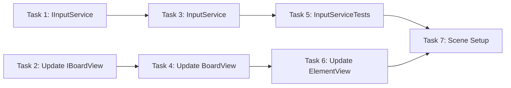

# Step 5: Input + Drag & Drop

## Overview
Обработка ввода игрока. InputService валидирует swap между соседними ячейками. BoardView обрабатывает Unity input (drag). ElementView получает события клика/drag.

## Prerequisites
- Step 4 (BoardView, ElementView, BoardPresenter, IBoardView, IElementView)
- Step 1 (GridPosition, ElementType)

---

## 0. Parallel Execution Plan

### Task Dependency Graph


### Parallel Groups
| Group | Tasks | Can Run In Parallel |
|-------|-------|---------------------|
| Group A | IInputService, Update IBoardView | Yes |
| Group B | InputService | After IInputService |
| Group C | Update BoardView | After IBoardView update |
| Group D | Update ElementView | After BoardView |
| Group E | InputServiceTests | After InputService |
| Group F | Scene Setup | After all |

### Task Assignments
- **Group A (Parallel):** `IInputService.cs`, update `IBoardView.cs` (add OnSwapAttempted)
- **Group B:** `InputService.cs` - validates adjacent positions
- **Group C:** Update `BoardView.cs` - drag handling
- **Group D:** Update `ElementView.cs` - input events (click, drag start)
- **Group E:** `InputServiceTests.cs` - validation tests
- **Group F:** `Step5SceneSetup.cs` - test drag in scene

---

## 1. Components

### 1.1 IInputService
**Type:** Interface
**Responsibility:** Contract for input handling and swap validation
**Path:** `Assets/Scripts/Features/Board/Services/IInputService.cs`

### 1.2 InputService
**Type:** Service (Pure C#)
**Responsibility:** Validates swap requests (adjacent cells only)
**Path:** `Assets/Scripts/Features/Board/Services/InputService.cs`
**Dependencies:** None (receives GridPositions)

### 1.3 IBoardView (UPDATE)
**Type:** Interface
**Responsibility:** Add OnSwapAttempted event for drag completion
**Path:** `Assets/Scripts/Features/Board/Views/IBoardView.cs`

### 1.4 BoardView (UPDATE)
**Type:** View (MonoBehaviour)
**Responsibility:** Handle drag between elements, fire OnSwapAttempted
**Path:** `Assets/Scripts/Features/Board/Views/BoardView.cs`

### 1.5 ElementView (UPDATE)
**Type:** View (MonoBehaviour)
**Responsibility:** Handle mouse input, notify parent of drag
**Path:** `Assets/Scripts/Features/Board/Views/ElementView.cs`

---

## 2. Interfaces

### 2.1 IInputService.cs

```csharp
// Assets/Scripts/Features/Board/Services/IInputService.cs
using System;
using Common;

namespace Features.Board.Services
{
    public interface IInputService
    {
        event Action<GridPosition, GridPosition> OnSwapRequested;

        void SetInputEnabled(bool enabled);
        void RequestSwap(GridPosition from, GridPosition to);
    }
}
```

### 2.2 IBoardView.cs (UPDATED)

```csharp
// Assets/Scripts/Features/Board/Views/IBoardView.cs
using System;
using Common;

namespace Features.Board.Views
{
    public interface IBoardView
    {
        void Initialize(int width, int height, float cellSize);
        void CreateElement(GridPosition pos, ElementType type);
        void RemoveElement(GridPosition pos);
        void Clear();

        event Action<GridPosition> OnCellClicked;
        event Action<GridPosition, GridPosition> OnSwapAttempted;
    }
}
```

---

## 3. Implementation Specs

### 3.1 IInputService.cs

```csharp
// Assets/Scripts/Features/Board/Services/IInputService.cs
using System;
using Common;

namespace Features.Board.Services
{
    public interface IInputService
    {
        /// <summary>
        /// Fired when a valid swap is requested (adjacent cells only).
        /// </summary>
        event Action<GridPosition, GridPosition> OnSwapRequested;

        /// <summary>
        /// Enable or disable input processing.
        /// </summary>
        void SetInputEnabled(bool enabled);

        /// <summary>
        /// Request a swap between two positions. Validates adjacency.
        /// </summary>
        void RequestSwap(GridPosition from, GridPosition to);
    }
}
```

### 3.2 InputService.cs

```csharp
// Assets/Scripts/Features/Board/Services/InputService.cs
using System;
using Common;

namespace Features.Board.Services
{
    public class InputService : IInputService
    {
        private bool _inputEnabled = true;

        public event Action<GridPosition, GridPosition> OnSwapRequested;

        public void SetInputEnabled(bool enabled)
        {
            _inputEnabled = enabled;
        }

        public void RequestSwap(GridPosition from, GridPosition to)
        {
            if (!_inputEnabled) return;
            if (!from.IsValid || !to.IsValid) return;
            if (from == to) return;
            if (!AreAdjacent(from, to)) return;

            OnSwapRequested?.Invoke(from, to);
        }

        /// <summary>
        /// Check if two positions are adjacent (not diagonal).
        /// Adjacent = difference of 1 in exactly one axis.
        /// </summary>
        public static bool AreAdjacent(GridPosition a, GridPosition b)
        {
            int dx = Math.Abs(a.X - b.X);
            int dy = Math.Abs(a.Y - b.Y);

            // Adjacent: (1,0) or (0,1), NOT (1,1) diagonal
            return (dx == 1 && dy == 0) || (dx == 0 && dy == 1);
        }
    }
}
```

### 3.3 IBoardView.cs (UPDATED)

```csharp
// Assets/Scripts/Features/Board/Views/IBoardView.cs
using System;
using Common;

namespace Features.Board.Views
{
    public interface IBoardView
    {
        void Initialize(int width, int height, float cellSize);
        void CreateElement(GridPosition pos, ElementType type);
        void RemoveElement(GridPosition pos);
        void Clear();

        event Action<GridPosition> OnCellClicked;

        /// <summary>
        /// Fired when player drags from one element to another.
        /// </summary>
        event Action<GridPosition, GridPosition> OnSwapAttempted;
    }
}
```

### 3.4 BoardView.cs (UPDATED)

```csharp
// Assets/Scripts/Features/Board/Views/BoardView.cs
using System;
using System.Collections.Generic;
using Common;
using Configs;
using UnityEngine;

namespace Features.Board.Views
{
    public class BoardView : MonoBehaviour, IBoardView
    {
        [SerializeField] private GameConfig _config;

        private int _width;
        private int _height;
        private float _cellSize;
        private Vector3 _originOffset;

        private readonly Dictionary<GridPosition, ElementView> _elementViews = new();

        // Drag state
        private GridPosition _dragStartPos = GridPosition.Invalid;
        private bool _isDragging;

        public event Action<GridPosition> OnCellClicked;
        public event Action<GridPosition, GridPosition> OnSwapAttempted;

        public void Initialize(int width, int height, float cellSize)
        {
            _width = width;
            _height = height;
            _cellSize = cellSize;

            _originOffset = new Vector3(
                -(_width - 1) * _cellSize * 0.5f,
                -(_height - 1) * _cellSize * 0.5f,
                0f
            );
        }

        public void CreateElement(GridPosition pos, ElementType type)
        {
            if (_elementViews.ContainsKey(pos))
            {
                RemoveElement(pos);
            }

            var sprite = GetSpriteForType(type);
            if (sprite == null) return;

            var elementGO = new GameObject($"Element_{pos.X}_{pos.Y}");
            elementGO.transform.SetParent(transform);

            var elementView = elementGO.AddComponent<ElementView>();
            elementView.Initialize(pos, type, sprite);
            elementView.UpdatePosition(GridToWorld(pos));

            // Subscribe to element events
            elementView.OnDragStart += HandleElementDragStart;
            elementView.OnDragEnd += HandleElementDragEnd;
            elementView.OnClicked += HandleElementClicked;

            _elementViews[pos] = elementView;
        }

        public void RemoveElement(GridPosition pos)
        {
            if (_elementViews.TryGetValue(pos, out var view))
            {
                // Unsubscribe from events
                view.OnDragStart -= HandleElementDragStart;
                view.OnDragEnd -= HandleElementDragEnd;
                view.OnClicked -= HandleElementClicked;

                view.Destroy();
                _elementViews.Remove(pos);
            }
        }

        public void Clear()
        {
            foreach (var view in _elementViews.Values)
            {
                view.OnDragStart -= HandleElementDragStart;
                view.OnDragEnd -= HandleElementDragEnd;
                view.OnClicked -= HandleElementClicked;
                view.Destroy();
            }
            _elementViews.Clear();
        }

        private void HandleElementDragStart(GridPosition pos)
        {
            _dragStartPos = pos;
            _isDragging = true;
        }

        private void HandleElementDragEnd(GridPosition endPos)
        {
            if (!_isDragging) return;

            _isDragging = false;

            if (_dragStartPos.IsValid && endPos.IsValid && _dragStartPos != endPos)
            {
                OnSwapAttempted?.Invoke(_dragStartPos, endPos);
            }

            _dragStartPos = GridPosition.Invalid;
        }

        private void HandleElementClicked(GridPosition pos)
        {
            OnCellClicked?.Invoke(pos);
        }

        private Vector3 GridToWorld(GridPosition pos)
        {
            return transform.position + _originOffset + new Vector3(
                pos.X * _cellSize,
                pos.Y * _cellSize,
                0f
            );
        }

        /// <summary>
        /// Convert world position to grid position.
        /// </summary>
        public GridPosition WorldToGrid(Vector3 worldPos)
        {
            Vector3 localPos = worldPos - transform.position - _originOffset;

            int x = Mathf.RoundToInt(localPos.x / _cellSize);
            int y = Mathf.RoundToInt(localPos.y / _cellSize);

            if (x < 0 || x >= _width || y < 0 || y >= _height)
                return GridPosition.Invalid;

            return new GridPosition(x, y);
        }

        private Sprite GetSpriteForType(ElementType type)
        {
            if (_config == null || _config.ElementSprites == null)
                return null;

            int index = (int)type - 1;
            if (index >= 0 && index < _config.ElementSprites.Length)
                return _config.ElementSprites[index];

            return null;
        }

        public void SetConfig(GameConfig config)
        {
            _config = config;
        }

        private void OnDestroy()
        {
            Clear();
        }
    }
}
```

### 3.5 IElementView.cs (UPDATED)

```csharp
// Assets/Scripts/Features/Board/Views/IElementView.cs
using System;
using Common;
using UnityEngine;

namespace Features.Board.Views
{
    public interface IElementView
    {
        GridPosition Position { get; }
        ElementType Type { get; }

        void Initialize(GridPosition pos, ElementType type, Sprite sprite);
        void SetSprite(Sprite sprite);
        void UpdatePosition(Vector3 worldPosition);
        void SetActive(bool active);
        void Destroy();

        // Input events
        event Action<GridPosition> OnClicked;
        event Action<GridPosition> OnDragStart;
        event Action<GridPosition> OnDragEnd;
    }
}
```

### 3.6 ElementView.cs (UPDATED)

```csharp
// Assets/Scripts/Features/Board/Views/ElementView.cs
using System;
using Common;
using UnityEngine;

namespace Features.Board.Views
{
    [RequireComponent(typeof(SpriteRenderer))]
    [RequireComponent(typeof(BoxCollider2D))]
    public class ElementView : MonoBehaviour, IElementView
    {
        private SpriteRenderer _spriteRenderer;
        private BoxCollider2D _collider;
        private Camera _mainCamera;

        private bool _isDragging;
        private Vector3 _dragStartWorldPos;
        private const float DragThreshold = 0.3f;

        public GridPosition Position { get; private set; }
        public ElementType Type { get; private set; }

        public event Action<GridPosition> OnClicked;
        public event Action<GridPosition> OnDragStart;
        public event Action<GridPosition> OnDragEnd;

        private void Awake()
        {
            _spriteRenderer = GetComponent<SpriteRenderer>();
            _collider = GetComponent<BoxCollider2D>();
            _mainCamera = Camera.main;
        }

        public void Initialize(GridPosition pos, ElementType type, Sprite sprite)
        {
            Position = pos;
            Type = type;
            SetSprite(sprite);
            gameObject.name = $"Element_{pos.X}_{pos.Y}_{type}";

            // Setup collider for input
            if (_collider == null)
                _collider = gameObject.AddComponent<BoxCollider2D>();

            _collider.size = Vector2.one * 0.9f;
        }

        public void SetSprite(Sprite sprite)
        {
            if (_spriteRenderer == null)
                _spriteRenderer = GetComponent<SpriteRenderer>();

            _spriteRenderer.sprite = sprite;
        }

        public void UpdatePosition(Vector3 worldPosition)
        {
            transform.position = worldPosition;
        }

        public void SetActive(bool active)
        {
            gameObject.SetActive(active);
        }

        public void Destroy()
        {
            if (Application.isPlaying)
                UnityEngine.Object.Destroy(gameObject);
            else
                UnityEngine.Object.DestroyImmediate(gameObject);
        }

        private void OnMouseDown()
        {
            _isDragging = true;
            _dragStartWorldPos = GetMouseWorldPosition();
            OnDragStart?.Invoke(Position);
        }

        private void OnMouseUp()
        {
            if (!_isDragging) return;

            _isDragging = false;

            Vector3 mousePos = GetMouseWorldPosition();
            Vector3 delta = mousePos - _dragStartWorldPos;

            if (delta.magnitude < DragThreshold)
            {
                // Just a click, not a drag
                OnClicked?.Invoke(Position);
                OnDragEnd?.Invoke(Position);
            }
            else
            {
                // Determine drag direction and target position
                GridPosition targetPos = GetTargetPositionFromDrag(delta);
                OnDragEnd?.Invoke(targetPos);
            }
        }

        private Vector3 GetMouseWorldPosition()
        {
            if (_mainCamera == null)
                _mainCamera = Camera.main;

            Vector3 mousePos = Input.mousePosition;
            mousePos.z = -_mainCamera.transform.position.z;
            return _mainCamera.ScreenToWorldPoint(mousePos);
        }

        private GridPosition GetTargetPositionFromDrag(Vector3 delta)
        {
            // Determine primary direction (horizontal or vertical)
            if (Mathf.Abs(delta.x) > Mathf.Abs(delta.y))
            {
                // Horizontal drag
                int dx = delta.x > 0 ? 1 : -1;
                return new GridPosition(Position.X + dx, Position.Y);
            }
            else
            {
                // Vertical drag
                int dy = delta.y > 0 ? 1 : -1;
                return new GridPosition(Position.X, Position.Y + dy);
            }
        }
    }
}
```

---

## 4. Test Specs

### 4.1 InputServiceTests.cs

```csharp
// Assets/Tests/EditMode/Features/Board/InputServiceTests.cs
using System;
using NUnit.Framework;
using Common;
using Features.Board.Services;

namespace Features.Board.Services
{
    [TestFixture]
    public class InputServiceTests
    {
        private InputService _service;

        [SetUp]
        public void SetUp()
        {
            _service = new InputService();
        }

        // === AreAdjacent Tests ===

        [Test]
        public void AreAdjacent_HorizontalNeighbors_ReturnsTrue()
        {
            var a = new GridPosition(2, 3);
            var b = new GridPosition(3, 3);

            Assert.IsTrue(InputService.AreAdjacent(a, b));
        }

        [Test]
        public void AreAdjacent_VerticalNeighbors_ReturnsTrue()
        {
            var a = new GridPosition(2, 3);
            var b = new GridPosition(2, 4);

            Assert.IsTrue(InputService.AreAdjacent(a, b));
        }

        [Test]
        public void AreAdjacent_DiagonalNeighbors_ReturnsFalse()
        {
            var a = new GridPosition(2, 3);
            var b = new GridPosition(3, 4);

            Assert.IsFalse(InputService.AreAdjacent(a, b));
        }

        [Test]
        public void AreAdjacent_SamePosition_ReturnsFalse()
        {
            var a = new GridPosition(2, 3);
            var b = new GridPosition(2, 3);

            Assert.IsFalse(InputService.AreAdjacent(a, b));
        }

        [Test]
        public void AreAdjacent_TwoApart_ReturnsFalse()
        {
            var a = new GridPosition(2, 3);
            var b = new GridPosition(4, 3);

            Assert.IsFalse(InputService.AreAdjacent(a, b));
        }

        [Test]
        public void AreAdjacent_LeftNeighbor_ReturnsTrue()
        {
            var a = new GridPosition(3, 3);
            var b = new GridPosition(2, 3);

            Assert.IsTrue(InputService.AreAdjacent(a, b));
        }

        [Test]
        public void AreAdjacent_BottomNeighbor_ReturnsTrue()
        {
            var a = new GridPosition(3, 3);
            var b = new GridPosition(3, 2);

            Assert.IsTrue(InputService.AreAdjacent(a, b));
        }

        // === RequestSwap Tests ===

        [Test]
        public void RequestSwap_AdjacentPositions_FiresOnSwapRequested()
        {
            GridPosition receivedFrom = GridPosition.Invalid;
            GridPosition receivedTo = GridPosition.Invalid;
            _service.OnSwapRequested += (from, to) =>
            {
                receivedFrom = from;
                receivedTo = to;
            };

            var from = new GridPosition(2, 3);
            var to = new GridPosition(3, 3);

            _service.RequestSwap(from, to);

            Assert.AreEqual(from, receivedFrom);
            Assert.AreEqual(to, receivedTo);
        }

        [Test]
        public void RequestSwap_DiagonalPositions_DoesNotFireEvent()
        {
            bool eventFired = false;
            _service.OnSwapRequested += (from, to) => eventFired = true;

            var from = new GridPosition(2, 3);
            var to = new GridPosition(3, 4);

            _service.RequestSwap(from, to);

            Assert.IsFalse(eventFired);
        }

        [Test]
        public void RequestSwap_SamePosition_DoesNotFireEvent()
        {
            bool eventFired = false;
            _service.OnSwapRequested += (from, to) => eventFired = true;

            var pos = new GridPosition(2, 3);

            _service.RequestSwap(pos, pos);

            Assert.IsFalse(eventFired);
        }

        [Test]
        public void RequestSwap_InvalidFromPosition_DoesNotFireEvent()
        {
            bool eventFired = false;
            _service.OnSwapRequested += (from, to) => eventFired = true;

            var from = GridPosition.Invalid;
            var to = new GridPosition(3, 3);

            _service.RequestSwap(from, to);

            Assert.IsFalse(eventFired);
        }

        [Test]
        public void RequestSwap_InvalidToPosition_DoesNotFireEvent()
        {
            bool eventFired = false;
            _service.OnSwapRequested += (from, to) => eventFired = true;

            var from = new GridPosition(2, 3);
            var to = GridPosition.Invalid;

            _service.RequestSwap(from, to);

            Assert.IsFalse(eventFired);
        }

        [Test]
        public void RequestSwap_TwoApartPositions_DoesNotFireEvent()
        {
            bool eventFired = false;
            _service.OnSwapRequested += (from, to) => eventFired = true;

            var from = new GridPosition(2, 3);
            var to = new GridPosition(4, 3);

            _service.RequestSwap(from, to);

            Assert.IsFalse(eventFired);
        }

        // === SetInputEnabled Tests ===

        [Test]
        public void RequestSwap_WhenInputDisabled_DoesNotFireEvent()
        {
            bool eventFired = false;
            _service.OnSwapRequested += (from, to) => eventFired = true;

            _service.SetInputEnabled(false);

            var from = new GridPosition(2, 3);
            var to = new GridPosition(3, 3);

            _service.RequestSwap(from, to);

            Assert.IsFalse(eventFired);
        }

        [Test]
        public void RequestSwap_WhenInputReEnabled_FiresEvent()
        {
            bool eventFired = false;
            _service.OnSwapRequested += (from, to) => eventFired = true;

            _service.SetInputEnabled(false);
            _service.SetInputEnabled(true);

            var from = new GridPosition(2, 3);
            var to = new GridPosition(3, 3);

            _service.RequestSwap(from, to);

            Assert.IsTrue(eventFired);
        }

        // === Edge Cases ===

        [TestCase(0, 0, 1, 0, true)]   // Bottom-left horizontal
        [TestCase(0, 0, 0, 1, true)]   // Bottom-left vertical
        [TestCase(7, 7, 6, 7, true)]   // Top-right horizontal
        [TestCase(7, 7, 7, 6, true)]   // Top-right vertical
        [TestCase(0, 0, 1, 1, false)]  // Diagonal
        [TestCase(3, 3, 5, 3, false)]  // Two apart horizontal
        [TestCase(3, 3, 3, 5, false)]  // Two apart vertical
        public void AreAdjacent_VariousPositions_ReturnsExpected(
            int ax, int ay, int bx, int by, bool expected)
        {
            var a = new GridPosition(ax, ay);
            var b = new GridPosition(bx, by);

            Assert.AreEqual(expected, InputService.AreAdjacent(a, b));
        }
    }
}
```

---

## 5. Scene Setup Script

```csharp
// Assets/Scripts/Editor/Setup/Step5SceneSetup.cs
using UnityEngine;
using UnityEditor;
using Configs;
using Features.Board.Views;
using Features.Board.Models;
using Features.Board.Presenters;
using Features.Board.Services;
using Common;

namespace Editor.Setup
{
    public static class Step5SceneSetup
    {
        private const string ConfigPath = "Assets/Configs/GameConfig.asset";

        [MenuItem("Setup/Step 5 - Input + Drag")]
        public static void Setup()
        {
            ClearPreviousSetup();

            var config = LoadOrCreateConfig();
            if (config == null)
            {
                Debug.LogError("[Step 5] Failed to load GameConfig!");
                return;
            }

            CreateBoardWithInput(config);
            SetupCamera(config);

            Debug.Log("[Step 5] Scene setup complete.");
            Debug.Log("[Step 5] Enter Play mode and drag elements to test swap detection.");
        }

        private static void ClearPreviousSetup()
        {
            var existing = GameObject.Find("[Board]");
            if (existing != null)
            {
                Object.DestroyImmediate(existing);
            }
        }

        private static GameConfig LoadOrCreateConfig()
        {
            var config = AssetDatabase.LoadAssetAtPath<GameConfig>(ConfigPath);

            if (config == null)
            {
                Debug.LogWarning("[Step 5] GameConfig not found. Run Step 2 setup first.");
            }

            return config;
        }

        private static void CreateBoardWithInput(GameConfig config)
        {
            var boardGO = new GameObject("[Board]");
            var boardView = boardGO.AddComponent<BoardView>();
            boardView.SetConfig(config);

            var initializer = boardGO.AddComponent<Step5Initializer>();
            initializer.Config = config;

            EditorUtility.SetDirty(boardGO);
        }

        private static void SetupCamera(GameConfig config)
        {
            var camera = Camera.main;
            if (camera == null)
            {
                var cameraGO = new GameObject("Main Camera");
                camera = cameraGO.AddComponent<Camera>();
                cameraGO.tag = "MainCamera";
            }

            camera.orthographic = true;

            float gridHeight = config.GridHeight * config.CellSize;
            float gridWidth = config.GridWidth * config.CellSize;
            float aspectRatio = (float)Screen.width / Screen.height;

            float verticalSize = gridHeight * 0.6f;
            float horizontalSize = (gridWidth * 0.6f) / aspectRatio;

            camera.orthographicSize = Mathf.Max(verticalSize, horizontalSize);
            camera.transform.position = new Vector3(0, 0, -10);
            camera.backgroundColor = new Color(0.2f, 0.2f, 0.3f);

            EditorUtility.SetDirty(camera.gameObject);
        }

        [MenuItem("Setup/Step 5 - Input + Drag", validate = true)]
        private static bool ValidateSetup()
        {
            return !EditorApplication.isPlaying;
        }
    }
}
```

### 5.1 Step5Initializer.cs (Runtime test helper)

```csharp
// Assets/Scripts/Editor/Setup/Step5Initializer.cs
using UnityEngine;
using Configs;
using Features.Board.Views;
using Features.Board.Models;
using Features.Board.Presenters;
using Features.Board.Services;
using Common;

namespace Editor.Setup
{
    /// <summary>
    /// Runtime initializer for testing Input + Drag.
    /// Logs swap attempts to console.
    /// </summary>
    public class Step5Initializer : MonoBehaviour
    {
        public GameConfig Config;

        private BoardModel _model;
        private BoardPresenter _presenter;
        private InputService _inputService;

        private void Start()
        {
            if (Config == null)
            {
                Debug.LogError("[Step5Initializer] GameConfig is not assigned!");
                return;
            }

            var view = GetComponent<BoardView>();
            if (view == null)
            {
                Debug.LogError("[Step5Initializer] BoardView component not found!");
                return;
            }

            InitializeBoard(view);
        }

        private void InitializeBoard(BoardView view)
        {
            _model = new BoardModel(Config.GridWidth, Config.GridHeight);
            _presenter = new BoardPresenter(_model, view, Config.CellSize);
            _inputService = new InputService();

            // Connect BoardView to InputService
            view.OnSwapAttempted += HandleSwapAttempted;

            // Log swap requests from InputService
            _inputService.OnSwapRequested += HandleSwapRequested;

            FillBoardWithTestElements();

            Debug.Log($"[Step5Initializer] Board initialized. Drag elements to test!");
        }

        private void HandleSwapAttempted(GridPosition from, GridPosition to)
        {
            Debug.Log($"[BoardView] Swap attempted: {from} -> {to}");
            _inputService.RequestSwap(from, to);
        }

        private void HandleSwapRequested(GridPosition from, GridPosition to)
        {
            Debug.Log($"[InputService] VALID SWAP: {from} -> {to}");
        }

        private void FillBoardWithTestElements()
        {
            for (int x = 0; x < Config.GridWidth; x++)
            {
                for (int y = 0; y < Config.GridHeight; y++)
                {
                    var pos = new GridPosition(x, y);
                    var type = (ElementType)((x + y) % Config.ElementTypeCount + 1);
                    _model.SetElement(pos, new Element(type));
                }
            }
        }

        private void OnDestroy()
        {
            _presenter?.Dispose();

            var view = GetComponent<BoardView>();
            if (view != null)
            {
                view.OnSwapAttempted -= HandleSwapAttempted;
            }

            if (_inputService != null)
            {
                _inputService.OnSwapRequested -= HandleSwapRequested;
            }
        }
    }
}
```

---

## 6. Validation Checklist

- [ ] All .cs files compile without errors
- [ ] All tests pass (`run_tests` EditMode)
- [ ] Scene Setup executes successfully
- [ ] `IInputService` interface defined with OnSwapRequested event
- [ ] `InputService` validates adjacency (not diagonal)
- [ ] `InputService.AreAdjacent` returns true only for orthogonal neighbors
- [ ] `IBoardView` has OnSwapAttempted event
- [ ] `BoardView` fires OnSwapAttempted on drag completion
- [ ] `ElementView` handles OnMouseDown/OnMouseUp
- [ ] `ElementView` fires OnDragStart/OnDragEnd events
- [ ] `ElementView` has BoxCollider2D for input detection
- [ ] In Play mode: drag logs to console
- [ ] Adjacent drag shows "VALID SWAP" message
- [ ] Diagonal drag does NOT show "VALID SWAP"
- [ ] No Unity dependencies in InputService

---

## 7. Files to Create/Update

### New Files

| File | Path | Type |
|------|------|------|
| IInputService.cs | Assets/Scripts/Features/Board/Services/ | Interface |
| InputService.cs | Assets/Scripts/Features/Board/Services/ | Service |
| InputServiceTests.cs | Assets/Tests/EditMode/Features/Board/ | Test |
| Step5SceneSetup.cs | Assets/Scripts/Editor/Setup/ | Editor Script |
| Step5Initializer.cs | Assets/Scripts/Editor/Setup/ | MonoBehaviour |

### Updated Files (from Step 4)

| File | Path | Action |
|------|------|--------|
| IBoardView.cs | Assets/Scripts/Features/Board/Views/ | ADD OnSwapAttempted event |
| IElementView.cs | Assets/Scripts/Features/Board/Views/ | ADD input events |
| BoardView.cs | Assets/Scripts/Features/Board/Views/ | ADD drag handling |
| ElementView.cs | Assets/Scripts/Features/Board/Views/ | ADD input handling |

---

## 8. Directory Structure After Step 5

```
Assets/Scripts/
├── Features/
│   └── Board/
│       ├── Models/
│       │   ├── BoardModel.cs (exists)
│       │   ├── Cell.cs (exists)
│       │   └── Element.cs (exists)
│       ├── Presenters/
│       │   └── BoardPresenter.cs (from Step 4)
│       ├── Views/
│       │   ├── IElementView.cs (UPDATED)
│       │   ├── ElementView.cs (UPDATED)
│       │   ├── IBoardView.cs (UPDATED)
│       │   └── BoardView.cs (UPDATED)
│       └── Services/
│           ├── ISpawnService.cs (exists)
│           ├── SpawnService.cs (exists)
│           ├── IMatchService.cs (exists)
│           ├── MatchService.cs (exists)
│           ├── IInputService.cs (NEW)
│           └── InputService.cs (NEW)
└── Editor/
    └── Setup/
        ├── Step2SceneSetup.cs (exists)
        ├── Step5SceneSetup.cs (NEW)
        └── Step5Initializer.cs (NEW)

Assets/Tests/EditMode/
└── Features/
    └── Board/
        ├── BoardModelTests.cs (exists)
        ├── SpawnServiceTests.cs (exists)
        ├── MatchServiceTests.cs (exists)
        └── InputServiceTests.cs (NEW)
```

---

## 9. Integration Notes

### Event Flow

```
User drags element
    ↓
ElementView.OnMouseDown() → OnDragStart event
    ↓
BoardView.HandleElementDragStart() → stores start position
    ↓
User releases mouse
    ↓
ElementView.OnMouseUp() → calculates target → OnDragEnd event
    ↓
BoardView.HandleElementDragEnd() → OnSwapAttempted event
    ↓
InputService.RequestSwap() → validates adjacency
    ↓
If valid: OnSwapRequested event (for GameplayCoordinator in Step 6+)
```

### How to Test

1. Run `Setup/Step 5 - Input + Drag` menu item
2. Enter Play mode
3. Drag an element horizontally or vertically
4. Check console for messages:
   - `[BoardView] Swap attempted: (x1, y1) -> (x2, y2)`
   - `[InputService] VALID SWAP: ...` (only for adjacent cells)
5. Try diagonal drag - should NOT show "VALID SWAP"

### Adjacency Rule

```
     [N]
      |
[W]--[X]--[E]   Valid: N, S, E, W
      |
     [S]

     [D]         Invalid: diagonal (D)
```

Only orthogonal neighbors (Manhattan distance = 1) are valid swap targets.
