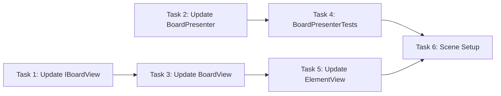

# Step 6: Swap Logic + Validation

## Overview
Свап с валидацией: элементы меняются местами только если это создает матч. Если свап не создает матч — элементы возвращаются обратно (rollback). BoardPresenter получает зависимость от IMatchService для валидации. BoardView получает методы анимации свапа.

## Prerequisites
- Step 5 (IInputService, InputService, drag handling)
- Step 3 (IMatchService, MatchService)
- Step 4 (BoardPresenter, IBoardView, BoardView)
- Step 1 (BoardModel, GridPosition)

---

## 0. Parallel Execution Plan

### Task Dependency Graph


### Parallel Groups
| Group | Tasks | Can Run In Parallel |
|-------|-------|---------------------|
| Group A | Update IBoardView, Update BoardPresenter | Yes |
| Group B | Update BoardView | After IBoardView |
| Group C | Update ElementView | After BoardView |
| Group D | BoardPresenterTests | After BoardPresenter |
| Group E | Scene Setup | After all |

### Task Assignments
- **Group A (Parallel):** `IBoardView.cs` (add SwapElements method), `BoardPresenter.cs` (add swap logic with match validation)
- **Group B:** `BoardView.cs` - implement SwapElements with animation
- **Group C:** `ElementView.cs` - add MoveTo method for animation
- **Group D:** `BoardPresenterTests.cs` - test swap validation logic
- **Group E:** `Step6SceneSetup.cs` - test full swap flow

---

## 1. Components

### 1.1 IBoardView (UPDATE)
**Type:** Interface
**Responsibility:** Add SwapElements method for swap animation
**Path:** `Assets/Scripts/Features/Board/Views/IBoardView.cs`

### 1.2 BoardView (UPDATE)
**Type:** View (MonoBehaviour)
**Responsibility:** Implement SwapElements with animation callback
**Path:** `Assets/Scripts/Features/Board/Views/BoardView.cs`

### 1.3 IElementView (UPDATE)
**Type:** Interface
**Responsibility:** Add MoveTo method for position animation
**Path:** `Assets/Scripts/Features/Board/Views/IElementView.cs`

### 1.4 ElementView (UPDATE)
**Type:** View (MonoBehaviour)
**Responsibility:** Implement MoveTo with lerp animation
**Path:** `Assets/Scripts/Features/Board/Views/ElementView.cs`

### 1.5 BoardPresenter (UPDATE)
**Type:** Presenter (Pure C#)
**Responsibility:** Handle swap requests, validate with MatchService, coordinate view
**Path:** `Assets/Scripts/Features/Board/Presenters/BoardPresenter.cs`
**Dependencies:** BoardModel, IBoardView, IMatchService, IInputService

### 1.6 GameConfig (UPDATE)
**Type:** ScriptableObject
**Responsibility:** Already has SwapDuration, already configured

---

## 2. Interfaces

### 2.1 IBoardView.cs (UPDATED)

```csharp
// Assets/Scripts/Features/Board/Views/IBoardView.cs
using System;
using Common;

namespace Features.Board.Views
{
    public interface IBoardView
    {
        void Initialize(int width, int height, float cellSize);
        void CreateElement(GridPosition pos, ElementType type);
        void RemoveElement(GridPosition pos);
        void Clear();

        /// <summary>
        /// Swap two elements visually with animation.
        /// </summary>
        void SwapElements(GridPosition from, GridPosition to, Action onComplete);

        event Action<GridPosition> OnCellClicked;
        event Action<GridPosition, GridPosition> OnSwapAttempted;
    }
}
```

### 2.2 IElementView.cs (UPDATED)

```csharp
// Assets/Scripts/Features/Board/Views/IElementView.cs
using System;
using Common;
using UnityEngine;

namespace Features.Board.Views
{
    public interface IElementView
    {
        GridPosition Position { get; }
        ElementType Type { get; }

        void Initialize(GridPosition pos, ElementType type, Sprite sprite);
        void SetSprite(Sprite sprite);
        void UpdatePosition(Vector3 worldPosition);
        void SetActive(bool active);
        void Destroy();

        /// <summary>
        /// Animate movement to new position.
        /// </summary>
        void MoveTo(Vector3 targetPosition, float duration, Action onComplete);

        /// <summary>
        /// Update logical grid position (after swap completes).
        /// </summary>
        void SetGridPosition(GridPosition newPos);
    }
}
```

---

## 3. Implementation Specs

### 3.1 IBoardView.cs (FULL FILE)

```csharp
// Assets/Scripts/Features/Board/Views/IBoardView.cs
using System;
using Common;

namespace Features.Board.Views
{
    public interface IBoardView
    {
        void Initialize(int width, int height, float cellSize);
        void CreateElement(GridPosition pos, ElementType type);
        void RemoveElement(GridPosition pos);
        void Clear();

        /// <summary>
        /// Swap two elements visually with animation.
        /// Calls onComplete when both elements finish moving.
        /// </summary>
        void SwapElements(GridPosition from, GridPosition to, Action onComplete);

        event Action<GridPosition> OnCellClicked;
        event Action<GridPosition, GridPosition> OnSwapAttempted;
    }
}
```

### 3.2 IElementView.cs (FULL FILE)

```csharp
// Assets/Scripts/Features/Board/Views/IElementView.cs
using System;
using Common;
using UnityEngine;

namespace Features.Board.Views
{
    public interface IElementView
    {
        GridPosition Position { get; }
        ElementType Type { get; }

        void Initialize(GridPosition pos, ElementType type, Sprite sprite);
        void SetSprite(Sprite sprite);
        void UpdatePosition(Vector3 worldPosition);
        void SetActive(bool active);
        void Destroy();

        /// <summary>
        /// Animate movement to target position over duration seconds.
        /// </summary>
        void MoveTo(Vector3 targetPosition, float duration, Action onComplete);

        /// <summary>
        /// Update logical grid position (after swap/move completes).
        /// </summary>
        void SetGridPosition(GridPosition newPos);
    }
}
```

### 3.3 ElementView.cs (FULL FILE)

```csharp
// Assets/Scripts/Features/Board/Views/ElementView.cs
using System;
using System.Collections;
using Common;
using UnityEngine;

namespace Features.Board.Views
{
    [RequireComponent(typeof(SpriteRenderer))]
    public class ElementView : MonoBehaviour, IElementView
    {
        private SpriteRenderer _spriteRenderer;
        private Coroutine _moveCoroutine;

        public GridPosition Position { get; private set; }
        public ElementType Type { get; private set; }

        private void Awake()
        {
            _spriteRenderer = GetComponent<SpriteRenderer>();
        }

        public void Initialize(GridPosition pos, ElementType type, Sprite sprite)
        {
            Position = pos;
            Type = type;
            SetSprite(sprite);
            gameObject.name = $"Element_{pos.X}_{pos.Y}_{type}";
        }

        public void SetSprite(Sprite sprite)
        {
            if (_spriteRenderer == null)
                _spriteRenderer = GetComponent<SpriteRenderer>();

            _spriteRenderer.sprite = sprite;
        }

        public void UpdatePosition(Vector3 worldPosition)
        {
            transform.position = worldPosition;
        }

        public void SetActive(bool active)
        {
            gameObject.SetActive(active);
        }

        public void SetGridPosition(GridPosition newPos)
        {
            Position = newPos;
            gameObject.name = $"Element_{newPos.X}_{newPos.Y}_{Type}";
        }

        public void MoveTo(Vector3 targetPosition, float duration, Action onComplete)
        {
            if (_moveCoroutine != null)
            {
                StopCoroutine(_moveCoroutine);
            }

            if (duration <= 0f)
            {
                transform.position = targetPosition;
                onComplete?.Invoke();
                return;
            }

            _moveCoroutine = StartCoroutine(MoveCoroutine(targetPosition, duration, onComplete));
        }

        private IEnumerator MoveCoroutine(Vector3 targetPosition, float duration, Action onComplete)
        {
            Vector3 startPosition = transform.position;
            float elapsed = 0f;

            while (elapsed < duration)
            {
                elapsed += Time.deltaTime;
                float t = Mathf.Clamp01(elapsed / duration);

                // Ease out quad for smooth deceleration
                t = 1f - (1f - t) * (1f - t);

                transform.position = Vector3.Lerp(startPosition, targetPosition, t);
                yield return null;
            }

            transform.position = targetPosition;
            _moveCoroutine = null;
            onComplete?.Invoke();
        }

        public void Destroy()
        {
            if (_moveCoroutine != null)
            {
                StopCoroutine(_moveCoroutine);
                _moveCoroutine = null;
            }

            if (Application.isPlaying)
                UnityEngine.Object.Destroy(gameObject);
            else
                UnityEngine.Object.DestroyImmediate(gameObject);
        }
    }
}
```

### 3.4 BoardView.cs (FULL FILE)

```csharp
// Assets/Scripts/Features/Board/Views/BoardView.cs
using System;
using System.Collections.Generic;
using Common;
using Configs;
using UnityEngine;

namespace Features.Board.Views
{
    public class BoardView : MonoBehaviour, IBoardView
    {
        [SerializeField] private GameConfig _config;

        private int _width;
        private int _height;
        private float _cellSize;
        private Vector3 _originOffset;

        private readonly Dictionary<GridPosition, ElementView> _elementViews = new();

        public event Action<GridPosition> OnCellClicked;
        public event Action<GridPosition, GridPosition> OnSwapAttempted;

        public void Initialize(int width, int height, float cellSize)
        {
            _width = width;
            _height = height;
            _cellSize = cellSize;

            _originOffset = new Vector3(
                -(_width - 1) * _cellSize * 0.5f,
                -(_height - 1) * _cellSize * 0.5f,
                0f
            );
        }

        public void CreateElement(GridPosition pos, ElementType type)
        {
            if (_elementViews.ContainsKey(pos))
            {
                RemoveElement(pos);
            }

            var sprite = GetSpriteForType(type);
            if (sprite == null) return;

            var elementGO = new GameObject($"Element_{pos.X}_{pos.Y}");
            elementGO.transform.SetParent(transform);

            var elementView = elementGO.AddComponent<ElementView>();
            elementView.Initialize(pos, type, sprite);
            elementView.UpdatePosition(GridToWorld(pos));

            _elementViews[pos] = elementView;
        }

        public void RemoveElement(GridPosition pos)
        {
            if (_elementViews.TryGetValue(pos, out var view))
            {
                view.Destroy();
                _elementViews.Remove(pos);
            }
        }

        public void Clear()
        {
            foreach (var view in _elementViews.Values)
            {
                view.Destroy();
            }
            _elementViews.Clear();
        }

        public void SwapElements(GridPosition from, GridPosition to, Action onComplete)
        {
            if (!_elementViews.TryGetValue(from, out var viewFrom) ||
                !_elementViews.TryGetValue(to, out var viewTo))
            {
                onComplete?.Invoke();
                return;
            }

            float duration = _config != null ? _config.SwapDuration : 0.3f;
            int completedCount = 0;

            void OnMoveComplete()
            {
                completedCount++;
                if (completedCount >= 2)
                {
                    // Update dictionary keys after swap
                    _elementViews.Remove(from);
                    _elementViews.Remove(to);

                    viewFrom.SetGridPosition(to);
                    viewTo.SetGridPosition(from);

                    _elementViews[to] = viewFrom;
                    _elementViews[from] = viewTo;

                    onComplete?.Invoke();
                }
            }

            Vector3 targetFrom = GridToWorld(to);
            Vector3 targetTo = GridToWorld(from);

            viewFrom.MoveTo(targetFrom, duration, OnMoveComplete);
            viewTo.MoveTo(targetTo, duration, OnMoveComplete);
        }

        private Vector3 GridToWorld(GridPosition pos)
        {
            return transform.position + _originOffset + new Vector3(
                pos.X * _cellSize,
                pos.Y * _cellSize,
                0f
            );
        }

        private Sprite GetSpriteForType(ElementType type)
        {
            if (_config == null || _config.ElementSprites == null)
                return null;

            int index = (int)type - 1;
            if (index >= 0 && index < _config.ElementSprites.Length)
                return _config.ElementSprites[index];

            return null;
        }

        public void SetConfig(GameConfig config)
        {
            _config = config;
        }

        private void OnDestroy()
        {
            Clear();
        }
    }
}
```

### 3.5 BoardPresenter.cs (FULL FILE)

```csharp
// Assets/Scripts/Features/Board/Presenters/BoardPresenter.cs
using System;
using Common;
using Features.Board.Models;
using Features.Board.Views;
using Features.Board.Services;

namespace Features.Board.Presenters
{
    public class BoardPresenter : IDisposable
    {
        private readonly BoardModel _model;
        private readonly IBoardView _view;
        private readonly IMatchService _matchService;
        private readonly IInputService _inputService;

        private bool _isSwapping;

        public BoardPresenter(
            BoardModel model,
            IBoardView view,
            float cellSize,
            IMatchService matchService = null,
            IInputService inputService = null)
        {
            _model = model;
            _view = view;
            _matchService = matchService;
            _inputService = inputService;

            _view.Initialize(_model.Width, _model.Height, cellSize);

            _model.OnElementAdded += HandleElementAdded;
            _model.OnElementRemoved += HandleElementRemoved;

            if (_inputService != null)
            {
                _inputService.OnSwapRequested += HandleSwapRequested;
            }

            if (_view is IBoardView viewWithEvents)
            {
                viewWithEvents.OnSwapAttempted += HandleSwapAttempted;
            }
        }

        private void HandleElementAdded(GridPosition pos, ElementType type)
        {
            _view.CreateElement(pos, type);
        }

        private void HandleElementRemoved(GridPosition pos)
        {
            _view.RemoveElement(pos);
        }

        private void HandleSwapAttempted(GridPosition from, GridPosition to)
        {
            _inputService?.RequestSwap(from, to);
        }

        private void HandleSwapRequested(GridPosition from, GridPosition to)
        {
            if (_isSwapping) return;

            TrySwap(from, to);
        }

        /// <summary>
        /// Attempt to swap elements at two positions.
        /// If swap creates a match, it persists. Otherwise, elements swap back.
        /// </summary>
        public void TrySwap(GridPosition from, GridPosition to)
        {
            if (_isSwapping) return;

            var elementFrom = _model.GetElement(from);
            var elementTo = _model.GetElement(to);

            if (elementFrom == null || elementTo == null)
                return;

            _isSwapping = true;
            _inputService?.SetInputEnabled(false);

            // Perform swap in model first
            _model.SwapElements(from, to);

            // Animate the swap
            _view.SwapElements(from, to, () => OnSwapAnimationComplete(from, to));
        }

        private void OnSwapAnimationComplete(GridPosition from, GridPosition to)
        {
            bool createsMatch = CheckForMatches(from, to);

            if (!createsMatch)
            {
                // Rollback: swap back in model
                _model.SwapElements(from, to);

                // Animate swap back
                _view.SwapElements(from, to, OnRollbackComplete);
            }
            else
            {
                // Valid swap - matches will be processed by GameplayCoordinator (Step 7+)
                OnSwapSuccess();
            }
        }

        private bool CheckForMatches(GridPosition from, GridPosition to)
        {
            if (_matchService == null) return true;

            var matchesFrom = _matchService.FindMatchesAt(_model, from);
            var matchesTo = _matchService.FindMatchesAt(_model, to);

            return matchesFrom.Count > 0 || matchesTo.Count > 0;
        }

        private void OnRollbackComplete()
        {
            _isSwapping = false;
            _inputService?.SetInputEnabled(true);
        }

        private void OnSwapSuccess()
        {
            _isSwapping = false;
            _inputService?.SetInputEnabled(true);
            // GameplayCoordinator will handle match detection in Step 7+
        }

        public void SyncViewWithModel()
        {
            _view.Clear();

            for (int x = 0; x < _model.Width; x++)
            {
                for (int y = 0; y < _model.Height; y++)
                {
                    var pos = new GridPosition(x, y);
                    var element = _model.GetElement(pos);
                    if (element != null)
                    {
                        _view.CreateElement(pos, element.Type);
                    }
                }
            }
        }

        public bool IsSwapping => _isSwapping;

        public void Dispose()
        {
            _model.OnElementAdded -= HandleElementAdded;
            _model.OnElementRemoved -= HandleElementRemoved;

            if (_inputService != null)
            {
                _inputService.OnSwapRequested -= HandleSwapRequested;
            }

            if (_view is IBoardView viewWithEvents)
            {
                viewWithEvents.OnSwapAttempted -= HandleSwapAttempted;
            }
        }
    }
}
```

---

## 4. Test Specs

### 4.1 BoardModelTests.cs (ADDITIONS)

The existing tests already cover SwapElements. No additional tests needed for BoardModel in this step.

### 4.2 BoardPresenterTests.cs (NEW FILE)

```csharp
// Assets/Tests/EditMode/Features/Board/BoardPresenterTests.cs
using System;
using System.Collections.Generic;
using NUnit.Framework;
using NSubstitute;
using Common;
using Features.Board.Models;
using Features.Board.Views;
using Features.Board.Services;
using Features.Board.Presenters;

namespace Features.Board.Presenters
{
    [TestFixture]
    public class BoardPresenterTests
    {
        private BoardModel _model;
        private IBoardView _view;
        private IMatchService _matchService;
        private IInputService _inputService;
        private BoardPresenter _presenter;

        private const int Width = 8;
        private const int Height = 8;
        private const float CellSize = 1f;

        [SetUp]
        public void SetUp()
        {
            _model = new BoardModel(Width, Height);
            _view = Substitute.For<IBoardView>();
            _matchService = Substitute.For<IMatchService>();
            _inputService = Substitute.For<IInputService>();

            _presenter = new BoardPresenter(
                _model,
                _view,
                CellSize,
                _matchService,
                _inputService);
        }

        [TearDown]
        public void TearDown()
        {
            _presenter.Dispose();
        }

        // === Constructor Tests ===

        [Test]
        public void Constructor_InitializesView()
        {
            _view.Received(1).Initialize(Width, Height, CellSize);
        }

        [Test]
        public void Constructor_SubscribesToModelEvents()
        {
            var pos = new GridPosition(0, 0);
            _model.SetElement(pos, new Element(ElementType.Red));

            _view.Received(1).CreateElement(pos, ElementType.Red);
        }

        // === TrySwap Tests ===

        [Test]
        public void TrySwap_WithValidPositions_SwapsInModel()
        {
            var posA = new GridPosition(0, 0);
            var posB = new GridPosition(1, 0);
            var elementA = new Element(ElementType.Red);
            var elementB = new Element(ElementType.Blue);
            _model.SetElement(posA, elementA);
            _model.SetElement(posB, elementB);

            // Setup match service to return matches (valid swap)
            _matchService.FindMatchesAt(_model, Arg.Any<GridPosition>())
                .Returns(new List<GridPosition> { posA });

            _presenter.TrySwap(posA, posB);

            // Model should have swapped
            Assert.AreEqual(elementB, _model.GetElement(posA));
            Assert.AreEqual(elementA, _model.GetElement(posB));
        }

        [Test]
        public void TrySwap_CallsViewSwapElements()
        {
            var posA = new GridPosition(0, 0);
            var posB = new GridPosition(1, 0);
            _model.SetElement(posA, new Element(ElementType.Red));
            _model.SetElement(posB, new Element(ElementType.Blue));

            _matchService.FindMatchesAt(_model, Arg.Any<GridPosition>())
                .Returns(new List<GridPosition> { posA });

            _presenter.TrySwap(posA, posB);

            _view.Received(1).SwapElements(posA, posB, Arg.Any<Action>());
        }

        [Test]
        public void TrySwap_WithEmptyPosition_DoesNotSwap()
        {
            var posA = new GridPosition(0, 0);
            var posB = new GridPosition(1, 0);
            _model.SetElement(posA, new Element(ElementType.Red));
            // posB is empty

            _presenter.TrySwap(posA, posB);

            _view.DidNotReceive().SwapElements(Arg.Any<GridPosition>(), Arg.Any<GridPosition>(), Arg.Any<Action>());
        }

        [Test]
        public void TrySwap_WhenAlreadySwapping_DoesNothing()
        {
            var posA = new GridPosition(0, 0);
            var posB = new GridPosition(1, 0);
            _model.SetElement(posA, new Element(ElementType.Red));
            _model.SetElement(posB, new Element(ElementType.Blue));

            _matchService.FindMatchesAt(_model, Arg.Any<GridPosition>())
                .Returns(new List<GridPosition> { posA });

            // Start first swap
            _presenter.TrySwap(posA, posB);

            // Clear received calls
            _view.ClearReceivedCalls();

            // Try second swap while first is in progress
            var posC = new GridPosition(2, 0);
            var posD = new GridPosition(3, 0);
            _model.SetElement(posC, new Element(ElementType.Green));
            _model.SetElement(posD, new Element(ElementType.Yellow));

            _presenter.TrySwap(posC, posD);

            _view.DidNotReceive().SwapElements(posC, posD, Arg.Any<Action>());
        }

        [Test]
        public void TrySwap_SetsIsSwappingTrue()
        {
            var posA = new GridPosition(0, 0);
            var posB = new GridPosition(1, 0);
            _model.SetElement(posA, new Element(ElementType.Red));
            _model.SetElement(posB, new Element(ElementType.Blue));

            _presenter.TrySwap(posA, posB);

            Assert.IsTrue(_presenter.IsSwapping);
        }

        [Test]
        public void TrySwap_DisablesInput()
        {
            var posA = new GridPosition(0, 0);
            var posB = new GridPosition(1, 0);
            _model.SetElement(posA, new Element(ElementType.Red));
            _model.SetElement(posB, new Element(ElementType.Blue));

            _presenter.TrySwap(posA, posB);

            _inputService.Received(1).SetInputEnabled(false);
        }

        // === Match Validation Tests ===

        [Test]
        public void TrySwap_NoMatchCreated_RollsBackSwap()
        {
            var posA = new GridPosition(0, 0);
            var posB = new GridPosition(1, 0);
            var elementA = new Element(ElementType.Red);
            var elementB = new Element(ElementType.Blue);
            _model.SetElement(posA, elementA);
            _model.SetElement(posB, elementB);

            // Match service returns NO matches (invalid swap)
            _matchService.FindMatchesAt(_model, Arg.Any<GridPosition>())
                .Returns(new List<GridPosition>());

            Action swapCallback = null;
            _view.SwapElements(posA, posB, Arg.Do<Action>(cb => swapCallback = cb));

            _presenter.TrySwap(posA, posB);

            // After first swap animation completes
            swapCallback?.Invoke();

            // Should call swap again (rollback animation)
            _view.Received(2).SwapElements(Arg.Any<GridPosition>(), Arg.Any<GridPosition>(), Arg.Any<Action>());
        }

        [Test]
        public void TrySwap_NoMatchCreated_RestoresModelState()
        {
            var posA = new GridPosition(0, 0);
            var posB = new GridPosition(1, 0);
            var elementA = new Element(ElementType.Red);
            var elementB = new Element(ElementType.Blue);
            _model.SetElement(posA, elementA);
            _model.SetElement(posB, elementB);

            // No matches
            _matchService.FindMatchesAt(_model, Arg.Any<GridPosition>())
                .Returns(new List<GridPosition>());

            Action swapCallback = null;
            _view.SwapElements(posA, posB, Arg.Do<Action>(cb => swapCallback = cb));

            _presenter.TrySwap(posA, posB);
            swapCallback?.Invoke();

            // Model should be back to original state
            Assert.AreEqual(elementA, _model.GetElement(posA));
            Assert.AreEqual(elementB, _model.GetElement(posB));
        }

        [Test]
        public void TrySwap_MatchFromFirstPosition_IsValid()
        {
            var posA = new GridPosition(0, 0);
            var posB = new GridPosition(1, 0);
            _model.SetElement(posA, new Element(ElementType.Red));
            _model.SetElement(posB, new Element(ElementType.Blue));

            // Only position A creates match
            _matchService.FindMatchesAt(_model, posA)
                .Returns(new List<GridPosition> { posA, new GridPosition(0, 1), new GridPosition(0, 2) });
            _matchService.FindMatchesAt(_model, posB)
                .Returns(new List<GridPosition>());

            Action swapCallback = null;
            _view.SwapElements(posA, posB, Arg.Do<Action>(cb => swapCallback = cb));

            _presenter.TrySwap(posA, posB);
            swapCallback?.Invoke();

            // Should NOT rollback (only one call to SwapElements)
            _view.Received(1).SwapElements(Arg.Any<GridPosition>(), Arg.Any<GridPosition>(), Arg.Any<Action>());
        }

        [Test]
        public void TrySwap_MatchFromSecondPosition_IsValid()
        {
            var posA = new GridPosition(0, 0);
            var posB = new GridPosition(1, 0);
            _model.SetElement(posA, new Element(ElementType.Red));
            _model.SetElement(posB, new Element(ElementType.Blue));

            // Only position B creates match
            _matchService.FindMatchesAt(_model, posA)
                .Returns(new List<GridPosition>());
            _matchService.FindMatchesAt(_model, posB)
                .Returns(new List<GridPosition> { posB, new GridPosition(1, 1), new GridPosition(1, 2) });

            Action swapCallback = null;
            _view.SwapElements(posA, posB, Arg.Do<Action>(cb => swapCallback = cb));

            _presenter.TrySwap(posA, posB);
            swapCallback?.Invoke();

            // Should NOT rollback
            _view.Received(1).SwapElements(Arg.Any<GridPosition>(), Arg.Any<GridPosition>(), Arg.Any<Action>());
        }

        // === Input Service Integration ===

        [Test]
        public void WhenSwapRequested_CallsTrySwap()
        {
            var posA = new GridPosition(0, 0);
            var posB = new GridPosition(1, 0);
            _model.SetElement(posA, new Element(ElementType.Red));
            _model.SetElement(posB, new Element(ElementType.Blue));

            _matchService.FindMatchesAt(_model, Arg.Any<GridPosition>())
                .Returns(new List<GridPosition> { posA });

            // Simulate input service event
            _inputService.OnSwapRequested += Raise.Event<Action<GridPosition, GridPosition>>(posA, posB);

            _view.Received(1).SwapElements(posA, posB, Arg.Any<Action>());
        }

        [Test]
        public void AfterValidSwap_ReEnablesInput()
        {
            var posA = new GridPosition(0, 0);
            var posB = new GridPosition(1, 0);
            _model.SetElement(posA, new Element(ElementType.Red));
            _model.SetElement(posB, new Element(ElementType.Blue));

            _matchService.FindMatchesAt(_model, Arg.Any<GridPosition>())
                .Returns(new List<GridPosition> { posA });

            Action swapCallback = null;
            _view.SwapElements(posA, posB, Arg.Do<Action>(cb => swapCallback = cb));

            _presenter.TrySwap(posA, posB);
            _inputService.ClearReceivedCalls();

            swapCallback?.Invoke();

            _inputService.Received(1).SetInputEnabled(true);
        }

        [Test]
        public void AfterRollback_ReEnablesInput()
        {
            var posA = new GridPosition(0, 0);
            var posB = new GridPosition(1, 0);
            _model.SetElement(posA, new Element(ElementType.Red));
            _model.SetElement(posB, new Element(ElementType.Blue));

            // No matches
            _matchService.FindMatchesAt(_model, Arg.Any<GridPosition>())
                .Returns(new List<GridPosition>());

            Action swapCallback = null;
            Action rollbackCallback = null;
            int callCount = 0;

            _view.SwapElements(Arg.Any<GridPosition>(), Arg.Any<GridPosition>(),
                Arg.Do<Action>(cb =>
                {
                    if (callCount == 0) swapCallback = cb;
                    else rollbackCallback = cb;
                    callCount++;
                }));

            _presenter.TrySwap(posA, posB);
            _inputService.ClearReceivedCalls();

            swapCallback?.Invoke(); // Triggers rollback
            rollbackCallback?.Invoke(); // Completes rollback

            _inputService.Received(1).SetInputEnabled(true);
        }

        // === Dispose Tests ===

        [Test]
        public void Dispose_UnsubscribesFromModelEvents()
        {
            _presenter.Dispose();
            _view.ClearReceivedCalls();

            _model.SetElement(new GridPosition(0, 0), new Element(ElementType.Red));

            _view.DidNotReceive().CreateElement(Arg.Any<GridPosition>(), Arg.Any<ElementType>());
        }

        // === No MatchService Tests ===

        [Test]
        public void TrySwap_WithoutMatchService_AlwaysSucceeds()
        {
            // Create presenter without match service
            _presenter.Dispose();
            _presenter = new BoardPresenter(_model, _view, CellSize, null, _inputService);

            var posA = new GridPosition(0, 0);
            var posB = new GridPosition(1, 0);
            _model.SetElement(posA, new Element(ElementType.Red));
            _model.SetElement(posB, new Element(ElementType.Blue));

            Action swapCallback = null;
            _view.SwapElements(posA, posB, Arg.Do<Action>(cb => swapCallback = cb));

            _presenter.TrySwap(posA, posB);
            swapCallback?.Invoke();

            // Should only be called once (no rollback)
            _view.Received(1).SwapElements(Arg.Any<GridPosition>(), Arg.Any<GridPosition>(), Arg.Any<Action>());
        }
    }
}
```

---

## 5. Scene Setup Script

```csharp
// Assets/Scripts/Editor/Setup/Step6SceneSetup.cs
using UnityEngine;
using UnityEditor;
using Configs;
using Features.Board.Views;
using Features.Board.Models;
using Features.Board.Presenters;
using Features.Board.Services;
using Common;

namespace Editor.Setup
{
    public static class Step6SceneSetup
    {
        private const string ConfigPath = "Assets/Configs/GameConfig.asset";

        [MenuItem("Setup/Step 6 - Swap + Validation")]
        public static void Setup()
        {
            ClearPreviousSetup();

            var config = LoadOrCreateConfig();
            if (config == null)
            {
                Debug.LogError("[Step 6] Failed to load GameConfig!");
                return;
            }

            CreateBoardWithSwap(config);
            SetupCamera(config);

            Debug.Log("[Step 6] Scene setup complete.");
            Debug.Log("[Step 6] Enter Play mode and drag elements to test swap with validation.");
            Debug.Log("[Step 6] Valid swaps (create match) will stay. Invalid swaps will rollback.");
        }

        private static void ClearPreviousSetup()
        {
            var existing = GameObject.Find("[Board]");
            if (existing != null)
            {
                Object.DestroyImmediate(existing);
            }
        }

        private static GameConfig LoadOrCreateConfig()
        {
            var config = AssetDatabase.LoadAssetAtPath<GameConfig>(ConfigPath);

            if (config == null)
            {
                Debug.LogWarning("[Step 6] GameConfig not found. Run Step 2 setup first.");
            }

            return config;
        }

        private static void CreateBoardWithSwap(GameConfig config)
        {
            var boardGO = new GameObject("[Board]");
            var boardView = boardGO.AddComponent<BoardView>();
            boardView.SetConfig(config);

            var initializer = boardGO.AddComponent<Step6Initializer>();
            initializer.Config = config;

            EditorUtility.SetDirty(boardGO);
        }

        private static void SetupCamera(GameConfig config)
        {
            var camera = Camera.main;
            if (camera == null)
            {
                var cameraGO = new GameObject("Main Camera");
                camera = cameraGO.AddComponent<Camera>();
                cameraGO.tag = "MainCamera";
            }

            camera.orthographic = true;

            float gridHeight = config.GridHeight * 1f;
            float gridWidth = config.GridWidth * 1f;
            float aspectRatio = (float)Screen.width / Screen.height;

            float verticalSize = gridHeight * 0.6f;
            float horizontalSize = (gridWidth * 0.6f) / aspectRatio;

            camera.orthographicSize = Mathf.Max(verticalSize, horizontalSize);
            camera.transform.position = new Vector3(0, 0, -10);
            camera.backgroundColor = new Color(0.2f, 0.2f, 0.3f);

            EditorUtility.SetDirty(camera.gameObject);
        }

        [MenuItem("Setup/Step 6 - Swap + Validation", validate = true)]
        private static bool ValidateSetup()
        {
            return !EditorApplication.isPlaying;
        }
    }
}
```

### 5.1 Step6Initializer.cs

```csharp
// Assets/Scripts/Editor/Setup/Step6Initializer.cs
using UnityEngine;
using Configs;
using Features.Board.Views;
using Features.Board.Models;
using Features.Board.Presenters;
using Features.Board.Services;
using Common;

namespace Editor.Setup
{
    /// <summary>
    /// Runtime initializer for testing Swap + Validation.
    /// Creates a board where some swaps create matches and some don't.
    /// </summary>
    public class Step6Initializer : MonoBehaviour
    {
        public GameConfig Config;

        private BoardModel _model;
        private BoardPresenter _presenter;
        private InputService _inputService;
        private MatchService _matchService;

        private void Start()
        {
            if (Config == null)
            {
                Debug.LogError("[Step6Initializer] GameConfig is not assigned!");
                return;
            }

            var view = GetComponent<BoardView>();
            if (view == null)
            {
                Debug.LogError("[Step6Initializer] BoardView component not found!");
                return;
            }

            InitializeBoard(view);
        }

        private void InitializeBoard(BoardView view)
        {
            _model = new BoardModel(Config.GridWidth, Config.GridHeight);
            _inputService = new InputService();
            _matchService = new MatchService();

            _presenter = new BoardPresenter(
                _model,
                view,
                1f,
                _matchService,
                _inputService);

            // Connect BoardView to InputService
            view.OnSwapAttempted += HandleSwapAttempted;

            FillBoardForTesting();

            Debug.Log("[Step6Initializer] Board initialized for swap testing.");
            Debug.Log("[Step6Initializer] Try swapping elements - valid swaps stay, invalid ones rollback.");
        }

        private void HandleSwapAttempted(GridPosition from, GridPosition to)
        {
            Debug.Log($"[View] Swap attempted: {from} -> {to}");
            _inputService.RequestSwap(from, to);
        }

        /// <summary>
        /// Fill board with a pattern that allows some valid swaps.
        /// Creates a few "almost matches" that can be completed with swaps.
        /// </summary>
        private void FillBoardForTesting()
        {
            // Clear fill first
            for (int x = 0; x < Config.GridWidth; x++)
            {
                for (int y = 0; y < Config.GridHeight; y++)
                {
                    var pos = new GridPosition(x, y);
                    // Checkerboard-like pattern to avoid initial matches
                    var type = (ElementType)(((x + y) % 2) + 1);
                    _model.SetElement(pos, new Element(type));
                }
            }

            // Setup a scenario where swapping (2,0) with (3,0) creates a match
            // Row 0: Red, Red, Blue, Red, ...
            // If we swap Blue at (2,0) with Red at (3,0), row becomes:
            // Red, Red, Red, Blue -> creates match!
            _model.SetElement(new GridPosition(0, 0), new Element(ElementType.Red));
            _model.SetElement(new GridPosition(1, 0), new Element(ElementType.Red));
            _model.SetElement(new GridPosition(2, 0), new Element(ElementType.Blue));
            _model.SetElement(new GridPosition(3, 0), new Element(ElementType.Red));

            // Setup vertical match opportunity at column 0
            // Column 0: Red (0,0), Blue (0,1), Red (0,2), Red (0,3)
            // Swapping Blue at (0,1) with adjacent Red creates vertical match
            _model.SetElement(new GridPosition(0, 1), new Element(ElementType.Blue));
            _model.SetElement(new GridPosition(0, 2), new Element(ElementType.Red));
            _model.SetElement(new GridPosition(0, 3), new Element(ElementType.Red));
            _model.SetElement(new GridPosition(1, 1), new Element(ElementType.Red));

            Debug.Log("[Step6Initializer] Test scenarios:");
            Debug.Log("  - Swap (2,0) <-> (3,0): Should create horizontal Red match");
            Debug.Log("  - Swap (0,1) <-> (1,1): Should create vertical Red match at column 0");
            Debug.Log("  - Other swaps: Should rollback (no match)");
        }

        private void OnDestroy()
        {
            _presenter?.Dispose();

            var view = GetComponent<BoardView>();
            if (view != null)
            {
                view.OnSwapAttempted -= HandleSwapAttempted;
            }
        }
    }
}
```

---

## 6. Validation Checklist

- [ ] All .cs files compile without errors
- [ ] All tests pass (`run_tests` EditMode)
- [ ] Scene Setup executes successfully
- [ ] `IBoardView` has SwapElements method with callback
- [ ] `IElementView` has MoveTo and SetGridPosition methods
- [ ] `ElementView.MoveTo` animates position with easing
- [ ] `BoardView.SwapElements` animates both elements and updates dictionary
- [ ] `BoardPresenter` receives IMatchService dependency
- [ ] `BoardPresenter` receives IInputService dependency
- [ ] `BoardPresenter.TrySwap` validates matches before confirming
- [ ] Invalid swap triggers rollback animation
- [ ] Valid swap (creates match) persists
- [ ] Input disabled during swap animation
- [ ] Input re-enabled after swap completes or rollback
- [ ] `IsSwapping` flag prevents concurrent swaps
- [ ] In Play mode: drag to swap works with animation
- [ ] Valid swap stays, invalid swap returns

---

## 7. Files to Create/Update

### Updated Files

| File | Path | Action |
|------|------|--------|
| IBoardView.cs | Assets/Scripts/Features/Board/Views/ | ADD SwapElements method |
| IElementView.cs | Assets/Scripts/Features/Board/Views/ | ADD MoveTo, SetGridPosition |
| ElementView.cs | Assets/Scripts/Features/Board/Views/ | ADD MoveTo with coroutine |
| BoardView.cs | Assets/Scripts/Features/Board/Views/ | ADD SwapElements implementation |
| BoardPresenter.cs | Assets/Scripts/Features/Board/Presenters/ | ADD swap logic with validation |

### New Files

| File | Path | Type |
|------|------|------|
| BoardPresenterTests.cs | Assets/Tests/EditMode/Features/Board/ | Test |
| Step6SceneSetup.cs | Assets/Scripts/Editor/Setup/ | Editor Script |
| Step6Initializer.cs | Assets/Scripts/Editor/Setup/ | MonoBehaviour |

---

## 8. Directory Structure After Step 6

```
Assets/Scripts/
├── Features/
│   └── Board/
│       ├── Models/
│       │   ├── BoardModel.cs (unchanged)
│       │   ├── Cell.cs (unchanged)
│       │   └── Element.cs (unchanged)
│       ├── Presenters/
│       │   └── BoardPresenter.cs (UPDATED - swap logic)
│       ├── Views/
│       │   ├── IElementView.cs (UPDATED - MoveTo, SetGridPosition)
│       │   ├── ElementView.cs (UPDATED - MoveTo animation)
│       │   ├── IBoardView.cs (UPDATED - SwapElements)
│       │   └── BoardView.cs (UPDATED - SwapElements)
│       └── Services/
│           ├── ISpawnService.cs (unchanged)
│           ├── SpawnService.cs (unchanged)
│           ├── IMatchService.cs (unchanged)
│           ├── MatchService.cs (unchanged)
│           ├── IInputService.cs (unchanged)
│           └── InputService.cs (unchanged)
└── Editor/
    └── Setup/
        ├── Step2SceneSetup.cs (exists)
        ├── Step5SceneSetup.cs (exists)
        ├── Step5Initializer.cs (exists)
        ├── Step6SceneSetup.cs (NEW)
        └── Step6Initializer.cs (NEW)

Assets/Tests/EditMode/
└── Features/
    └── Board/
        ├── BoardModelTests.cs (unchanged)
        ├── SpawnServiceTests.cs (unchanged)
        ├── MatchServiceTests.cs (unchanged)
        ├── InputServiceTests.cs (unchanged)
        └── BoardPresenterTests.cs (NEW)
```

---

## 9. Integration Notes

### Swap Flow

```
User drags element (from Step 5)
    ↓
InputService.OnSwapRequested event
    ↓
BoardPresenter.HandleSwapRequested()
    ↓
BoardPresenter.TrySwap(from, to)
    ↓
├── Check both positions have elements
├── Set IsSwapping = true
├── Disable input
├── Swap in BoardModel
├── Call BoardView.SwapElements(from, to, callback)
    ↓
BoardView animates both elements
    ↓
Animation complete callback
    ↓
BoardPresenter.OnSwapAnimationComplete()
    ↓
├── Check matches via MatchService
│   ├── If matches found → OnSwapSuccess (done)
│   └── If no matches → Rollback
│       ├── Swap back in BoardModel
│       ├── Call BoardView.SwapElements (reverse)
│       └── OnRollbackComplete
            ↓
Re-enable input, IsSwapping = false
```

### Match Validation Logic

```
After swap, check BOTH positions:
- from position (where element moved TO)
- to position (where element moved FROM)

If EITHER creates a match (3+ in line) → valid swap
If NEITHER creates a match → invalid, rollback
```

### Animation Details

ElementView.MoveTo uses ease-out-quad:
- `t = 1 - (1 - t)^2`
- Fast start, smooth deceleration
- Duration from GameConfig.SwapDuration (default 0.3s)

### How to Test

1. Run `Setup/Step 6 - Swap + Validation`
2. Enter Play mode
3. Test scenarios:
   - Swap (2,0) <-> (3,0): Creates horizontal Red match - should stay
   - Swap (0,1) <-> (1,1): Creates vertical Red match - should stay
   - Other swaps: Should animate back (rollback)
4. Check console for debug messages
5. Verify input is blocked during animations
