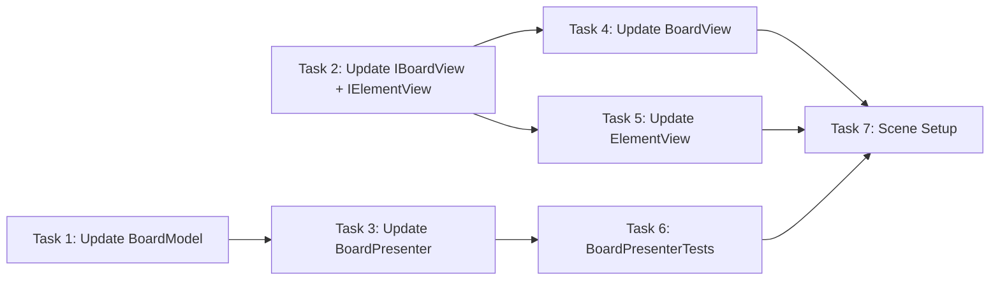

# Step 7: Destroy + Animation

## Overview
Уничтожение матчей с анимацией. BoardModel получает batch метод RemoveElements. BoardPresenter координирует уничтожение после успешного свапа. ElementView получает анимацию уничтожения (scale + fade). IBoardView получает batch метод DestroyElements с callback.

## Prerequisites
- Step 6 (Swap Logic + Validation) completed
- Step 3 (MatchService) completed
- Step 4 (BoardPresenter, IBoardView, BoardView, ElementView) completed
- Step 1 (BoardModel, GridPosition) completed

---

## 0. Parallel Execution Plan

### Task Dependency Graph


### Parallel Groups
| Group | Tasks | Can Run In Parallel |
|-------|-------|---------------------|
| Group A | Update BoardModel, Update Interfaces (IBoardView, IElementView) | Yes |
| Group B | Update BoardPresenter | After BoardModel |
| Group C | Update BoardView, Update ElementView | After Interfaces |
| Group D | BoardPresenterTests | After BoardPresenter |
| Group E | Scene Setup | After all |

### Task Assignments
- **Group A (Parallel):** `BoardModel.cs` (add RemoveElements batch), `IBoardView.cs` (add DestroyElements), `IElementView.cs` (add PlayDestroyAnimation)
- **Group B:** `BoardPresenter.cs` - add destroy coordination after match detection
- **Group C (Parallel):** `BoardView.cs` (implement DestroyElements), `ElementView.cs` (implement PlayDestroyAnimation with scale+fade)
- **Group D:** `BoardPresenterTests.cs` - add tests for destroy logic
- **Group E:** `Step7SceneSetup.cs` - test destroy flow

---

## 1. Components

### 1.1 BoardModel (UPDATE)
**Type:** Model (Pure C#)
**Responsibility:** Add RemoveElements batch method for removing multiple elements
**Path:** `Assets/Scripts/Features/Board/Models/BoardModel.cs`

### 1.2 IBoardView (UPDATE)
**Type:** Interface
**Responsibility:** Add DestroyElements batch method with callback
**Path:** `Assets/Scripts/Features/Board/Views/IBoardView.cs`

### 1.3 IElementView (UPDATE)
**Type:** Interface
**Responsibility:** Add PlayDestroyAnimation method
**Path:** `Assets/Scripts/Features/Board/Views/IElementView.cs`

### 1.4 BoardView (UPDATE)
**Type:** View (MonoBehaviour)
**Responsibility:** Implement DestroyElements with parallel animations
**Path:** `Assets/Scripts/Features/Board/Views/BoardView.cs`

### 1.5 ElementView (UPDATE)
**Type:** View (MonoBehaviour)
**Responsibility:** Implement PlayDestroyAnimation (scale + fade)
**Path:** `Assets/Scripts/Features/Board/Views/ElementView.cs`

### 1.6 BoardPresenter (UPDATE)
**Type:** Presenter (Pure C#)
**Responsibility:** Coordinate destroy after successful swap, call MatchService, trigger view animations
**Path:** `Assets/Scripts/Features/Board/Presenters/BoardPresenter.cs`

---

## 2. Interfaces

### 2.1 IBoardView.cs (UPDATED)

```csharp
// Assets/Scripts/Features/Board/Views/IBoardView.cs
using System;
using System.Collections.Generic;
using Common;

namespace Features.Board.Views
{
    public interface IBoardView
    {
        void Initialize(int width, int height, float cellSize);
        void CreateElement(GridPosition pos, ElementType type);
        void RemoveElement(GridPosition pos);
        void Clear();
        void SwapElements(GridPosition from, GridPosition to, Action onComplete);

        /// <summary>
        /// Destroy multiple elements with animation.
        /// Calls onComplete when ALL animations finish.
        /// </summary>
        void DestroyElements(List<GridPosition> positions, Action onComplete);

        event Action<GridPosition> OnCellClicked;
        event Action<GridPosition, GridPosition> OnSwapAttempted;
    }
}
```

### 2.2 IElementView.cs (UPDATED)

```csharp
// Assets/Scripts/Features/Board/Views/IElementView.cs
using System;
using Common;
using UnityEngine;

namespace Features.Board.Views
{
    public interface IElementView
    {
        GridPosition Position { get; }
        ElementType Type { get; }

        void Initialize(GridPosition pos, ElementType type, Sprite sprite);
        void SetSprite(Sprite sprite);
        void UpdatePosition(Vector3 worldPosition);
        void SetActive(bool active);
        void Destroy();
        void MoveTo(Vector3 targetPosition, float duration, Action onComplete);
        void SetGridPosition(GridPosition newPos);

        /// <summary>
        /// Play destroy animation (scale + fade) then destroy.
        /// </summary>
        void PlayDestroyAnimation(float duration, Action onComplete);
    }
}
```

---

## 3. Implementation Specs

### 3.1 BoardModel.cs (FULL FILE)

```csharp
// Assets/Scripts/Features/Board/Models/BoardModel.cs
using System;
using System.Collections.Generic;
using Common;

namespace Features.Board.Models
{
    public class BoardModel
    {
        public int Width { get; }
        public int Height { get; }

        private readonly Cell[,] _cells;

        public event Action<GridPosition, ElementType> OnElementAdded;
        public event Action<GridPosition> OnElementRemoved;
        public event Action<GridPosition, GridPosition> OnElementsSwapped;

        public BoardModel(int width, int height)
        {
            Width = width;
            Height = height;
            _cells = new Cell[width, height];
            InitializeCells();
        }

        private void InitializeCells()
        {
            for (int x = 0; x < Width; x++)
            {
                for (int y = 0; y < Height; y++)
                {
                    _cells[x, y] = new Cell(new GridPosition(x, y));
                }
            }
        }

        public bool IsValidPosition(GridPosition pos)
        {
            return pos.X >= 0 && pos.X < Width && pos.Y >= 0 && pos.Y < Height;
        }

        public Cell GetCell(GridPosition pos)
        {
            return IsValidPosition(pos) ? _cells[pos.X, pos.Y] : null;
        }

        public Element GetElement(GridPosition pos)
        {
            return GetCell(pos)?.Element;
        }

        public void SetElement(GridPosition pos, Element element)
        {
            var cell = GetCell(pos);
            if (cell == null) return;

            cell.SetElement(element);
            OnElementAdded?.Invoke(pos, element.Type);
        }

        public void RemoveElement(GridPosition pos)
        {
            var cell = GetCell(pos);
            if (cell == null || cell.IsEmpty) return;

            cell.RemoveElement();
            OnElementRemoved?.Invoke(pos);
        }

        /// <summary>
        /// Remove multiple elements at once.
        /// Fires OnElementRemoved for each valid position.
        /// </summary>
        public void RemoveElements(List<GridPosition> positions)
        {
            if (positions == null) return;

            foreach (var pos in positions)
            {
                RemoveElement(pos);
            }
        }

        public void SwapElements(GridPosition a, GridPosition b)
        {
            var cellA = GetCell(a);
            var cellB = GetCell(b);
            if (cellA == null || cellB == null) return;

            var elementA = cellA.Element;
            var elementB = cellB.Element;

            cellA.SetElement(elementB);
            cellB.SetElement(elementA);

            OnElementsSwapped?.Invoke(a, b);
        }
    }
}
```

### 3.2 IBoardView.cs (FULL FILE)

```csharp
// Assets/Scripts/Features/Board/Views/IBoardView.cs
using System;
using System.Collections.Generic;
using Common;

namespace Features.Board.Views
{
    public interface IBoardView
    {
        void Initialize(int width, int height, float cellSize);
        void CreateElement(GridPosition pos, ElementType type);
        void RemoveElement(GridPosition pos);
        void Clear();
        void SwapElements(GridPosition from, GridPosition to, Action onComplete);

        /// <summary>
        /// Destroy multiple elements with animation.
        /// Calls onComplete when ALL animations finish.
        /// </summary>
        void DestroyElements(List<GridPosition> positions, Action onComplete);

        event Action<GridPosition> OnCellClicked;
        event Action<GridPosition, GridPosition> OnSwapAttempted;
    }
}
```

### 3.3 IElementView.cs (FULL FILE)

```csharp
// Assets/Scripts/Features/Board/Views/IElementView.cs
using System;
using Common;
using UnityEngine;

namespace Features.Board.Views
{
    public interface IElementView
    {
        GridPosition Position { get; }
        ElementType Type { get; }

        void Initialize(GridPosition pos, ElementType type, Sprite sprite);
        void SetSprite(Sprite sprite);
        void UpdatePosition(Vector3 worldPosition);
        void SetActive(bool active);
        void Destroy();
        void MoveTo(Vector3 targetPosition, float duration, Action onComplete);
        void SetGridPosition(GridPosition newPos);

        /// <summary>
        /// Play destroy animation (scale + fade) then destroy.
        /// </summary>
        void PlayDestroyAnimation(float duration, Action onComplete);
    }
}
```

### 3.4 ElementView.cs (FULL FILE)

```csharp
// Assets/Scripts/Features/Board/Views/ElementView.cs
using System;
using System.Collections;
using Common;
using UnityEngine;

namespace Features.Board.Views
{
    [RequireComponent(typeof(SpriteRenderer))]
    public class ElementView : MonoBehaviour, IElementView
    {
        private SpriteRenderer _spriteRenderer;
        private Coroutine _moveCoroutine;
        private Coroutine _destroyCoroutine;

        public GridPosition Position { get; private set; }
        public ElementType Type { get; private set; }

        private void Awake()
        {
            _spriteRenderer = GetComponent<SpriteRenderer>();
        }

        public void Initialize(GridPosition pos, ElementType type, Sprite sprite)
        {
            Position = pos;
            Type = type;
            SetSprite(sprite);
            gameObject.name = $"Element_{pos.X}_{pos.Y}_{type}";
        }

        public void SetSprite(Sprite sprite)
        {
            if (_spriteRenderer == null)
                _spriteRenderer = GetComponent<SpriteRenderer>();

            _spriteRenderer.sprite = sprite;
        }

        public void UpdatePosition(Vector3 worldPosition)
        {
            transform.position = worldPosition;
        }

        public void SetActive(bool active)
        {
            gameObject.SetActive(active);
        }

        public void SetGridPosition(GridPosition newPos)
        {
            Position = newPos;
            gameObject.name = $"Element_{newPos.X}_{newPos.Y}_{Type}";
        }

        public void MoveTo(Vector3 targetPosition, float duration, Action onComplete)
        {
            if (_moveCoroutine != null)
            {
                StopCoroutine(_moveCoroutine);
            }

            if (duration <= 0f)
            {
                transform.position = targetPosition;
                onComplete?.Invoke();
                return;
            }

            _moveCoroutine = StartCoroutine(MoveCoroutine(targetPosition, duration, onComplete));
        }

        private IEnumerator MoveCoroutine(Vector3 targetPosition, float duration, Action onComplete)
        {
            Vector3 startPosition = transform.position;
            float elapsed = 0f;

            while (elapsed < duration)
            {
                elapsed += Time.deltaTime;
                float t = Mathf.Clamp01(elapsed / duration);
                t = 1f - (1f - t) * (1f - t); // Ease out quad

                transform.position = Vector3.Lerp(startPosition, targetPosition, t);
                yield return null;
            }

            transform.position = targetPosition;
            _moveCoroutine = null;
            onComplete?.Invoke();
        }

        public void PlayDestroyAnimation(float duration, Action onComplete)
        {
            if (_destroyCoroutine != null)
            {
                StopCoroutine(_destroyCoroutine);
            }

            if (duration <= 0f)
            {
                onComplete?.Invoke();
                Destroy();
                return;
            }

            _destroyCoroutine = StartCoroutine(DestroyCoroutine(duration, onComplete));
        }

        private IEnumerator DestroyCoroutine(float duration, Action onComplete)
        {
            Vector3 startScale = transform.localScale;
            Color startColor = _spriteRenderer.color;
            float elapsed = 0f;

            while (elapsed < duration)
            {
                elapsed += Time.deltaTime;
                float t = Mathf.Clamp01(elapsed / duration);

                // Ease in quad for acceleration effect
                float easedT = t * t;

                // Scale down
                transform.localScale = Vector3.Lerp(startScale, Vector3.zero, easedT);

                // Fade out
                Color newColor = startColor;
                newColor.a = Mathf.Lerp(1f, 0f, easedT);
                _spriteRenderer.color = newColor;

                yield return null;
            }

            transform.localScale = Vector3.zero;
            _destroyCoroutine = null;
            onComplete?.Invoke();
            Destroy();
        }

        public void Destroy()
        {
            if (_moveCoroutine != null)
            {
                StopCoroutine(_moveCoroutine);
                _moveCoroutine = null;
            }

            if (_destroyCoroutine != null)
            {
                StopCoroutine(_destroyCoroutine);
                _destroyCoroutine = null;
            }

            if (Application.isPlaying)
                UnityEngine.Object.Destroy(gameObject);
            else
                UnityEngine.Object.DestroyImmediate(gameObject);
        }
    }
}
```

### 3.5 BoardView.cs (FULL FILE)

```csharp
// Assets/Scripts/Features/Board/Views/BoardView.cs
using System;
using System.Collections.Generic;
using Common;
using Configs;
using UnityEngine;

namespace Features.Board.Views
{
    public class BoardView : MonoBehaviour, IBoardView
    {
        [SerializeField] private GameConfig _config;

        private int _width;
        private int _height;
        private float _cellSize;
        private Vector3 _originOffset;

        private readonly Dictionary<GridPosition, ElementView> _elementViews = new();

        public event Action<GridPosition> OnCellClicked;
        public event Action<GridPosition, GridPosition> OnSwapAttempted;

        public void Initialize(int width, int height, float cellSize)
        {
            _width = width;
            _height = height;
            _cellSize = cellSize;

            _originOffset = new Vector3(
                -(_width - 1) * _cellSize * 0.5f,
                -(_height - 1) * _cellSize * 0.5f,
                0f
            );
        }

        public void CreateElement(GridPosition pos, ElementType type)
        {
            if (_elementViews.ContainsKey(pos))
            {
                RemoveElement(pos);
            }

            var sprite = GetSpriteForType(type);
            if (sprite == null) return;

            var elementGO = new GameObject($"Element_{pos.X}_{pos.Y}");
            elementGO.transform.SetParent(transform);

            var elementView = elementGO.AddComponent<ElementView>();
            elementView.Initialize(pos, type, sprite);
            elementView.UpdatePosition(GridToWorld(pos));

            _elementViews[pos] = elementView;
        }

        public void RemoveElement(GridPosition pos)
        {
            if (_elementViews.TryGetValue(pos, out var view))
            {
                view.Destroy();
                _elementViews.Remove(pos);
            }
        }

        public void Clear()
        {
            foreach (var view in _elementViews.Values)
            {
                view.Destroy();
            }
            _elementViews.Clear();
        }

        public void SwapElements(GridPosition from, GridPosition to, Action onComplete)
        {
            if (!_elementViews.TryGetValue(from, out var viewFrom) ||
                !_elementViews.TryGetValue(to, out var viewTo))
            {
                onComplete?.Invoke();
                return;
            }

            float duration = _config != null ? _config.SwapDuration : 0.3f;
            int completedCount = 0;

            void OnMoveComplete()
            {
                completedCount++;
                if (completedCount >= 2)
                {
                    _elementViews.Remove(from);
                    _elementViews.Remove(to);

                    viewFrom.SetGridPosition(to);
                    viewTo.SetGridPosition(from);

                    _elementViews[to] = viewFrom;
                    _elementViews[from] = viewTo;

                    onComplete?.Invoke();
                }
            }

            Vector3 targetFrom = GridToWorld(to);
            Vector3 targetTo = GridToWorld(from);

            viewFrom.MoveTo(targetFrom, duration, OnMoveComplete);
            viewTo.MoveTo(targetTo, duration, OnMoveComplete);
        }

        public void DestroyElements(List<GridPosition> positions, Action onComplete)
        {
            if (positions == null || positions.Count == 0)
            {
                onComplete?.Invoke();
                return;
            }

            float duration = _config != null ? _config.DestroyDuration : 0.2f;
            int totalToDestroy = 0;
            int destroyedCount = 0;

            // Count valid positions
            foreach (var pos in positions)
            {
                if (_elementViews.ContainsKey(pos))
                {
                    totalToDestroy++;
                }
            }

            if (totalToDestroy == 0)
            {
                onComplete?.Invoke();
                return;
            }

            void OnDestroyComplete(GridPosition pos)
            {
                _elementViews.Remove(pos);
                destroyedCount++;

                if (destroyedCount >= totalToDestroy)
                {
                    onComplete?.Invoke();
                }
            }

            // Start all destroy animations in parallel
            foreach (var pos in positions)
            {
                if (_elementViews.TryGetValue(pos, out var view))
                {
                    var capturedPos = pos;
                    view.PlayDestroyAnimation(duration, () => OnDestroyComplete(capturedPos));
                }
            }
        }

        private Vector3 GridToWorld(GridPosition pos)
        {
            return transform.position + _originOffset + new Vector3(
                pos.X * _cellSize,
                pos.Y * _cellSize,
                0f
            );
        }

        private Sprite GetSpriteForType(ElementType type)
        {
            if (_config == null || _config.ElementSprites == null)
                return null;

            int index = (int)type - 1;
            if (index >= 0 && index < _config.ElementSprites.Length)
                return _config.ElementSprites[index];

            return null;
        }

        public void SetConfig(GameConfig config)
        {
            _config = config;
        }

        private void OnDestroy()
        {
            Clear();
        }
    }
}
```

### 3.6 BoardPresenter.cs (FULL FILE)

```csharp
// Assets/Scripts/Features/Board/Presenters/BoardPresenter.cs
using System;
using System.Collections.Generic;
using Common;
using Features.Board.Models;
using Features.Board.Views;
using Features.Board.Services;

namespace Features.Board.Presenters
{
    public class BoardPresenter : IDisposable
    {
        private readonly BoardModel _model;
        private readonly IBoardView _view;
        private readonly IMatchService _matchService;
        private readonly IInputService _inputService;

        private bool _isProcessing;

        public event Action OnMatchesDestroyed;

        public BoardPresenter(
            BoardModel model,
            IBoardView view,
            float cellSize,
            IMatchService matchService = null,
            IInputService inputService = null)
        {
            _model = model;
            _view = view;
            _matchService = matchService;
            _inputService = inputService;

            _view.Initialize(_model.Width, _model.Height, cellSize);

            _model.OnElementAdded += HandleElementAdded;
            _model.OnElementRemoved += HandleElementRemoved;

            if (_inputService != null)
            {
                _inputService.OnSwapRequested += HandleSwapRequested;
            }

            if (_view is IBoardView viewWithEvents)
            {
                viewWithEvents.OnSwapAttempted += HandleSwapAttempted;
            }
        }

        private void HandleElementAdded(GridPosition pos, ElementType type)
        {
            _view.CreateElement(pos, type);
        }

        private void HandleElementRemoved(GridPosition pos)
        {
            _view.RemoveElement(pos);
        }

        private void HandleSwapAttempted(GridPosition from, GridPosition to)
        {
            _inputService?.RequestSwap(from, to);
        }

        private void HandleSwapRequested(GridPosition from, GridPosition to)
        {
            if (_isProcessing) return;

            TrySwap(from, to);
        }

        public void TrySwap(GridPosition from, GridPosition to)
        {
            if (_isProcessing) return;

            var elementFrom = _model.GetElement(from);
            var elementTo = _model.GetElement(to);

            if (elementFrom == null || elementTo == null)
                return;

            _isProcessing = true;
            _inputService?.SetInputEnabled(false);

            _model.SwapElements(from, to);

            _view.SwapElements(from, to, () => OnSwapAnimationComplete(from, to));
        }

        private void OnSwapAnimationComplete(GridPosition from, GridPosition to)
        {
            bool createsMatch = CheckForMatches(from, to);

            if (!createsMatch)
            {
                _model.SwapElements(from, to);
                _view.SwapElements(from, to, OnRollbackComplete);
            }
            else
            {
                ProcessMatches(from, to);
            }
        }

        private bool CheckForMatches(GridPosition from, GridPosition to)
        {
            if (_matchService == null) return true;

            var matchesFrom = _matchService.FindMatchesAt(_model, from);
            var matchesTo = _matchService.FindMatchesAt(_model, to);

            return matchesFrom.Count > 0 || matchesTo.Count > 0;
        }

        private void ProcessMatches(GridPosition from, GridPosition to)
        {
            if (_matchService == null)
            {
                OnProcessingComplete();
                return;
            }

            var allMatches = new List<GridPosition>();

            var matchesFrom = _matchService.FindMatchesAt(_model, from);
            var matchesTo = _matchService.FindMatchesAt(_model, to);

            AddUniquePositions(allMatches, matchesFrom);
            AddUniquePositions(allMatches, matchesTo);

            if (allMatches.Count > 0)
            {
                DestroyMatches(allMatches);
            }
            else
            {
                OnProcessingComplete();
            }
        }

        private void AddUniquePositions(List<GridPosition> target, List<GridPosition> source)
        {
            foreach (var pos in source)
            {
                if (!target.Contains(pos))
                {
                    target.Add(pos);
                }
            }
        }

        /// <summary>
        /// Destroy matched elements: animate in view, then remove from model.
        /// </summary>
        public void DestroyMatches(List<GridPosition> matches)
        {
            if (matches == null || matches.Count == 0)
            {
                OnProcessingComplete();
                return;
            }

            // Animate destruction in view
            _view.DestroyElements(matches, () => OnDestroyAnimationComplete(matches));
        }

        private void OnDestroyAnimationComplete(List<GridPosition> destroyedPositions)
        {
            // Remove from model after animation
            _model.RemoveElements(destroyedPositions);

            OnMatchesDestroyed?.Invoke();
            OnProcessingComplete();
        }

        private void OnRollbackComplete()
        {
            OnProcessingComplete();
        }

        private void OnProcessingComplete()
        {
            _isProcessing = false;
            _inputService?.SetInputEnabled(true);
        }

        public void SyncViewWithModel()
        {
            _view.Clear();

            for (int x = 0; x < _model.Width; x++)
            {
                for (int y = 0; y < _model.Height; y++)
                {
                    var pos = new GridPosition(x, y);
                    var element = _model.GetElement(pos);
                    if (element != null)
                    {
                        _view.CreateElement(pos, element.Type);
                    }
                }
            }
        }

        public bool IsProcessing => _isProcessing;

        public void Dispose()
        {
            _model.OnElementAdded -= HandleElementAdded;
            _model.OnElementRemoved -= HandleElementRemoved;

            if (_inputService != null)
            {
                _inputService.OnSwapRequested -= HandleSwapRequested;
            }

            if (_view is IBoardView viewWithEvents)
            {
                viewWithEvents.OnSwapAttempted -= HandleSwapAttempted;
            }
        }
    }
}
```

---

## 4. Test Specs

### 4.1 BoardModelTests.cs (ADDITIONS)

Add these tests to existing `BoardModelTests.cs`:

```csharp
// Add to Assets/Tests/EditMode/Features/Board/BoardModelTests.cs

[Test]
public void RemoveElements_RemovesMultipleElements()
{
    var positions = new List<GridPosition>
    {
        new GridPosition(0, 0),
        new GridPosition(1, 0),
        new GridPosition(2, 0)
    };

    foreach (var pos in positions)
    {
        _model.SetElement(pos, new Element(ElementType.Red));
    }

    _model.RemoveElements(positions);

    foreach (var pos in positions)
    {
        Assert.IsNull(_model.GetElement(pos));
    }
}

[Test]
public void RemoveElements_FiresOnElementRemovedForEach()
{
    var positions = new List<GridPosition>
    {
        new GridPosition(0, 0),
        new GridPosition(1, 0)
    };

    foreach (var pos in positions)
    {
        _model.SetElement(pos, new Element(ElementType.Red));
    }

    var removedPositions = new List<GridPosition>();
    _model.OnElementRemoved += pos => removedPositions.Add(pos);

    _model.RemoveElements(positions);

    Assert.AreEqual(2, removedPositions.Count);
    CollectionAssert.Contains(removedPositions, new GridPosition(0, 0));
    CollectionAssert.Contains(removedPositions, new GridPosition(1, 0));
}

[Test]
public void RemoveElements_WithNullList_DoesNothing()
{
    _model.RemoveElements(null);
    // Should not throw
    Assert.Pass();
}

[Test]
public void RemoveElements_WithEmptyList_DoesNothing()
{
    _model.RemoveElements(new List<GridPosition>());
    // Should not throw
    Assert.Pass();
}

[Test]
public void RemoveElements_SkipsInvalidPositions()
{
    var validPos = new GridPosition(0, 0);
    var invalidPos = new GridPosition(-1, -1);

    _model.SetElement(validPos, new Element(ElementType.Red));

    var positions = new List<GridPosition> { validPos, invalidPos };

    _model.RemoveElements(positions);

    Assert.IsNull(_model.GetElement(validPos));
    // Should not throw for invalid position
}
```

### 4.2 BoardPresenterTests.cs (ADDITIONS)

Add these tests to existing `BoardPresenterTests.cs`:

```csharp
// Add to Assets/Tests/EditMode/Features/Board/BoardPresenterTests.cs

// === Destroy Tests ===

[Test]
public void DestroyMatches_CallsViewDestroyElements()
{
    var matches = new List<GridPosition>
    {
        new GridPosition(0, 0),
        new GridPosition(1, 0),
        new GridPosition(2, 0)
    };

    _presenter.DestroyMatches(matches);

    _view.Received(1).DestroyElements(
        Arg.Is<List<GridPosition>>(list => list.Count == 3),
        Arg.Any<Action>());
}

[Test]
public void DestroyMatches_AfterAnimation_RemovesFromModel()
{
    var pos = new GridPosition(0, 0);
    _model.SetElement(pos, new Element(ElementType.Red));

    var matches = new List<GridPosition> { pos };

    Action destroyCallback = null;
    _view.DestroyElements(
        Arg.Any<List<GridPosition>>(),
        Arg.Do<Action>(cb => destroyCallback = cb));

    _presenter.DestroyMatches(matches);
    destroyCallback?.Invoke();

    Assert.IsNull(_model.GetElement(pos));
}

[Test]
public void DestroyMatches_WithEmptyList_CompletesImmediately()
{
    _presenter.DestroyMatches(new List<GridPosition>());

    _view.DidNotReceive().DestroyElements(
        Arg.Any<List<GridPosition>>(),
        Arg.Any<Action>());
}

[Test]
public void DestroyMatches_FiresOnMatchesDestroyedEvent()
{
    var pos = new GridPosition(0, 0);
    _model.SetElement(pos, new Element(ElementType.Red));

    bool eventFired = false;
    _presenter.OnMatchesDestroyed += () => eventFired = true;

    Action destroyCallback = null;
    _view.DestroyElements(
        Arg.Any<List<GridPosition>>(),
        Arg.Do<Action>(cb => destroyCallback = cb));

    _presenter.DestroyMatches(new List<GridPosition> { pos });
    destroyCallback?.Invoke();

    Assert.IsTrue(eventFired);
}

[Test]
public void TrySwap_WhenMatchCreated_CallsDestroyElements()
{
    var posA = new GridPosition(0, 0);
    var posB = new GridPosition(1, 0);
    _model.SetElement(posA, new Element(ElementType.Red));
    _model.SetElement(posB, new Element(ElementType.Blue));

    // Setup match at posA after swap
    _matchService.FindMatchesAt(_model, posA)
        .Returns(new List<GridPosition> { posA, new GridPosition(0, 1), new GridPosition(0, 2) });
    _matchService.FindMatchesAt(_model, posB)
        .Returns(new List<GridPosition>());

    Action swapCallback = null;
    _view.SwapElements(posA, posB, Arg.Do<Action>(cb => swapCallback = cb));

    _presenter.TrySwap(posA, posB);
    swapCallback?.Invoke();

    _view.Received(1).DestroyElements(
        Arg.Is<List<GridPosition>>(list => list.Count == 3),
        Arg.Any<Action>());
}

[Test]
public void TrySwap_WhenNoMatch_DoesNotCallDestroyElements()
{
    var posA = new GridPosition(0, 0);
    var posB = new GridPosition(1, 0);
    _model.SetElement(posA, new Element(ElementType.Red));
    _model.SetElement(posB, new Element(ElementType.Blue));

    // No matches
    _matchService.FindMatchesAt(_model, Arg.Any<GridPosition>())
        .Returns(new List<GridPosition>());

    Action swapCallback = null;
    _view.SwapElements(Arg.Any<GridPosition>(), Arg.Any<GridPosition>(),
        Arg.Do<Action>(cb => swapCallback = cb));

    _presenter.TrySwap(posA, posB);
    swapCallback?.Invoke(); // First swap animation complete

    _view.DidNotReceive().DestroyElements(
        Arg.Any<List<GridPosition>>(),
        Arg.Any<Action>());
}

[Test]
public void TrySwap_WithMatchesFromBothPositions_CombinesMatches()
{
    var posA = new GridPosition(0, 0);
    var posB = new GridPosition(1, 0);
    _model.SetElement(posA, new Element(ElementType.Red));
    _model.SetElement(posB, new Element(ElementType.Blue));

    // Matches from both positions
    _matchService.FindMatchesAt(_model, posA)
        .Returns(new List<GridPosition> { posA, new GridPosition(0, 1) });
    _matchService.FindMatchesAt(_model, posB)
        .Returns(new List<GridPosition> { posB, new GridPosition(1, 1) });

    Action swapCallback = null;
    _view.SwapElements(posA, posB, Arg.Do<Action>(cb => swapCallback = cb));

    _presenter.TrySwap(posA, posB);
    swapCallback?.Invoke();

    _view.Received(1).DestroyElements(
        Arg.Is<List<GridPosition>>(list => list.Count == 4),
        Arg.Any<Action>());
}

[Test]
public void AfterDestroyComplete_ReEnablesInput()
{
    var posA = new GridPosition(0, 0);
    var posB = new GridPosition(1, 0);
    _model.SetElement(posA, new Element(ElementType.Red));
    _model.SetElement(posB, new Element(ElementType.Blue));

    _matchService.FindMatchesAt(_model, posA)
        .Returns(new List<GridPosition> { posA });
    _matchService.FindMatchesAt(_model, posB)
        .Returns(new List<GridPosition>());

    Action swapCallback = null;
    Action destroyCallback = null;

    _view.SwapElements(posA, posB, Arg.Do<Action>(cb => swapCallback = cb));
    _view.DestroyElements(Arg.Any<List<GridPosition>>(), Arg.Do<Action>(cb => destroyCallback = cb));

    _presenter.TrySwap(posA, posB);
    _inputService.ClearReceivedCalls();

    swapCallback?.Invoke();
    destroyCallback?.Invoke();

    _inputService.Received(1).SetInputEnabled(true);
}

[Test]
public void IsProcessing_TrueDuringDestroy()
{
    var posA = new GridPosition(0, 0);
    var posB = new GridPosition(1, 0);
    _model.SetElement(posA, new Element(ElementType.Red));
    _model.SetElement(posB, new Element(ElementType.Blue));

    _matchService.FindMatchesAt(_model, posA)
        .Returns(new List<GridPosition> { posA });
    _matchService.FindMatchesAt(_model, posB)
        .Returns(new List<GridPosition>());

    Action swapCallback = null;
    _view.SwapElements(posA, posB, Arg.Do<Action>(cb => swapCallback = cb));

    _presenter.TrySwap(posA, posB);
    swapCallback?.Invoke();

    Assert.IsTrue(_presenter.IsProcessing);
}
```

---

## 5. Scene Setup Script

### 5.1 Step7SceneSetup.cs

```csharp
// Assets/Scripts/Editor/Setup/Step7SceneSetup.cs
using UnityEngine;
using UnityEditor;
using Configs;
using Features.Board.Views;

namespace Editor.Setup
{
    public static class Step7SceneSetup
    {
        private const string ConfigPath = "Assets/Configs/GameConfig.asset";

        [MenuItem("Setup/Step 7 - Destroy + Animation")]
        public static void Setup()
        {
            ClearPreviousSetup();

            var config = LoadOrCreateConfig();
            if (config == null)
            {
                Debug.LogError("[Step 7] Failed to load GameConfig!");
                return;
            }

            CreateBoardWithDestroy(config);
            SetupCamera(config);

            Debug.Log("[Step 7] Scene setup complete.");
            Debug.Log("[Step 7] Enter Play mode and swap to create matches.");
            Debug.Log("[Step 7] Matched elements will animate destruction (scale + fade).");
        }

        private static void ClearPreviousSetup()
        {
            var existing = GameObject.Find("[Board]");
            if (existing != null)
            {
                Object.DestroyImmediate(existing);
            }
        }

        private static GameConfig LoadOrCreateConfig()
        {
            var config = AssetDatabase.LoadAssetAtPath<GameConfig>(ConfigPath);

            if (config == null)
            {
                Debug.LogWarning("[Step 7] GameConfig not found. Run Step 2 setup first.");
            }

            return config;
        }

        private static void CreateBoardWithDestroy(GameConfig config)
        {
            var boardGO = new GameObject("[Board]");
            var boardView = boardGO.AddComponent<BoardView>();
            boardView.SetConfig(config);

            var initializer = boardGO.AddComponent<Step7Initializer>();
            initializer.Config = config;

            EditorUtility.SetDirty(boardGO);
        }

        private static void SetupCamera(GameConfig config)
        {
            var camera = Camera.main;
            if (camera == null)
            {
                var cameraGO = new GameObject("Main Camera");
                camera = cameraGO.AddComponent<Camera>();
                cameraGO.tag = "MainCamera";
            }

            camera.orthographic = true;

            float gridHeight = config.GridHeight * 1f;
            float gridWidth = config.GridWidth * 1f;
            float aspectRatio = (float)Screen.width / Screen.height;

            float verticalSize = gridHeight * 0.6f;
            float horizontalSize = (gridWidth * 0.6f) / aspectRatio;

            camera.orthographicSize = Mathf.Max(verticalSize, horizontalSize);
            camera.transform.position = new Vector3(0, 0, -10);
            camera.backgroundColor = new Color(0.2f, 0.2f, 0.3f);

            EditorUtility.SetDirty(camera.gameObject);
        }

        [MenuItem("Setup/Step 7 - Destroy + Animation", validate = true)]
        private static bool ValidateSetup()
        {
            return !EditorApplication.isPlaying;
        }
    }
}
```

### 5.2 Step7Initializer.cs

```csharp
// Assets/Scripts/Editor/Setup/Step7Initializer.cs
using UnityEngine;
using Configs;
using Features.Board.Views;
using Features.Board.Models;
using Features.Board.Presenters;
using Features.Board.Services;
using Common;

namespace Editor.Setup
{
    /// <summary>
    /// Runtime initializer for testing Destroy + Animation.
    /// Creates a board where swaps create matches that get destroyed with animation.
    /// </summary>
    public class Step7Initializer : MonoBehaviour
    {
        public GameConfig Config;

        private BoardModel _model;
        private BoardPresenter _presenter;
        private InputService _inputService;
        private MatchService _matchService;

        private void Start()
        {
            if (Config == null)
            {
                Debug.LogError("[Step7Initializer] GameConfig is not assigned!");
                return;
            }

            var view = GetComponent<BoardView>();
            if (view == null)
            {
                Debug.LogError("[Step7Initializer] BoardView component not found!");
                return;
            }

            InitializeBoard(view);
        }

        private void InitializeBoard(BoardView view)
        {
            _model = new BoardModel(Config.GridWidth, Config.GridHeight);
            _inputService = new InputService();
            _matchService = new MatchService();

            _presenter = new BoardPresenter(
                _model,
                view,
                1f,
                _matchService,
                _inputService);

            // Subscribe to destroy events for debugging
            _presenter.OnMatchesDestroyed += HandleMatchesDestroyed;

            // Connect BoardView to InputService
            view.OnSwapAttempted += HandleSwapAttempted;

            FillBoardForTesting();

            Debug.Log("[Step7Initializer] Board initialized for destroy testing.");
            Debug.Log("[Step7Initializer] Swap elements to create matches - they will be destroyed with animation.");
        }

        private void HandleSwapAttempted(GridPosition from, GridPosition to)
        {
            Debug.Log($"[View] Swap attempted: {from} -> {to}");
            _inputService.RequestSwap(from, to);
        }

        private void HandleMatchesDestroyed()
        {
            Debug.Log("[Step7Initializer] Matches destroyed!");
        }

        /// <summary>
        /// Fill board with a pattern that allows match creation.
        /// Creates "almost matches" that can be completed with swaps.
        /// </summary>
        private void FillBoardForTesting()
        {
            // Fill with alternating pattern to avoid initial matches
            for (int x = 0; x < Config.GridWidth; x++)
            {
                for (int y = 0; y < Config.GridHeight; y++)
                {
                    var pos = new GridPosition(x, y);
                    var type = (ElementType)(((x + y) % 2) + 1);
                    _model.SetElement(pos, new Element(type));
                }
            }

            // Setup horizontal match opportunity at row 0
            // Row 0: Red, Red, Blue, Red, ...
            // Swapping Blue at (2,0) with Red at (3,0) creates Red-Red-Red
            _model.SetElement(new GridPosition(0, 0), new Element(ElementType.Red));
            _model.SetElement(new GridPosition(1, 0), new Element(ElementType.Red));
            _model.SetElement(new GridPosition(2, 0), new Element(ElementType.Blue));
            _model.SetElement(new GridPosition(3, 0), new Element(ElementType.Red));
            _model.SetElement(new GridPosition(4, 0), new Element(ElementType.Green));

            // Setup vertical match opportunity at column 0
            // Column 0: Red, Blue, Red, Red
            // Swapping Blue at (0,1) with Red at (1,1) creates vertical Red match
            _model.SetElement(new GridPosition(0, 1), new Element(ElementType.Blue));
            _model.SetElement(new GridPosition(0, 2), new Element(ElementType.Red));
            _model.SetElement(new GridPosition(0, 3), new Element(ElementType.Red));
            _model.SetElement(new GridPosition(1, 1), new Element(ElementType.Red));

            Debug.Log("[Step7Initializer] Test scenarios:");
            Debug.Log("  - Swap (2,0) <-> (3,0): Creates horizontal Red match -> destroy 3 elements");
            Debug.Log("  - Swap (0,1) <-> (1,1): Creates vertical Red match at column 0 -> destroy 4 elements");
            Debug.Log("  - Watch for scale+fade animation on destroyed elements");
        }

        private void OnDestroy()
        {
            if (_presenter != null)
            {
                _presenter.OnMatchesDestroyed -= HandleMatchesDestroyed;
                _presenter.Dispose();
            }

            var view = GetComponent<BoardView>();
            if (view != null)
            {
                view.OnSwapAttempted -= HandleSwapAttempted;
            }
        }
    }
}
```

---

## 6. Validation Checklist

- [ ] All .cs files compile without errors
- [ ] All tests pass (`run_tests` EditMode)
- [ ] Scene Setup executes successfully
- [ ] `BoardModel.RemoveElements` removes batch of elements
- [ ] `BoardModel.RemoveElements` fires OnElementRemoved for each
- [ ] `IBoardView` has DestroyElements with callback
- [ ] `IElementView` has PlayDestroyAnimation method
- [ ] `ElementView.PlayDestroyAnimation` animates scale + fade
- [ ] `BoardView.DestroyElements` animates all elements in parallel
- [ ] `BoardView.DestroyElements` calls onComplete after ALL animations finish
- [ ] `BoardPresenter` has OnMatchesDestroyed event
- [ ] `BoardPresenter.DestroyMatches` coordinates view and model
- [ ] After swap creates match -> destroy animation plays
- [ ] After destroy animation -> elements removed from model
- [ ] Input disabled during swap and destroy
- [ ] Input re-enabled after destroy complete
- [ ] In Play mode: swap creates match -> elements animate destruction

---

## 7. Files to Create/Update

### Updated Files

| File | Path | Action |
|------|------|--------|
| BoardModel.cs | Assets/Scripts/Features/Board/Models/ | ADD RemoveElements batch method |
| IBoardView.cs | Assets/Scripts/Features/Board/Views/ | ADD DestroyElements method |
| IElementView.cs | Assets/Scripts/Features/Board/Views/ | ADD PlayDestroyAnimation method |
| BoardView.cs | Assets/Scripts/Features/Board/Views/ | ADD DestroyElements implementation |
| ElementView.cs | Assets/Scripts/Features/Board/Views/ | ADD PlayDestroyAnimation with scale+fade |
| BoardPresenter.cs | Assets/Scripts/Features/Board/Presenters/ | ADD destroy coordination, OnMatchesDestroyed event |
| BoardModelTests.cs | Assets/Tests/EditMode/Features/Board/ | ADD RemoveElements tests |
| BoardPresenterTests.cs | Assets/Tests/EditMode/Features/Board/ | ADD destroy tests |

### New Files

| File | Path | Type |
|------|------|------|
| Step7SceneSetup.cs | Assets/Scripts/Editor/Setup/ | Editor Script |
| Step7Initializer.cs | Assets/Scripts/Editor/Setup/ | MonoBehaviour |

---

## 8. Directory Structure After Step 7

```
Assets/Scripts/
├── Features/
│   └── Board/
│       ├── Models/
│       │   ├── BoardModel.cs (UPDATED - RemoveElements)
│       │   ├── Cell.cs (unchanged)
│       │   └── Element.cs (unchanged)
│       ├── Presenters/
│       │   └── BoardPresenter.cs (UPDATED - destroy logic)
│       ├── Views/
│       │   ├── IElementView.cs (UPDATED - PlayDestroyAnimation)
│       │   ├── ElementView.cs (UPDATED - PlayDestroyAnimation)
│       │   ├── IBoardView.cs (UPDATED - DestroyElements)
│       │   └── BoardView.cs (UPDATED - DestroyElements)
│       └── Services/
│           └── ... (unchanged)
└── Editor/
    └── Setup/
        ├── Step7SceneSetup.cs (NEW)
        └── Step7Initializer.cs (NEW)

Assets/Tests/EditMode/
└── Features/
    └── Board/
        ├── BoardModelTests.cs (UPDATED - RemoveElements tests)
        └── BoardPresenterTests.cs (UPDATED - destroy tests)
```

---

## 9. Integration Notes

### Destroy Flow

```
Successful Swap (from Step 6)
    |
    v
BoardPresenter.OnSwapAnimationComplete()
    |
    v
Check matches at both swap positions
    |
    +--> If matches found:
    |       |
    |       v
    |   ProcessMatches(from, to)
    |       |
    |       v
    |   Combine all match positions (no duplicates)
    |       |
    |       v
    |   DestroyMatches(allMatches)
    |       |
    |       v
    |   BoardView.DestroyElements(matches, callback)
    |       |
    |       v
    |   All ElementViews animate scale+fade in parallel
    |       |
    |       v
    |   When ALL animations complete:
    |       |
    |       v
    |   OnDestroyAnimationComplete()
    |       |
    |       v
    |   BoardModel.RemoveElements(matches)
    |       |
    |       v
    |   OnMatchesDestroyed event
    |       |
    |       v
    |   OnProcessingComplete()
    |       |
    |       v
    |   Re-enable input
    |
    +--> If no matches:
            |
            v
        Rollback swap (from Step 6)
```

### Animation Details

ElementView.PlayDestroyAnimation uses ease-in-quad:
- `t = t * t`
- Slow start, accelerating (feels like "sucking in")
- Scale: 1.0 -> 0.0
- Alpha: 1.0 -> 0.0
- Duration from GameConfig.DestroyDuration (default 0.2s)

### Important Notes

1. **View animates first, then Model updates** - This ensures visual feedback before data changes
2. **All animations run in parallel** - DestroyElements starts all animations simultaneously
3. **OnComplete only fires when ALL complete** - Uses counter to track completions
4. **Input stays disabled until destroy complete** - IsProcessing flag covers entire flow

### How to Test

1. Run `Setup/Step 7 - Destroy + Animation`
2. Enter Play mode
3. Test scenarios:
   - Swap (2,0) <-> (3,0): Creates horizontal Red match
   - Watch 3 elements animate destruction (scale down + fade out)
   - Swap (0,1) <-> (1,1): Creates vertical Red match
   - Watch 4 elements animate destruction
4. Check console for debug messages
5. Verify elements disappear with smooth animation
6. Verify input is blocked during animations
