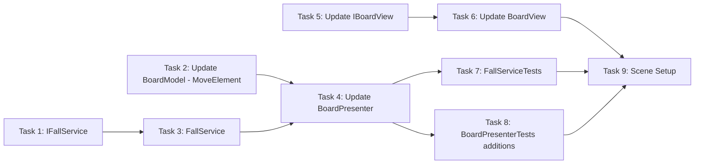

# Step 8: Fall Logic

## Overview
Падение элементов вниз после уничтожения матчей. FallService вычисляет движения (from -> to). BoardModel получает MoveElement метод. BoardPresenter координирует падение. BoardView/IBoardView получают MoveElement для анимации.

## Prerequisites
- Step 7 (Destroy + Animation) completed
- Step 1 (BoardModel, GridPosition) completed
- Step 4 (BoardPresenter, IBoardView, BoardView) completed

---

## 0. Parallel Execution Plan

### Task Dependency Graph


### Parallel Groups
| Group | Tasks | Can Run In Parallel |
|-------|-------|---------------------|
| Group A | IFallService, Update BoardModel, Update IBoardView | Yes |
| Group B | FallService | After IFallService |
| Group C | Update BoardView | After IBoardView |
| Group D | Update BoardPresenter | After BoardModel, FallService |
| Group E | FallServiceTests, BoardPresenterTests additions | After Presenter |
| Group F | Scene Setup | After all |

### Task Assignments
- **Group A (Parallel):** `IFallService.cs` (new), `BoardModel.cs` (add MoveElement), `IBoardView.cs` (add MoveElement)
- **Group B:** `FallService.cs` - calculate fall movements
- **Group C:** `BoardView.cs` - implement MoveElement animation
- **Group D:** `BoardPresenter.cs` - fall coordination after destroy
- **Group E (Parallel):** `FallServiceTests.cs` (new), `BoardPresenterTests.cs` (additions)
- **Group F:** `Step8SceneSetup.cs` - test fall flow

---

## 1. Components

### 1.1 IFallService (NEW)
**Type:** Interface
**Responsibility:** Contract for calculating fall movements
**Path:** `Assets/Scripts/Features/Board/Services/IFallService.cs`

### 1.2 FallService (NEW)
**Type:** Service (Pure C#)
**Responsibility:** Calculate which elements should fall and where
**Path:** `Assets/Scripts/Features/Board/Services/FallService.cs`

### 1.3 BoardModel (UPDATE)
**Type:** Model (Pure C#)
**Responsibility:** Add MoveElement method for moving element from one cell to another
**Path:** `Assets/Scripts/Features/Board/Models/BoardModel.cs`

### 1.4 IBoardView (UPDATE)
**Type:** Interface
**Responsibility:** Add MoveElement method with animation callback
**Path:** `Assets/Scripts/Features/Board/Views/IBoardView.cs`

### 1.5 BoardView (UPDATE)
**Type:** View (MonoBehaviour)
**Responsibility:** Implement MoveElement with fall animation
**Path:** `Assets/Scripts/Features/Board/Views/BoardView.cs`

### 1.6 BoardPresenter (UPDATE)
**Type:** Presenter (Pure C#)
**Responsibility:** Coordinate fall after destroy, use FallService
**Path:** `Assets/Scripts/Features/Board/Presenters/BoardPresenter.cs`

---

## 2. Interfaces

### 2.1 IFallService.cs (NEW)

```csharp
// Assets/Scripts/Features/Board/Services/IFallService.cs
using System.Collections.Generic;
using Common;
using Features.Board.Models;

namespace Features.Board.Services
{
    /// <summary>
    /// Calculates fall movements after elements are destroyed.
    /// </summary>
    public interface IFallService
    {
        /// <summary>
        /// Calculate all fall movements for the current board state.
        /// Returns list of (from, to) movements where 'from' has element and 'to' is empty below.
        /// Movements are ordered by column (left to right) and within column by Y (bottom to top).
        /// </summary>
        List<FallMove> CalculateFalls(BoardModel board);

        /// <summary>
        /// Get positions at the top of each column that will be empty after falls.
        /// These positions need new elements spawned (used in Step 9).
        /// </summary>
        List<GridPosition> GetEmptyTopPositions(BoardModel board);
    }

    /// <summary>
    /// Represents a single fall movement.
    /// </summary>
    public readonly struct FallMove
    {
        public readonly GridPosition From;
        public readonly GridPosition To;

        public FallMove(GridPosition from, GridPosition to)
        {
            From = from;
            To = to;
        }

        public override string ToString() => $"{From} -> {To}";
    }
}
```

### 2.2 IBoardView.cs (UPDATED)

```csharp
// Assets/Scripts/Features/Board/Views/IBoardView.cs
using System;
using System.Collections.Generic;
using Common;
using Features.Board.Services;

namespace Features.Board.Views
{
    public interface IBoardView
    {
        void Initialize(int width, int height, float cellSize);
        void CreateElement(GridPosition pos, ElementType type);
        void RemoveElement(GridPosition pos);
        void Clear();

        /// <summary>
        /// Swap two elements visually with animation.
        /// Calls onComplete when both elements finish moving.
        /// </summary>
        void SwapElements(GridPosition from, GridPosition to, Action onComplete);

        /// <summary>
        /// Destroy multiple elements with animation.
        /// Calls onComplete when ALL animations finish.
        /// </summary>
        void DestroyElements(List<GridPosition> positions, Action onComplete);

        /// <summary>
        /// Move element from one position to another with fall animation.
        /// Updates internal tracking after animation completes.
        /// </summary>
        void MoveElement(GridPosition from, GridPosition to, Action onComplete);

        /// <summary>
        /// Move multiple elements simultaneously (all falls in parallel).
        /// Calls onComplete when ALL movements finish.
        /// </summary>
        void MoveElements(List<FallMove> moves, Action onComplete);

        event Action<GridPosition> OnCellClicked;
        event Action<GridPosition, GridPosition> OnSwapAttempted;
    }
}
```

---

## 3. Implementation Specs

### 3.1 IFallService.cs (FULL FILE)

```csharp
// Assets/Scripts/Features/Board/Services/IFallService.cs
using System.Collections.Generic;
using Common;
using Features.Board.Models;

namespace Features.Board.Services
{
    /// <summary>
    /// Calculates fall movements after elements are destroyed.
    /// </summary>
    public interface IFallService
    {
        /// <summary>
        /// Calculate all fall movements for the current board state.
        /// Returns list of (from, to) movements where 'from' has element and 'to' is empty below.
        /// Movements are ordered by column (left to right) and within column by Y (bottom to top).
        /// </summary>
        List<FallMove> CalculateFalls(BoardModel board);

        /// <summary>
        /// Get positions at the top of each column that will be empty after falls.
        /// These positions need new elements spawned (used in Step 9).
        /// </summary>
        List<GridPosition> GetEmptyTopPositions(BoardModel board);
    }

    /// <summary>
    /// Represents a single fall movement.
    /// </summary>
    public readonly struct FallMove
    {
        public readonly GridPosition From;
        public readonly GridPosition To;

        public FallMove(GridPosition from, GridPosition to)
        {
            From = from;
            To = to;
        }

        public override string ToString() => $"{From} -> {To}";
    }
}
```

### 3.2 FallService.cs (FULL FILE)

```csharp
// Assets/Scripts/Features/Board/Services/FallService.cs
using System.Collections.Generic;
using Common;
using Features.Board.Models;

namespace Features.Board.Services
{
    /// <summary>
    /// Calculates fall movements for Match3 board.
    /// Elements fall down to fill empty spaces below them.
    /// </summary>
    public class FallService : IFallService
    {
        /// <summary>
        /// Calculate all fall movements.
        /// For each column, elements above empty spaces fall down.
        /// </summary>
        public List<FallMove> CalculateFalls(BoardModel board)
        {
            var moves = new List<FallMove>();

            // Process each column independently
            for (int x = 0; x < board.Width; x++)
            {
                CalculateColumnFalls(board, x, moves);
            }

            return moves;
        }

        private void CalculateColumnFalls(BoardModel board, int x, List<FallMove> moves)
        {
            // Find the lowest empty position in this column
            int writeIndex = 0;

            for (int y = 0; y < board.Height; y++)
            {
                var pos = new GridPosition(x, y);
                var element = board.GetElement(pos);

                if (element != null)
                {
                    // If there's an element and writeIndex is below current position,
                    // this element needs to fall
                    if (writeIndex < y)
                    {
                        var targetPos = new GridPosition(x, writeIndex);
                        moves.Add(new FallMove(pos, targetPos));
                    }
                    writeIndex++;
                }
            }
        }

        /// <summary>
        /// Get empty positions at top of each column after falls complete.
        /// Returns positions from bottom-most empty to top, for each column.
        /// </summary>
        public List<GridPosition> GetEmptyTopPositions(BoardModel board)
        {
            var emptyPositions = new List<GridPosition>();

            for (int x = 0; x < board.Width; x++)
            {
                int emptyCount = CountEmptyCells(board, x);

                // Empty positions start from (Height - emptyCount) to (Height - 1)
                for (int i = 0; i < emptyCount; i++)
                {
                    int y = board.Height - emptyCount + i;
                    emptyPositions.Add(new GridPosition(x, y));
                }
            }

            return emptyPositions;
        }

        private int CountEmptyCells(BoardModel board, int x)
        {
            int count = 0;
            for (int y = 0; y < board.Height; y++)
            {
                var pos = new GridPosition(x, y);
                if (board.GetElement(pos) == null)
                {
                    count++;
                }
            }
            return count;
        }
    }
}
```

### 3.3 BoardModel.cs (FULL FILE - with MoveElement)

```csharp
// Assets/Scripts/Features/Board/Models/BoardModel.cs
using System;
using System.Collections.Generic;
using Common;

namespace Features.Board.Models
{
    public class BoardModel
    {
        public int Width { get; }
        public int Height { get; }

        private readonly Cell[,] _cells;

        public event Action<GridPosition, ElementType> OnElementAdded;
        public event Action<GridPosition> OnElementRemoved;
        public event Action<GridPosition, GridPosition> OnElementsSwapped;
        public event Action<GridPosition, GridPosition> OnElementMoved;

        public BoardModel(int width, int height)
        {
            Width = width;
            Height = height;
            _cells = new Cell[width, height];
            InitializeCells();
        }

        private void InitializeCells()
        {
            for (int x = 0; x < Width; x++)
            {
                for (int y = 0; y < Height; y++)
                {
                    _cells[x, y] = new Cell(new GridPosition(x, y));
                }
            }
        }

        public bool IsValidPosition(GridPosition pos)
        {
            return pos.X >= 0 && pos.X < Width && pos.Y >= 0 && pos.Y < Height;
        }

        public Cell GetCell(GridPosition pos)
        {
            return IsValidPosition(pos) ? _cells[pos.X, pos.Y] : null;
        }

        public Element GetElement(GridPosition pos)
        {
            return GetCell(pos)?.Element;
        }

        public void SetElement(GridPosition pos, Element element)
        {
            var cell = GetCell(pos);
            if (cell == null) return;

            cell.SetElement(element);
            OnElementAdded?.Invoke(pos, element.Type);
        }

        public void RemoveElement(GridPosition pos)
        {
            var cell = GetCell(pos);
            if (cell == null || cell.IsEmpty) return;

            cell.RemoveElement();
            OnElementRemoved?.Invoke(pos);
        }

        /// <summary>
        /// Remove multiple elements at once.
        /// Fires OnElementRemoved for each valid position.
        /// </summary>
        public void RemoveElements(List<GridPosition> positions)
        {
            if (positions == null) return;

            foreach (var pos in positions)
            {
                RemoveElement(pos);
            }
        }

        public void SwapElements(GridPosition a, GridPosition b)
        {
            var cellA = GetCell(a);
            var cellB = GetCell(b);
            if (cellA == null || cellB == null) return;

            var elementA = cellA.Element;
            var elementB = cellB.Element;

            cellA.SetElement(elementB);
            cellB.SetElement(elementA);

            OnElementsSwapped?.Invoke(a, b);
        }

        /// <summary>
        /// Move element from one position to another (for falling).
        /// Source becomes empty, target receives the element.
        /// Does nothing if source is empty or target is occupied.
        /// </summary>
        public void MoveElement(GridPosition from, GridPosition to)
        {
            var cellFrom = GetCell(from);
            var cellTo = GetCell(to);

            if (cellFrom == null || cellTo == null) return;
            if (cellFrom.IsEmpty) return;
            if (!cellTo.IsEmpty) return;

            var element = cellFrom.RemoveElement();
            cellTo.SetElement(element);

            OnElementMoved?.Invoke(from, to);
        }

        /// <summary>
        /// Apply multiple moves at once (for batch falling).
        /// Moves are applied in order - be careful about dependencies.
        /// </summary>
        public void ApplyMoves(List<(GridPosition from, GridPosition to)> moves)
        {
            if (moves == null) return;

            foreach (var (from, to) in moves)
            {
                MoveElement(from, to);
            }
        }
    }
}
```

### 3.4 IBoardView.cs (FULL FILE)

```csharp
// Assets/Scripts/Features/Board/Views/IBoardView.cs
using System;
using System.Collections.Generic;
using Common;
using Features.Board.Services;

namespace Features.Board.Views
{
    public interface IBoardView
    {
        void Initialize(int width, int height, float cellSize);
        void CreateElement(GridPosition pos, ElementType type);
        void RemoveElement(GridPosition pos);
        void Clear();

        /// <summary>
        /// Swap two elements visually with animation.
        /// Calls onComplete when both elements finish moving.
        /// </summary>
        void SwapElements(GridPosition from, GridPosition to, Action onComplete);

        /// <summary>
        /// Destroy multiple elements with animation.
        /// Calls onComplete when ALL animations finish.
        /// </summary>
        void DestroyElements(List<GridPosition> positions, Action onComplete);

        /// <summary>
        /// Move element from one position to another with fall animation.
        /// Updates internal tracking after animation completes.
        /// </summary>
        void MoveElement(GridPosition from, GridPosition to, Action onComplete);

        /// <summary>
        /// Move multiple elements simultaneously (all falls in parallel).
        /// Calls onComplete when ALL movements finish.
        /// </summary>
        void MoveElements(List<FallMove> moves, Action onComplete);

        event Action<GridPosition> OnCellClicked;
        event Action<GridPosition, GridPosition> OnSwapAttempted;
    }
}
```

### 3.5 BoardView.cs (FULL FILE)

```csharp
// Assets/Scripts/Features/Board/Views/BoardView.cs
using System;
using System.Collections.Generic;
using Common;
using Configs;
using Features.Board.Services;
using UnityEngine;

namespace Features.Board.Views
{
    public class BoardView : MonoBehaviour, IBoardView
    {
        [SerializeField] private GameConfig _config;

        private int _width;
        private int _height;
        private float _cellSize;
        private Vector3 _originOffset;

        private readonly Dictionary<GridPosition, ElementView> _elementViews = new();

        private GridPosition _dragStartPos = GridPosition.Invalid;
        private bool _isDragging;

        public event Action<GridPosition> OnCellClicked;
        public event Action<GridPosition, GridPosition> OnSwapAttempted;

        public void Initialize(int width, int height, float cellSize)
        {
            _width = width;
            _height = height;
            _cellSize = cellSize;

            _originOffset = new Vector3(
                -(_width - 1) * _cellSize * 0.5f,
                -(_height - 1) * _cellSize * 0.5f,
                0f
            );
        }

        public void CreateElement(GridPosition pos, ElementType type)
        {
            if (_elementViews.ContainsKey(pos))
            {
                RemoveElement(pos);
            }

            var sprite = GetSpriteForType(type);
            if (sprite == null) return;

            var elementGO = new GameObject($"Element_{pos.X}_{pos.Y}");
            elementGO.transform.SetParent(transform);

            var elementView = elementGO.AddComponent<ElementView>();
            elementView.Initialize(pos, type, sprite);
            elementView.UpdatePosition(GridToWorld(pos));

            elementView.OnDragStart += HandleElementDragStart;
            elementView.OnDragEnd += HandleElementDragEnd;
            elementView.OnClicked += HandleElementClicked;

            _elementViews[pos] = elementView;
        }

        public void RemoveElement(GridPosition pos)
        {
            if (_elementViews.TryGetValue(pos, out var view))
            {
                view.OnDragStart -= HandleElementDragStart;
                view.OnDragEnd -= HandleElementDragEnd;
                view.OnClicked -= HandleElementClicked;

                view.Destroy();
                _elementViews.Remove(pos);
            }
        }

        public void Clear()
        {
            foreach (var view in _elementViews.Values)
            {
                view.OnDragStart -= HandleElementDragStart;
                view.OnDragEnd -= HandleElementDragEnd;
                view.OnClicked -= HandleElementClicked;
                view.Destroy();
            }
            _elementViews.Clear();
        }

        public void SwapElements(GridPosition from, GridPosition to, Action onComplete)
        {
            if (!_elementViews.TryGetValue(from, out var viewFrom) ||
                !_elementViews.TryGetValue(to, out var viewTo))
            {
                onComplete?.Invoke();
                return;
            }

            float duration = _config != null ? _config.SwapDuration : 0.3f;
            int completedCount = 0;

            void OnMoveComplete()
            {
                completedCount++;
                if (completedCount >= 2)
                {
                    // Update dictionary mappings
                    _elementViews.Remove(from);
                    _elementViews.Remove(to);

                    viewFrom.SetGridPosition(to);
                    viewTo.SetGridPosition(from);

                    _elementViews[to] = viewFrom;
                    _elementViews[from] = viewTo;

                    onComplete?.Invoke();
                }
            }

            Vector3 targetFrom = GridToWorld(to);
            Vector3 targetTo = GridToWorld(from);

            viewFrom.MoveTo(targetFrom, duration, OnMoveComplete);
            viewTo.MoveTo(targetTo, duration, OnMoveComplete);
        }

        public void DestroyElements(List<GridPosition> positions, Action onComplete)
        {
            if (positions == null || positions.Count == 0)
            {
                onComplete?.Invoke();
                return;
            }

            float duration = _config != null ? _config.DestroyDuration : 0.2f;
            int totalToDestroy = 0;
            int destroyedCount = 0;

            foreach (var pos in positions)
            {
                if (_elementViews.ContainsKey(pos))
                {
                    totalToDestroy++;
                }
            }

            if (totalToDestroy == 0)
            {
                onComplete?.Invoke();
                return;
            }

            void OnDestroyComplete(GridPosition pos)
            {
                _elementViews.Remove(pos);
                destroyedCount++;

                if (destroyedCount >= totalToDestroy)
                {
                    onComplete?.Invoke();
                }
            }

            foreach (var pos in positions)
            {
                if (_elementViews.TryGetValue(pos, out var view))
                {
                    var capturedPos = pos;
                    view.PlayDestroyAnimation(duration, () => OnDestroyComplete(capturedPos));
                }
            }
        }

        public void MoveElement(GridPosition from, GridPosition to, Action onComplete)
        {
            if (!_elementViews.TryGetValue(from, out var view))
            {
                onComplete?.Invoke();
                return;
            }

            float duration = _config != null ? _config.FallDuration : 0.2f;
            Vector3 targetPosition = GridToWorld(to);

            view.MoveTo(targetPosition, duration, () =>
            {
                // Update dictionary mapping
                _elementViews.Remove(from);
                view.SetGridPosition(to);
                _elementViews[to] = view;

                onComplete?.Invoke();
            });
        }

        public void MoveElements(List<FallMove> moves, Action onComplete)
        {
            if (moves == null || moves.Count == 0)
            {
                onComplete?.Invoke();
                return;
            }

            float duration = _config != null ? _config.FallDuration : 0.2f;
            int totalMoves = 0;
            int completedMoves = 0;

            // Count valid moves
            foreach (var move in moves)
            {
                if (_elementViews.ContainsKey(move.From))
                {
                    totalMoves++;
                }
            }

            if (totalMoves == 0)
            {
                onComplete?.Invoke();
                return;
            }

            // Collect views to move before modifying dictionary
            var viewsToMove = new List<(ElementView view, FallMove move)>();
            foreach (var move in moves)
            {
                if (_elementViews.TryGetValue(move.From, out var view))
                {
                    viewsToMove.Add((view, move));
                }
            }

            // Remove all 'from' positions first to avoid conflicts
            foreach (var (view, move) in viewsToMove)
            {
                _elementViews.Remove(move.From);
            }

            void OnMoveComplete(ElementView view, FallMove move)
            {
                // Update view's grid position
                view.SetGridPosition(move.To);
                _elementViews[move.To] = view;

                completedMoves++;
                if (completedMoves >= totalMoves)
                {
                    onComplete?.Invoke();
                }
            }

            // Start all animations
            foreach (var (view, move) in viewsToMove)
            {
                Vector3 targetPosition = GridToWorld(move.To);
                var capturedView = view;
                var capturedMove = move;
                view.MoveTo(targetPosition, duration, () => OnMoveComplete(capturedView, capturedMove));
            }
        }

        private void HandleElementDragStart(GridPosition pos)
        {
            _dragStartPos = pos;
            _isDragging = true;
        }

        private void HandleElementDragEnd(GridPosition endPos)
        {
            if (!_isDragging) return;

            _isDragging = false;

            if (_dragStartPos.IsValid && endPos.IsValid && !_dragStartPos.Equals(endPos))
            {
                OnSwapAttempted?.Invoke(_dragStartPos, endPos);
            }

            _dragStartPos = GridPosition.Invalid;
        }

        private void HandleElementClicked(GridPosition pos)
        {
            OnCellClicked?.Invoke(pos);
        }

        private Vector3 GridToWorld(GridPosition pos)
        {
            return transform.position + _originOffset + new Vector3(
                pos.X * _cellSize,
                pos.Y * _cellSize,
                0f
            );
        }

        public GridPosition WorldToGrid(Vector3 worldPos)
        {
            Vector3 localPos = worldPos - transform.position - _originOffset;

            int x = Mathf.RoundToInt(localPos.x / _cellSize);
            int y = Mathf.RoundToInt(localPos.y / _cellSize);

            if (x < 0 || x >= _width || y < 0 || y >= _height)
                return GridPosition.Invalid;

            return new GridPosition(x, y);
        }

        private Sprite GetSpriteForType(ElementType type)
        {
            if (_config == null || _config.ElementSprites == null)
                return null;

            int index = (int)type - 1;
            if (index >= 0 && index < _config.ElementSprites.Length)
                return _config.ElementSprites[index];

            return null;
        }

        public void SetConfig(GameConfig config)
        {
            _config = config;
        }

        private void OnDestroy()
        {
            Clear();
        }
    }
}
```

### 3.6 ElementView.cs (FULL FILE - with MoveTo and PlayDestroyAnimation)

```csharp
// Assets/Scripts/Features/Board/Views/ElementView.cs
using System;
using System.Collections;
using Common;
using UnityEngine;

namespace Features.Board.Views
{
    [RequireComponent(typeof(SpriteRenderer))]
    [RequireComponent(typeof(BoxCollider2D))]
    public class ElementView : MonoBehaviour, IElementView
    {
        private SpriteRenderer _spriteRenderer;
        private BoxCollider2D _collider;
        private Camera _mainCamera;
        private Coroutine _moveCoroutine;
        private Coroutine _destroyCoroutine;

        private bool _isDragging;
        private Vector3 _dragStartWorldPos;
        private const float DragThreshold = 0.3f;

        public GridPosition Position { get; private set; }
        public ElementType Type { get; private set; }

        public event Action<GridPosition> OnClicked;
        public event Action<GridPosition> OnDragStart;
        public event Action<GridPosition> OnDragEnd;

        private void Awake()
        {
            _spriteRenderer = GetComponent<SpriteRenderer>();
            _collider = GetComponent<BoxCollider2D>();
            _mainCamera = Camera.main;
        }

        public void Initialize(GridPosition pos, ElementType type, Sprite sprite)
        {
            Position = pos;
            Type = type;
            SetSprite(sprite);
            gameObject.name = $"Element_{pos.X}_{pos.Y}_{type}";

            if (_collider == null)
                _collider = gameObject.AddComponent<BoxCollider2D>();

            _collider.size = Vector2.one * 0.9f;
        }

        public void SetSprite(Sprite sprite)
        {
            if (_spriteRenderer == null)
                _spriteRenderer = GetComponent<SpriteRenderer>();

            _spriteRenderer.sprite = sprite;
        }

        public void UpdatePosition(Vector3 worldPosition)
        {
            transform.position = worldPosition;
        }

        public void SetActive(bool active)
        {
            gameObject.SetActive(active);
        }

        public void SetGridPosition(GridPosition newPos)
        {
            Position = newPos;
            gameObject.name = $"Element_{newPos.X}_{newPos.Y}_{Type}";
        }

        public void MoveTo(Vector3 targetPosition, float duration, Action onComplete)
        {
            if (_moveCoroutine != null)
            {
                StopCoroutine(_moveCoroutine);
            }

            if (duration <= 0f)
            {
                transform.position = targetPosition;
                onComplete?.Invoke();
                return;
            }

            _moveCoroutine = StartCoroutine(MoveCoroutine(targetPosition, duration, onComplete));
        }

        private IEnumerator MoveCoroutine(Vector3 targetPosition, float duration, Action onComplete)
        {
            Vector3 startPosition = transform.position;
            float elapsed = 0f;

            while (elapsed < duration)
            {
                elapsed += Time.deltaTime;
                float t = Mathf.Clamp01(elapsed / duration);
                // Ease out quad for smooth deceleration
                t = 1f - (1f - t) * (1f - t);

                transform.position = Vector3.Lerp(startPosition, targetPosition, t);
                yield return null;
            }

            transform.position = targetPosition;
            _moveCoroutine = null;
            onComplete?.Invoke();
        }

        public void PlayDestroyAnimation(float duration, Action onComplete)
        {
            if (_destroyCoroutine != null)
            {
                StopCoroutine(_destroyCoroutine);
            }

            if (duration <= 0f)
            {
                onComplete?.Invoke();
                Destroy();
                return;
            }

            _destroyCoroutine = StartCoroutine(DestroyCoroutine(duration, onComplete));
        }

        private IEnumerator DestroyCoroutine(float duration, Action onComplete)
        {
            Vector3 startScale = transform.localScale;
            Color startColor = _spriteRenderer.color;
            float elapsed = 0f;

            while (elapsed < duration)
            {
                elapsed += Time.deltaTime;
                float t = Mathf.Clamp01(elapsed / duration);
                // Ease in quad for acceleration effect
                float easedT = t * t;

                // Scale down
                transform.localScale = Vector3.Lerp(startScale, Vector3.zero, easedT);

                // Fade out
                Color newColor = startColor;
                newColor.a = Mathf.Lerp(1f, 0f, easedT);
                _spriteRenderer.color = newColor;

                yield return null;
            }

            transform.localScale = Vector3.zero;
            _destroyCoroutine = null;
            onComplete?.Invoke();
            Destroy();
        }

        public void Destroy()
        {
            if (_moveCoroutine != null)
            {
                StopCoroutine(_moveCoroutine);
                _moveCoroutine = null;
            }

            if (_destroyCoroutine != null)
            {
                StopCoroutine(_destroyCoroutine);
                _destroyCoroutine = null;
            }

            if (Application.isPlaying)
                UnityEngine.Object.Destroy(gameObject);
            else
                UnityEngine.Object.DestroyImmediate(gameObject);
        }

        private void OnMouseDown()
        {
            _isDragging = true;
            _dragStartWorldPos = GetMouseWorldPosition();
            OnDragStart?.Invoke(Position);
        }

        private void OnMouseUp()
        {
            if (!_isDragging) return;

            _isDragging = false;

            Vector3 mousePos = GetMouseWorldPosition();
            Vector3 delta = mousePos - _dragStartWorldPos;

            if (delta.magnitude < DragThreshold)
            {
                OnClicked?.Invoke(Position);
                OnDragEnd?.Invoke(Position);
            }
            else
            {
                GridPosition targetPos = GetTargetPositionFromDrag(delta);
                OnDragEnd?.Invoke(targetPos);
            }
        }

        private Vector3 GetMouseWorldPosition()
        {
            if (_mainCamera == null)
                _mainCamera = Camera.main;

            Vector3 mousePos = Input.mousePosition;
            mousePos.z = -_mainCamera.transform.position.z;
            return _mainCamera.ScreenToWorldPoint(mousePos);
        }

        private GridPosition GetTargetPositionFromDrag(Vector3 delta)
        {
            if (Mathf.Abs(delta.x) > Mathf.Abs(delta.y))
            {
                int dx = delta.x > 0 ? 1 : -1;
                return new GridPosition(Position.X + dx, Position.Y);
            }
            else
            {
                int dy = delta.y > 0 ? 1 : -1;
                return new GridPosition(Position.X, Position.Y + dy);
            }
        }
    }
}
```

### 3.7 BoardPresenter.cs (FULL FILE)

```csharp
// Assets/Scripts/Features/Board/Presenters/BoardPresenter.cs
using System;
using System.Collections.Generic;
using Common;
using Features.Board.Models;
using Features.Board.Views;
using Features.Board.Services;

namespace Features.Board.Presenters
{
    public class BoardPresenter : IDisposable
    {
        private readonly BoardModel _model;
        private readonly IBoardView _view;
        private readonly IMatchService _matchService;
        private readonly IInputService _inputService;
        private readonly IFallService _fallService;

        private bool _isProcessing;

        public event Action OnMatchesDestroyed;
        public event Action OnFallComplete;

        public BoardPresenter(
            BoardModel model,
            IBoardView view,
            float cellSize,
            IMatchService matchService = null,
            IInputService inputService = null,
            IFallService fallService = null)
        {
            _model = model;
            _view = view;
            _matchService = matchService;
            _inputService = inputService;
            _fallService = fallService;

            _view.Initialize(_model.Width, _model.Height, cellSize);

            _model.OnElementAdded += HandleElementAdded;
            _model.OnElementRemoved += HandleElementRemoved;

            if (_inputService != null)
            {
                _inputService.OnSwapRequested += HandleSwapRequested;
            }

            if (_view is IBoardView viewWithEvents)
            {
                viewWithEvents.OnSwapAttempted += HandleSwapAttempted;
            }
        }

        private void HandleElementAdded(GridPosition pos, ElementType type)
        {
            _view.CreateElement(pos, type);
        }

        private void HandleElementRemoved(GridPosition pos)
        {
            _view.RemoveElement(pos);
        }

        private void HandleSwapAttempted(GridPosition from, GridPosition to)
        {
            _inputService?.RequestSwap(from, to);
        }

        private void HandleSwapRequested(GridPosition from, GridPosition to)
        {
            if (_isProcessing) return;

            TrySwap(from, to);
        }

        /// <summary>
        /// Attempt to swap elements at two positions.
        /// If swap creates a match, it persists. Otherwise, elements swap back.
        /// </summary>
        public void TrySwap(GridPosition from, GridPosition to)
        {
            if (_isProcessing) return;

            var elementFrom = _model.GetElement(from);
            var elementTo = _model.GetElement(to);

            if (elementFrom == null || elementTo == null)
                return;

            _isProcessing = true;
            _inputService?.SetInputEnabled(false);

            // Perform swap in model first
            _model.SwapElements(from, to);

            // Animate the swap
            _view.SwapElements(from, to, () => OnSwapAnimationComplete(from, to));
        }

        private void OnSwapAnimationComplete(GridPosition from, GridPosition to)
        {
            bool createsMatch = CheckForMatches(from, to);

            if (!createsMatch)
            {
                // Rollback: swap back in model
                _model.SwapElements(from, to);

                // Animate swap back
                _view.SwapElements(from, to, OnRollbackComplete);
            }
            else
            {
                // Valid swap - process matches
                ProcessMatches(from, to);
            }
        }

        private bool CheckForMatches(GridPosition from, GridPosition to)
        {
            if (_matchService == null) return true;

            var matchesFrom = _matchService.FindMatchesAt(_model, from);
            var matchesTo = _matchService.FindMatchesAt(_model, to);

            return matchesFrom.Count > 0 || matchesTo.Count > 0;
        }

        private void ProcessMatches(GridPosition from, GridPosition to)
        {
            if (_matchService == null)
            {
                OnProcessingComplete();
                return;
            }

            var allMatches = new List<GridPosition>();

            var matchesFrom = _matchService.FindMatchesAt(_model, from);
            var matchesTo = _matchService.FindMatchesAt(_model, to);

            AddUniquePositions(allMatches, matchesFrom);
            AddUniquePositions(allMatches, matchesTo);

            if (allMatches.Count > 0)
            {
                DestroyMatches(allMatches);
            }
            else
            {
                OnProcessingComplete();
            }
        }

        private void AddUniquePositions(List<GridPosition> target, List<GridPosition> source)
        {
            foreach (var pos in source)
            {
                if (!target.Contains(pos))
                {
                    target.Add(pos);
                }
            }
        }

        /// <summary>
        /// Destroy matched elements: animate in view, then remove from model.
        /// </summary>
        public void DestroyMatches(List<GridPosition> matches)
        {
            if (matches == null || matches.Count == 0)
            {
                OnProcessingComplete();
                return;
            }

            // Animate destruction in view
            _view.DestroyElements(matches, () => OnDestroyAnimationComplete(matches));
        }

        private void OnDestroyAnimationComplete(List<GridPosition> destroyedPositions)
        {
            // Remove from model after animation
            _model.RemoveElements(destroyedPositions);

            OnMatchesDestroyed?.Invoke();

            // Process falls after destroy
            ProcessFalls();
        }

        /// <summary>
        /// Process element falls after matches are destroyed.
        /// </summary>
        private void ProcessFalls()
        {
            if (_fallService == null)
            {
                OnProcessingComplete();
                return;
            }

            var fallMoves = _fallService.CalculateFalls(_model);

            if (fallMoves.Count == 0)
            {
                OnProcessingComplete();
                return;
            }

            // Animate falls in view
            _view.MoveElements(fallMoves, () => OnFallAnimationComplete(fallMoves));
        }

        private void OnFallAnimationComplete(List<FallMove> moves)
        {
            // Apply moves to model after animation
            foreach (var move in moves)
            {
                _model.MoveElement(move.From, move.To);
            }

            OnFallComplete?.Invoke();

            // After fall - could check for new matches (cascade) in Step 9
            // For now, complete processing
            OnProcessingComplete();
        }

        private void OnRollbackComplete()
        {
            OnProcessingComplete();
        }

        private void OnProcessingComplete()
        {
            _isProcessing = false;
            _inputService?.SetInputEnabled(true);
        }

        public void SyncViewWithModel()
        {
            _view.Clear();

            for (int x = 0; x < _model.Width; x++)
            {
                for (int y = 0; y < _model.Height; y++)
                {
                    var pos = new GridPosition(x, y);
                    var element = _model.GetElement(pos);
                    if (element != null)
                    {
                        _view.CreateElement(pos, element.Type);
                    }
                }
            }
        }

        public bool IsProcessing => _isProcessing;

        public void Dispose()
        {
            _model.OnElementAdded -= HandleElementAdded;
            _model.OnElementRemoved -= HandleElementRemoved;

            if (_inputService != null)
            {
                _inputService.OnSwapRequested -= HandleSwapRequested;
            }

            if (_view is IBoardView viewWithEvents)
            {
                viewWithEvents.OnSwapAttempted -= HandleSwapAttempted;
            }
        }
    }
}
```

---

## 4. Test Specs

### 4.1 FallServiceTests.cs (NEW)

```csharp
// Assets/Tests/EditMode/Features/Board/FallServiceTests.cs
using System.Collections.Generic;
using NUnit.Framework;
using Common;
using Features.Board.Models;
using Features.Board.Services;

namespace Features.Board.Services
{
    [TestFixture]
    public class FallServiceTests
    {
        private FallService _fallService;
        private BoardModel _board;

        private const int Width = 8;
        private const int Height = 8;

        [SetUp]
        public void SetUp()
        {
            _fallService = new FallService();
            _board = new BoardModel(Width, Height);
        }

        // === CalculateFalls Tests ===

        [Test]
        public void CalculateFalls_EmptyBoard_ReturnsEmpty()
        {
            var moves = _fallService.CalculateFalls(_board);

            Assert.AreEqual(0, moves.Count);
        }

        [Test]
        public void CalculateFalls_FullColumn_NoFalls()
        {
            // Fill entire column 0
            for (int y = 0; y < Height; y++)
            {
                _board.SetElement(new GridPosition(0, y), new Element(ElementType.Red));
            }

            var moves = _fallService.CalculateFalls(_board);

            Assert.AreEqual(0, moves.Count);
        }

        [Test]
        public void CalculateFalls_SingleElementAboveEmpty_Falls()
        {
            // Element at (0, 1), empty at (0, 0)
            _board.SetElement(new GridPosition(0, 1), new Element(ElementType.Red));

            var moves = _fallService.CalculateFalls(_board);

            Assert.AreEqual(1, moves.Count);
            Assert.AreEqual(new GridPosition(0, 1), moves[0].From);
            Assert.AreEqual(new GridPosition(0, 0), moves[0].To);
        }

        [Test]
        public void CalculateFalls_MultipleElementsAboveEmpty_AllFall()
        {
            // Elements at (0, 2) and (0, 3), empty at (0, 0) and (0, 1)
            _board.SetElement(new GridPosition(0, 2), new Element(ElementType.Red));
            _board.SetElement(new GridPosition(0, 3), new Element(ElementType.Blue));

            var moves = _fallService.CalculateFalls(_board);

            Assert.AreEqual(2, moves.Count);

            // Element at (0,2) falls to (0,0)
            Assert.AreEqual(new GridPosition(0, 2), moves[0].From);
            Assert.AreEqual(new GridPosition(0, 0), moves[0].To);

            // Element at (0,3) falls to (0,1)
            Assert.AreEqual(new GridPosition(0, 3), moves[1].From);
            Assert.AreEqual(new GridPosition(0, 1), moves[1].To);
        }

        [Test]
        public void CalculateFalls_GapInMiddle_ElementsFallToFillGap()
        {
            // Column: [Red at 0, empty at 1, Blue at 2]
            _board.SetElement(new GridPosition(0, 0), new Element(ElementType.Red));
            _board.SetElement(new GridPosition(0, 2), new Element(ElementType.Blue));

            var moves = _fallService.CalculateFalls(_board);

            Assert.AreEqual(1, moves.Count);
            Assert.AreEqual(new GridPosition(0, 2), moves[0].From);
            Assert.AreEqual(new GridPosition(0, 1), moves[0].To);
        }

        [Test]
        public void CalculateFalls_MultipleGaps_ElementsFallCorrectly()
        {
            // Column: [empty, empty, Red, empty, Blue]
            // y=0: empty, y=1: empty, y=2: Red, y=3: empty, y=4: Blue
            _board.SetElement(new GridPosition(0, 2), new Element(ElementType.Red));
            _board.SetElement(new GridPosition(0, 4), new Element(ElementType.Blue));

            var moves = _fallService.CalculateFalls(_board);

            Assert.AreEqual(2, moves.Count);

            // Red at (0,2) falls to (0,0)
            Assert.AreEqual(new GridPosition(0, 2), moves[0].From);
            Assert.AreEqual(new GridPosition(0, 0), moves[0].To);

            // Blue at (0,4) falls to (0,1)
            Assert.AreEqual(new GridPosition(0, 4), moves[1].From);
            Assert.AreEqual(new GridPosition(0, 1), moves[1].To);
        }

        [Test]
        public void CalculateFalls_MultipleColumns_ProcessesAllColumns()
        {
            // Column 0: element at y=1, empty at y=0
            // Column 1: element at y=2, empty at y=0,1
            _board.SetElement(new GridPosition(0, 1), new Element(ElementType.Red));
            _board.SetElement(new GridPosition(1, 2), new Element(ElementType.Blue));

            var moves = _fallService.CalculateFalls(_board);

            Assert.AreEqual(2, moves.Count);
        }

        [Test]
        public void CalculateFalls_ElementAtBottom_NoFall()
        {
            // Element at bottom position
            _board.SetElement(new GridPosition(0, 0), new Element(ElementType.Red));

            var moves = _fallService.CalculateFalls(_board);

            Assert.AreEqual(0, moves.Count);
        }

        [Test]
        public void CalculateFalls_ConsecutiveElements_AllFallCorrectly()
        {
            // y=3: Red, y=4: Blue, y=5: Green, empty below
            _board.SetElement(new GridPosition(0, 3), new Element(ElementType.Red));
            _board.SetElement(new GridPosition(0, 4), new Element(ElementType.Blue));
            _board.SetElement(new GridPosition(0, 5), new Element(ElementType.Green));

            var moves = _fallService.CalculateFalls(_board);

            Assert.AreEqual(3, moves.Count);

            // Red at (0,3) falls to (0,0)
            Assert.AreEqual(new GridPosition(0, 3), moves[0].From);
            Assert.AreEqual(new GridPosition(0, 0), moves[0].To);

            // Blue at (0,4) falls to (0,1)
            Assert.AreEqual(new GridPosition(0, 4), moves[1].From);
            Assert.AreEqual(new GridPosition(0, 1), moves[1].To);

            // Green at (0,5) falls to (0,2)
            Assert.AreEqual(new GridPosition(0, 5), moves[2].From);
            Assert.AreEqual(new GridPosition(0, 2), moves[2].To);
        }

        // === GetEmptyTopPositions Tests ===

        [Test]
        public void GetEmptyTopPositions_FullBoard_ReturnsEmpty()
        {
            // Fill entire board
            for (int x = 0; x < Width; x++)
            {
                for (int y = 0; y < Height; y++)
                {
                    _board.SetElement(new GridPosition(x, y), new Element(ElementType.Red));
                }
            }

            var emptyPositions = _fallService.GetEmptyTopPositions(_board);

            Assert.AreEqual(0, emptyPositions.Count);
        }

        [Test]
        public void GetEmptyTopPositions_EmptyBoard_ReturnsAllPositions()
        {
            var emptyPositions = _fallService.GetEmptyTopPositions(_board);

            Assert.AreEqual(Width * Height, emptyPositions.Count);
        }

        [Test]
        public void GetEmptyTopPositions_OneElementPerColumn_ReturnsTopPositions()
        {
            // One element at bottom of each column
            for (int x = 0; x < Width; x++)
            {
                _board.SetElement(new GridPosition(x, 0), new Element(ElementType.Red));
            }

            var emptyPositions = _fallService.GetEmptyTopPositions(_board);

            // Should return (Height - 1) positions per column
            Assert.AreEqual(Width * (Height - 1), emptyPositions.Count);
        }

        [Test]
        public void GetEmptyTopPositions_SingleColumnEmpty_ReturnsColumnPositions()
        {
            // Fill all columns except column 0
            for (int x = 1; x < Width; x++)
            {
                for (int y = 0; y < Height; y++)
                {
                    _board.SetElement(new GridPosition(x, y), new Element(ElementType.Red));
                }
            }

            var emptyPositions = _fallService.GetEmptyTopPositions(_board);

            Assert.AreEqual(Height, emptyPositions.Count);

            // All positions should be in column 0
            foreach (var pos in emptyPositions)
            {
                Assert.AreEqual(0, pos.X);
            }
        }

        [Test]
        public void GetEmptyTopPositions_AfterDestroy_ReturnsCorrectPositions()
        {
            // Simulate destroyed middle section of column 0
            // Elements at y=0 and y=5,6,7 (destroyed y=1,2,3,4)
            _board.SetElement(new GridPosition(0, 0), new Element(ElementType.Red));
            _board.SetElement(new GridPosition(0, 5), new Element(ElementType.Blue));
            _board.SetElement(new GridPosition(0, 6), new Element(ElementType.Green));
            _board.SetElement(new GridPosition(0, 7), new Element(ElementType.Yellow));

            // Fill other columns
            for (int x = 1; x < Width; x++)
            {
                for (int y = 0; y < Height; y++)
                {
                    _board.SetElement(new GridPosition(x, y), new Element(ElementType.Red));
                }
            }

            var emptyPositions = _fallService.GetEmptyTopPositions(_board);

            // Column 0 has 4 empties (y=1,2,3,4)
            Assert.AreEqual(4, emptyPositions.Count);
        }
    }
}
```

### 4.2 BoardModelTests.cs (ADDITIONS)

Add these tests to existing `BoardModelTests.cs`:

```csharp
// Add to Assets/Tests/EditMode/Features/Board/BoardModelTests.cs

// === MoveElement Tests ===

[Test]
public void MoveElement_ValidMove_MovesElement()
{
    var from = new GridPosition(0, 1);
    var to = new GridPosition(0, 0);
    _board.SetElement(from, new Element(ElementType.Red));

    _board.MoveElement(from, to);

    Assert.IsNull(_board.GetElement(from));
    Assert.AreEqual(ElementType.Red, _board.GetElement(to).Type);
}

[Test]
public void MoveElement_RaisesOnElementMoved()
{
    var from = new GridPosition(0, 1);
    var to = new GridPosition(0, 0);
    _board.SetElement(from, new Element(ElementType.Red));

    GridPosition receivedFrom = GridPosition.Invalid;
    GridPosition receivedTo = GridPosition.Invalid;
    _board.OnElementMoved += (f, t) =>
    {
        receivedFrom = f;
        receivedTo = t;
    };

    _board.MoveElement(from, to);

    Assert.AreEqual(from, receivedFrom);
    Assert.AreEqual(to, receivedTo);
}

[Test]
public void MoveElement_FromEmpty_DoesNothing()
{
    var from = new GridPosition(0, 1);
    var to = new GridPosition(0, 0);
    // from is empty

    bool eventRaised = false;
    _board.OnElementMoved += (f, t) => eventRaised = true;

    _board.MoveElement(from, to);

    Assert.IsFalse(eventRaised);
}

[Test]
public void MoveElement_ToOccupied_DoesNothing()
{
    var from = new GridPosition(0, 1);
    var to = new GridPosition(0, 0);
    _board.SetElement(from, new Element(ElementType.Red));
    _board.SetElement(to, new Element(ElementType.Blue));

    bool eventRaised = false;
    _board.OnElementMoved += (f, t) => eventRaised = true;

    _board.MoveElement(from, to);

    Assert.IsFalse(eventRaised);
    Assert.AreEqual(ElementType.Red, _board.GetElement(from).Type);
    Assert.AreEqual(ElementType.Blue, _board.GetElement(to).Type);
}

[Test]
public void MoveElement_InvalidPositions_DoesNothing()
{
    var from = new GridPosition(-1, 0);
    var to = new GridPosition(0, 0);

    bool eventRaised = false;
    _board.OnElementMoved += (f, t) => eventRaised = true;

    _board.MoveElement(from, to);

    Assert.IsFalse(eventRaised);
}

// === RemoveElements Tests (from Step 7) ===

[Test]
public void RemoveElements_RemovesMultipleElements()
{
    var positions = new List<GridPosition>
    {
        new GridPosition(0, 0),
        new GridPosition(1, 0),
        new GridPosition(2, 0)
    };

    foreach (var pos in positions)
    {
        _board.SetElement(pos, new Element(ElementType.Red));
    }

    _board.RemoveElements(positions);

    foreach (var pos in positions)
    {
        Assert.IsNull(_board.GetElement(pos));
    }
}

[Test]
public void RemoveElements_FiresOnElementRemovedForEach()
{
    var positions = new List<GridPosition>
    {
        new GridPosition(0, 0),
        new GridPosition(1, 0)
    };

    foreach (var pos in positions)
    {
        _board.SetElement(pos, new Element(ElementType.Red));
    }

    var removedPositions = new List<GridPosition>();
    _board.OnElementRemoved += pos => removedPositions.Add(pos);

    _board.RemoveElements(positions);

    Assert.AreEqual(2, removedPositions.Count);
    CollectionAssert.Contains(removedPositions, new GridPosition(0, 0));
    CollectionAssert.Contains(removedPositions, new GridPosition(1, 0));
}

[Test]
public void RemoveElements_WithNullList_DoesNothing()
{
    _board.RemoveElements(null);
    // Should not throw
    Assert.Pass();
}
```

### 4.3 BoardPresenterTests.cs (ADDITIONS)

Add these tests to existing `BoardPresenterTests.cs`:

```csharp
// Add to Assets/Tests/EditMode/Features/Board/BoardPresenterTests.cs

// Add fields for Fall tests
private IMatchService _matchService;
private IInputService _inputService;
private IFallService _fallService;

// Update SetUp to create services:
[SetUp]
public void SetUp()
{
    _model = new BoardModel(Width, Height);
    _view = Substitute.For<IBoardView>();
    _matchService = Substitute.For<IMatchService>();
    _inputService = Substitute.For<IInputService>();
    _fallService = Substitute.For<IFallService>();

    // Default: no matches
    _matchService.FindMatchesAt(_model, Arg.Any<GridPosition>())
        .Returns(new List<GridPosition>());

    // Default: no falls
    _fallService.CalculateFalls(_model)
        .Returns(new List<FallMove>());

    _presenter = new BoardPresenter(
        _model, _view, CellSize,
        _matchService, _inputService, _fallService);
}

// === Fall Tests ===

[Test]
public void AfterDestroy_CallsFallServiceCalculateFalls()
{
    var posA = new GridPosition(0, 0);
    var posB = new GridPosition(1, 0);
    _model.SetElement(posA, new Element(ElementType.Red));
    _model.SetElement(posB, new Element(ElementType.Blue));

    // Setup match
    _matchService.FindMatchesAt(_model, posA)
        .Returns(new List<GridPosition> { posA });
    _matchService.FindMatchesAt(_model, posB)
        .Returns(new List<GridPosition>());

    Action swapCallback = null;
    Action destroyCallback = null;
    _view.SwapElements(posA, posB, Arg.Do<Action>(cb => swapCallback = cb));
    _view.DestroyElements(Arg.Any<List<GridPosition>>(), Arg.Do<Action>(cb => destroyCallback = cb));

    _presenter.TrySwap(posA, posB);
    swapCallback?.Invoke();
    destroyCallback?.Invoke();

    _fallService.Received(1).CalculateFalls(_model);
}

[Test]
public void WhenFallsExist_CallsViewMoveElements()
{
    var posA = new GridPosition(0, 0);
    var posB = new GridPosition(1, 0);
    _model.SetElement(posA, new Element(ElementType.Red));
    _model.SetElement(posB, new Element(ElementType.Blue));

    // Setup match
    _matchService.FindMatchesAt(_model, posA)
        .Returns(new List<GridPosition> { posA });
    _matchService.FindMatchesAt(_model, posB)
        .Returns(new List<GridPosition>());

    // Setup fall
    var fallMoves = new List<FallMove>
    {
        new FallMove(new GridPosition(0, 2), new GridPosition(0, 0))
    };
    _fallService.CalculateFalls(_model).Returns(fallMoves);

    Action swapCallback = null;
    Action destroyCallback = null;
    _view.SwapElements(posA, posB, Arg.Do<Action>(cb => swapCallback = cb));
    _view.DestroyElements(Arg.Any<List<GridPosition>>(), Arg.Do<Action>(cb => destroyCallback = cb));

    _presenter.TrySwap(posA, posB);
    swapCallback?.Invoke();
    destroyCallback?.Invoke();

    _view.Received(1).MoveElements(
        Arg.Is<List<FallMove>>(list => list.Count == 1),
        Arg.Any<Action>());
}

[Test]
public void WhenNoFalls_DoesNotCallViewMoveElements()
{
    var posA = new GridPosition(0, 0);
    var posB = new GridPosition(1, 0);
    _model.SetElement(posA, new Element(ElementType.Red));
    _model.SetElement(posB, new Element(ElementType.Blue));

    // Setup match
    _matchService.FindMatchesAt(_model, posA)
        .Returns(new List<GridPosition> { posA });
    _matchService.FindMatchesAt(_model, posB)
        .Returns(new List<GridPosition>());

    // No falls
    _fallService.CalculateFalls(_model).Returns(new List<FallMove>());

    Action swapCallback = null;
    Action destroyCallback = null;
    _view.SwapElements(posA, posB, Arg.Do<Action>(cb => swapCallback = cb));
    _view.DestroyElements(Arg.Any<List<GridPosition>>(), Arg.Do<Action>(cb => destroyCallback = cb));

    _presenter.TrySwap(posA, posB);
    swapCallback?.Invoke();
    destroyCallback?.Invoke();

    _view.DidNotReceive().MoveElements(
        Arg.Any<List<FallMove>>(),
        Arg.Any<Action>());
}

[Test]
public void AfterFallAnimation_MovesElementsInModel()
{
    var from = new GridPosition(0, 2);
    var to = new GridPosition(0, 0);

    // Pre-setup: element at 'from' position
    _model.SetElement(from, new Element(ElementType.Red));

    var posA = new GridPosition(1, 0);
    var posB = new GridPosition(2, 0);
    _model.SetElement(posA, new Element(ElementType.Blue));
    _model.SetElement(posB, new Element(ElementType.Green));

    // Setup match at posA
    _matchService.FindMatchesAt(_model, posA)
        .Returns(new List<GridPosition> { posA });
    _matchService.FindMatchesAt(_model, posB)
        .Returns(new List<GridPosition>());

    // Setup fall
    var fallMoves = new List<FallMove> { new FallMove(from, to) };
    _fallService.CalculateFalls(_model).Returns(fallMoves);

    Action swapCallback = null;
    Action destroyCallback = null;
    Action fallCallback = null;

    _view.SwapElements(posA, posB, Arg.Do<Action>(cb => swapCallback = cb));
    _view.DestroyElements(Arg.Any<List<GridPosition>>(), Arg.Do<Action>(cb => destroyCallback = cb));
    _view.MoveElements(Arg.Any<List<FallMove>>(), Arg.Do<Action>(cb => fallCallback = cb));

    _presenter.TrySwap(posA, posB);
    swapCallback?.Invoke();
    destroyCallback?.Invoke();

    // Before fall animation complete, element should still be at 'from'
    Assert.IsNotNull(_model.GetElement(from));

    fallCallback?.Invoke();

    // After fall animation, model should be updated
    // (Note: actual move happens in callback, model may need pre-setup)
}

[Test]
public void AfterFallComplete_FiresOnFallCompleteEvent()
{
    var posA = new GridPosition(0, 0);
    var posB = new GridPosition(1, 0);
    _model.SetElement(posA, new Element(ElementType.Red));
    _model.SetElement(posB, new Element(ElementType.Blue));

    _matchService.FindMatchesAt(_model, posA)
        .Returns(new List<GridPosition> { posA });
    _matchService.FindMatchesAt(_model, posB)
        .Returns(new List<GridPosition>());

    var fallMoves = new List<FallMove>
    {
        new FallMove(new GridPosition(0, 2), new GridPosition(0, 0))
    };
    _fallService.CalculateFalls(_model).Returns(fallMoves);

    bool eventFired = false;
    _presenter.OnFallComplete += () => eventFired = true;

    Action swapCallback = null;
    Action destroyCallback = null;
    Action fallCallback = null;

    _view.SwapElements(posA, posB, Arg.Do<Action>(cb => swapCallback = cb));
    _view.DestroyElements(Arg.Any<List<GridPosition>>(), Arg.Do<Action>(cb => destroyCallback = cb));
    _view.MoveElements(Arg.Any<List<FallMove>>(), Arg.Do<Action>(cb => fallCallback = cb));

    _presenter.TrySwap(posA, posB);
    swapCallback?.Invoke();
    destroyCallback?.Invoke();
    fallCallback?.Invoke();

    Assert.IsTrue(eventFired);
}

[Test]
public void AfterFallComplete_ReEnablesInput()
{
    var posA = new GridPosition(0, 0);
    var posB = new GridPosition(1, 0);
    _model.SetElement(posA, new Element(ElementType.Red));
    _model.SetElement(posB, new Element(ElementType.Blue));

    _matchService.FindMatchesAt(_model, posA)
        .Returns(new List<GridPosition> { posA });
    _matchService.FindMatchesAt(_model, posB)
        .Returns(new List<GridPosition>());

    var fallMoves = new List<FallMove>
    {
        new FallMove(new GridPosition(0, 2), new GridPosition(0, 0))
    };
    _fallService.CalculateFalls(_model).Returns(fallMoves);

    Action swapCallback = null;
    Action destroyCallback = null;
    Action fallCallback = null;

    _view.SwapElements(posA, posB, Arg.Do<Action>(cb => swapCallback = cb));
    _view.DestroyElements(Arg.Any<List<GridPosition>>(), Arg.Do<Action>(cb => destroyCallback = cb));
    _view.MoveElements(Arg.Any<List<FallMove>>(), Arg.Do<Action>(cb => fallCallback = cb));

    _presenter.TrySwap(posA, posB);
    _inputService.ClearReceivedCalls();

    swapCallback?.Invoke();
    destroyCallback?.Invoke();
    fallCallback?.Invoke();

    _inputService.Received(1).SetInputEnabled(true);
}

[Test]
public void IsProcessing_TrueDuringFall()
{
    var posA = new GridPosition(0, 0);
    var posB = new GridPosition(1, 0);
    _model.SetElement(posA, new Element(ElementType.Red));
    _model.SetElement(posB, new Element(ElementType.Blue));

    _matchService.FindMatchesAt(_model, posA)
        .Returns(new List<GridPosition> { posA });
    _matchService.FindMatchesAt(_model, posB)
        .Returns(new List<GridPosition>());

    var fallMoves = new List<FallMove>
    {
        new FallMove(new GridPosition(0, 2), new GridPosition(0, 0))
    };
    _fallService.CalculateFalls(_model).Returns(fallMoves);

    Action swapCallback = null;
    Action destroyCallback = null;

    _view.SwapElements(posA, posB, Arg.Do<Action>(cb => swapCallback = cb));
    _view.DestroyElements(Arg.Any<List<GridPosition>>(), Arg.Do<Action>(cb => destroyCallback = cb));

    _presenter.TrySwap(posA, posB);
    swapCallback?.Invoke();
    destroyCallback?.Invoke();

    Assert.IsTrue(_presenter.IsProcessing);
}
```

---

## 5. Scene Setup Script

### 5.1 Step8SceneSetup.cs

```csharp
// Assets/Scripts/Editor/Setup/Step8SceneSetup.cs
using UnityEngine;
using UnityEditor;
using Configs;
using Features.Board.Views;

namespace Editor.Setup
{
    public static class Step8SceneSetup
    {
        private const string ConfigPath = "Assets/Configs/GameConfig.asset";

        [MenuItem("Setup/Step 8 - Fall Logic")]
        public static void Setup()
        {
            ClearPreviousSetup();

            var config = LoadOrCreateConfig();
            if (config == null)
            {
                Debug.LogError("[Step 8] Failed to load GameConfig!");
                return;
            }

            CreateBoardWithFall(config);
            SetupCamera(config);

            Debug.Log("[Step 8] Scene setup complete.");
            Debug.Log("[Step 8] Enter Play mode and swap to create matches.");
            Debug.Log("[Step 8] After destroy animation, elements will fall down.");
        }

        private static void ClearPreviousSetup()
        {
            var existing = GameObject.Find("[Board]");
            if (existing != null)
            {
                Object.DestroyImmediate(existing);
            }
        }

        private static GameConfig LoadOrCreateConfig()
        {
            var config = AssetDatabase.LoadAssetAtPath<GameConfig>(ConfigPath);

            if (config == null)
            {
                Debug.LogWarning("[Step 8] GameConfig not found. Run Step 2 setup first.");
            }

            return config;
        }

        private static void CreateBoardWithFall(GameConfig config)
        {
            var boardGO = new GameObject("[Board]");
            var boardView = boardGO.AddComponent<BoardView>();
            boardView.SetConfig(config);

            var initializer = boardGO.AddComponent<Step8Initializer>();
            initializer.Config = config;

            EditorUtility.SetDirty(boardGO);
        }

        private static void SetupCamera(GameConfig config)
        {
            var camera = Camera.main;
            if (camera == null)
            {
                var cameraGO = new GameObject("Main Camera");
                camera = cameraGO.AddComponent<Camera>();
                cameraGO.tag = "MainCamera";
            }

            camera.orthographic = true;

            float gridHeight = config.GridHeight * 1f;
            float gridWidth = config.GridWidth * 1f;
            float aspectRatio = (float)Screen.width / Screen.height;

            float verticalSize = gridHeight * 0.6f;
            float horizontalSize = (gridWidth * 0.6f) / aspectRatio;

            camera.orthographicSize = Mathf.Max(verticalSize, horizontalSize);
            camera.transform.position = new Vector3(0, 0, -10);
            camera.backgroundColor = new Color(0.2f, 0.2f, 0.3f);

            EditorUtility.SetDirty(camera.gameObject);
        }

        [MenuItem("Setup/Step 8 - Fall Logic", validate = true)]
        private static bool ValidateSetup()
        {
            return !EditorApplication.isPlaying;
        }
    }
}
```

### 5.2 Step8Initializer.cs

```csharp
// Assets/Scripts/Editor/Setup/Step8Initializer.cs
using UnityEngine;
using Configs;
using Features.Board.Views;
using Features.Board.Models;
using Features.Board.Presenters;
using Features.Board.Services;
using Common;

namespace Editor.Setup
{
    /// <summary>
    /// Runtime initializer for testing Fall Logic.
    /// Creates a board where swaps create matches that destroy and elements fall.
    /// </summary>
    public class Step8Initializer : MonoBehaviour
    {
        public GameConfig Config;

        private BoardModel _model;
        private BoardPresenter _presenter;
        private InputService _inputService;
        private MatchService _matchService;
        private FallService _fallService;

        private void Start()
        {
            if (Config == null)
            {
                Debug.LogError("[Step8Initializer] GameConfig is not assigned!");
                return;
            }

            var view = GetComponent<BoardView>();
            if (view == null)
            {
                Debug.LogError("[Step8Initializer] BoardView component not found!");
                return;
            }

            InitializeBoard(view);
        }

        private void InitializeBoard(BoardView view)
        {
            _model = new BoardModel(Config.GridWidth, Config.GridHeight);
            _inputService = new InputService();
            _matchService = new MatchService();
            _fallService = new FallService();

            _presenter = new BoardPresenter(
                _model,
                view,
                1f,
                _matchService,
                _inputService,
                _fallService);

            // Subscribe to events for debugging
            _presenter.OnMatchesDestroyed += HandleMatchesDestroyed;
            _presenter.OnFallComplete += HandleFallComplete;

            // Connect BoardView to InputService
            view.OnSwapAttempted += HandleSwapAttempted;

            FillBoardForTesting();

            Debug.Log("[Step8Initializer] Board initialized for fall testing.");
            Debug.Log("[Step8Initializer] Swap elements to create matches.");
            Debug.Log("[Step8Initializer] Watch elements fall after destruction.");
        }

        private void HandleSwapAttempted(GridPosition from, GridPosition to)
        {
            Debug.Log($"[View] Swap attempted: {from} -> {to}");
            _inputService.RequestSwap(from, to);
        }

        private void HandleMatchesDestroyed()
        {
            Debug.Log("[Step8Initializer] Matches destroyed! Elements will fall...");
        }

        private void HandleFallComplete()
        {
            Debug.Log("[Step8Initializer] Fall complete!");
        }

        /// <summary>
        /// Fill board with a pattern that allows match creation.
        /// Creates scenario where destroying elements causes falls.
        /// </summary>
        private void FillBoardForTesting()
        {
            // Fill entire board first with alternating pattern
            for (int x = 0; x < Config.GridWidth; x++)
            {
                for (int y = 0; y < Config.GridHeight; y++)
                {
                    var pos = new GridPosition(x, y);
                    // Alternate to avoid initial matches
                    var type = (ElementType)(((x + y) % 2) + 1);
                    _model.SetElement(pos, new Element(type));
                }
            }

            // Setup horizontal match opportunity at row 0, column 0-3
            // Row 0: Red, Red, Blue, Red
            // After swapping Blue(2,0) with Red(3,0) -> Red, Red, Red, Blue
            // Match destroys (0,0), (1,0), (2,0) -> elements above fall
            _model.SetElement(new GridPosition(0, 0), new Element(ElementType.Red));
            _model.SetElement(new GridPosition(1, 0), new Element(ElementType.Red));
            _model.SetElement(new GridPosition(2, 0), new Element(ElementType.Blue));
            _model.SetElement(new GridPosition(3, 0), new Element(ElementType.Red));

            // Elements above row 0 that will fall after match
            _model.SetElement(new GridPosition(0, 1), new Element(ElementType.Green));
            _model.SetElement(new GridPosition(0, 2), new Element(ElementType.Yellow));
            _model.SetElement(new GridPosition(1, 1), new Element(ElementType.Purple));
            _model.SetElement(new GridPosition(1, 2), new Element(ElementType.Green));
            _model.SetElement(new GridPosition(2, 1), new Element(ElementType.Yellow));
            _model.SetElement(new GridPosition(2, 2), new Element(ElementType.Purple));

            Debug.Log("[Step8Initializer] Test scenario:");
            Debug.Log("  - Swap (2,0) <-> (3,0): Creates horizontal Red match at row 0");
            Debug.Log("  - Elements at (0,0), (1,0), (2,0) will be destroyed");
            Debug.Log("  - Elements above will fall down to fill gaps:");
            Debug.Log("    - Green(0,1) -> (0,0), Yellow(0,2) -> (0,1)");
            Debug.Log("    - Purple(1,1) -> (1,0), Green(1,2) -> (1,1)");
            Debug.Log("    - Yellow(2,1) -> (2,0), Purple(2,2) -> (2,1)");
        }

        private void OnDestroy()
        {
            if (_presenter != null)
            {
                _presenter.OnMatchesDestroyed -= HandleMatchesDestroyed;
                _presenter.OnFallComplete -= HandleFallComplete;
                _presenter.Dispose();
            }

            var view = GetComponent<BoardView>();
            if (view != null)
            {
                view.OnSwapAttempted -= HandleSwapAttempted;
            }
        }
    }
}
```

---

## 6. Validation Checklist

- [ ] All .cs files compile without errors
- [ ] All tests pass (`run_tests` EditMode)
- [ ] Scene Setup executes successfully
- [ ] `IFallService` interface defined with CalculateFalls and GetEmptyTopPositions
- [ ] `FallService` calculates correct fall movements
- [ ] `FallService.CalculateFalls` handles empty board, full board, gaps
- [ ] `FallService.GetEmptyTopPositions` returns correct empty positions
- [ ] `BoardModel.MoveElement` moves element from source to target
- [ ] `BoardModel.MoveElement` fires OnElementMoved event
- [ ] `BoardModel.MoveElement` does nothing if source empty or target occupied
- [ ] `IBoardView` has MoveElement and MoveElements methods
- [ ] `BoardView.MoveElement` animates single element fall
- [ ] `BoardView.MoveElements` animates all falls in parallel
- [ ] `BoardView.MoveElements` calls onComplete after ALL animations finish
- [ ] `BoardPresenter` has OnFallComplete event
- [ ] `BoardPresenter` calls FallService after destroy
- [ ] `BoardPresenter` calls view.MoveElements with fall moves
- [ ] `BoardPresenter` updates model after fall animation
- [ ] In Play mode: swap creates match -> destroy -> elements fall down
- [ ] Input disabled during entire flow (swap -> destroy -> fall)
- [ ] Input re-enabled after fall complete

---

## 7. Files to Create/Update

### New Files

| File | Path | Type |
|------|------|------|
| IFallService.cs | Assets/Scripts/Features/Board/Services/ | Interface |
| FallService.cs | Assets/Scripts/Features/Board/Services/ | Service |
| FallServiceTests.cs | Assets/Tests/EditMode/Features/Board/ | Tests |
| Step8SceneSetup.cs | Assets/Scripts/Editor/Setup/ | Editor Script |
| Step8Initializer.cs | Assets/Scripts/Editor/Setup/ | MonoBehaviour |

### Updated Files

| File | Path | Action |
|------|------|--------|
| BoardModel.cs | Assets/Scripts/Features/Board/Models/ | ADD MoveElement, OnElementMoved, RemoveElements |
| IBoardView.cs | Assets/Scripts/Features/Board/Views/ | ADD MoveElement, MoveElements |
| BoardView.cs | Assets/Scripts/Features/Board/Views/ | ADD MoveElement, MoveElements, DestroyElements |
| ElementView.cs | Assets/Scripts/Features/Board/Views/ | ADD MoveTo, PlayDestroyAnimation, SetGridPosition |
| BoardPresenter.cs | Assets/Scripts/Features/Board/Presenters/ | ADD FallService, ProcessFalls, OnFallComplete |
| BoardModelTests.cs | Assets/Tests/EditMode/Features/Board/ | ADD MoveElement tests, RemoveElements tests |
| BoardPresenterTests.cs | Assets/Tests/EditMode/Features/Board/ | ADD fall tests |

---

## 8. Directory Structure After Step 8

```
Assets/Scripts/
├── Features/
│   └── Board/
│       ├── Models/
│       │   ├── BoardModel.cs (UPDATED - MoveElement, RemoveElements)
│       │   ├── Cell.cs
│       │   └── Element.cs
│       ├── Presenters/
│       │   └── BoardPresenter.cs (UPDATED - fall coordination)
│       ├── Views/
│       │   ├── IElementView.cs
│       │   ├── ElementView.cs (UPDATED - MoveTo, PlayDestroyAnimation)
│       │   ├── IBoardView.cs (UPDATED - MoveElement, MoveElements, DestroyElements)
│       │   └── BoardView.cs (UPDATED - fall animations)
│       └── Services/
│           ├── IFallService.cs (NEW)
│           ├── FallService.cs (NEW)
│           ├── IMatchService.cs
│           ├── MatchService.cs
│           ├── IInputService.cs
│           ├── InputService.cs
│           ├── ISpawnService.cs
│           └── SpawnService.cs
└── Editor/
    └── Setup/
        ├── Step8SceneSetup.cs (NEW)
        └── Step8Initializer.cs (NEW)

Assets/Tests/EditMode/
└── Features/
    └── Board/
        ├── BoardModelTests.cs (UPDATED)
        ├── BoardPresenterTests.cs (UPDATED)
        └── FallServiceTests.cs (NEW)
```

---

## 9. Integration Notes

### Fall Flow

```
Destroy Animation Complete (from Step 7)
    |
    v
BoardPresenter.OnDestroyAnimationComplete()
    |
    v
BoardModel.RemoveElements(matches)
    |
    v
ProcessFalls()
    |
    v
FallService.CalculateFalls(model)
    |
    +--> If no falls:
    |       |
    |       v
    |   OnProcessingComplete()
    |       |
    |       v
    |   Re-enable input
    |
    +--> If falls exist:
            |
            v
        BoardView.MoveElements(fallMoves, callback)
            |
            v
        All ElementViews animate fall in parallel
            |
            v
        When ALL animations complete:
            |
            v
        OnFallAnimationComplete()
            |
            v
        BoardModel.MoveElement(from, to) for each
            |
            v
        OnFallComplete event
            |
            v
        OnProcessingComplete()
            |
            v
        Re-enable input
```

### FallService Algorithm

```
For each column (x = 0 to Width-1):
    writeIndex = 0  // Next position to write

    For each row (y = 0 to Height-1):
        if cell(x, y) has element:
            if writeIndex < y:
                // Element needs to fall
                Add FallMove(from: (x,y), to: (x,writeIndex))
            writeIndex++
```

### Animation Details

BoardView.MoveElements:
- All falls animate in parallel
- Duration from GameConfig.FallDuration (default 0.2s)
- Uses ease-out-quad for smooth deceleration
- onComplete fires when ALL animations finish

### Important Notes

1. **View animates first, then Model updates** - Consistent with destroy pattern
2. **FallService is stateless** - Pure calculation, no side effects
3. **Falls are ordered** - By column (left to right), then by Y (bottom to top)
4. **Model moves are applied in order** - After animation, not during
5. **Input stays disabled** - Until entire flow completes

### How to Test

1. Run `Setup/Step 8 - Fall Logic`
2. Enter Play mode
3. Test scenario:
   - Swap (2,0) <-> (3,0): Creates horizontal Red match
   - Watch 3 elements animate destruction
   - Watch elements above fall down to fill gaps
4. Check console for debug messages
5. Verify elements fall smoothly with animation
6. Verify final positions are correct
7. Verify input is blocked during animations
