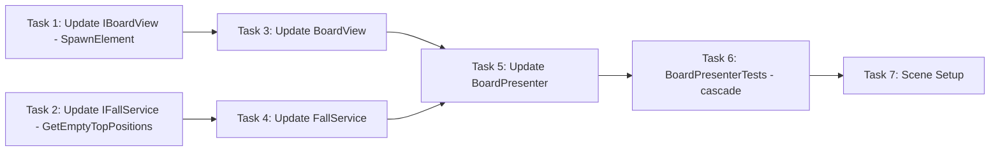

# Step 9: Refill + Cascade

## Overview
Спаун новых элементов после падения + каскадная проверка матчей. После fall BoardPresenter вызывает SpawnService для заполнения пустых позиций сверху. BoardView получает метод SpawnElement с анимацией (появление сверху + падение). После refill проверяем новые матчи - если есть, повторяем цикл destroy -> fall -> refill.

## Prerequisites
- Step 8 (Fall Logic) completed - FallService, BoardModel.MoveElement, BoardView.MoveElements
- Step 7 (Destroy + Animation) completed
- Step 2 (SpawnService) completed
- Step 3 (MatchService) completed

---

## 0. Parallel Execution Plan

### Task Dependency Graph


### Parallel Groups
| Group | Tasks | Can Run In Parallel |
|-------|-------|---------------------|
| Group A | Update IBoardView, Create IFallService/FallService | Yes |
| Group B | Update BoardView (SpawnElement) | After IBoardView |
| Group C | Update BoardPresenter (refill + cascade loop) | After BoardView, FallService |
| Group D | BoardPresenterTests (cascade tests) | After BoardPresenter |
| Group E | Scene Setup | After all |

### Task Assignments
- **Group A (Parallel):** `IBoardView.cs` (add SpawnElement, SpawnElements), create `IFallService.cs`, `FallService.cs`
- **Group B:** `BoardView.cs` - implement SpawnElement with spawn-from-top animation
- **Group C:** `BoardPresenter.cs` - add SpawnService, cascade loop (destroy -> fall -> refill -> check matches -> repeat)
- **Group D:** `BoardPresenterTests.cs` - cascade tests
- **Group E:** `Step9SceneSetup.cs` - test cascade flow

---

## 1. Components

### 1.1 IFallService (NEW)
**Type:** Interface
**Responsibility:** Calculate fall movements and empty top positions
**Path:** `Assets/Scripts/Features/Board/Services/IFallService.cs`

### 1.2 FallService (NEW)
**Type:** Service (Pure C#)
**Responsibility:** Calculate fall movements for elements
**Path:** `Assets/Scripts/Features/Board/Services/FallService.cs`

### 1.3 IBoardView (UPDATE)
**Type:** Interface
**Responsibility:** Add SpawnElement and SpawnElements methods
**Path:** `Assets/Scripts/Features/Board/Views/IBoardView.cs`

### 1.4 BoardView (UPDATE)
**Type:** View (MonoBehaviour)
**Responsibility:** Implement SpawnElement with fall-from-top animation
**Path:** `Assets/Scripts/Features/Board/Views/BoardView.cs`

### 1.5 BoardPresenter (UPDATE)
**Type:** Presenter (Pure C#)
**Responsibility:** Add FallService, SpawnService, cascade loop
**Path:** `Assets/Scripts/Features/Board/Presenters/BoardPresenter.cs`

---

## 2. Interfaces

### 2.1 IFallService.cs (NEW)

```csharp
// Assets/Scripts/Features/Board/Services/IFallService.cs
using System.Collections.Generic;
using Common;
using Features.Board.Models;

namespace Features.Board.Services
{
    public interface IFallService
    {
        List<FallMove> CalculateFalls(BoardModel board);
        List<GridPosition> GetEmptyTopPositions(BoardModel board);
    }

    public readonly struct FallMove
    {
        public readonly GridPosition From;
        public readonly GridPosition To;

        public FallMove(GridPosition from, GridPosition to)
        {
            From = from;
            To = to;
        }
    }
}
```

### 2.2 IBoardView.cs (UPDATED)

```csharp
// Assets/Scripts/Features/Board/Views/IBoardView.cs
using System;
using System.Collections.Generic;
using Common;
using Features.Board.Services;

namespace Features.Board.Views
{
    public interface IBoardView
    {
        void Initialize(int width, int height, float cellSize);
        void CreateElement(GridPosition pos, ElementType type);
        void RemoveElement(GridPosition pos);
        void Clear();

        void SwapElements(GridPosition from, GridPosition to, Action onComplete);
        void DestroyElements(List<GridPosition> positions, Action onComplete);
        void MoveElements(List<FallMove> moves, Action onComplete);

        /// <summary>
        /// Spawn element at position with fall-from-top animation.
        /// Element appears above the grid and falls to target position.
        /// </summary>
        void SpawnElement(GridPosition pos, ElementType type, int fallDistance, Action onComplete);

        /// <summary>
        /// Spawn multiple elements with fall animation.
        /// Calls onComplete when ALL spawn animations finish.
        /// </summary>
        void SpawnElements(List<SpawnData> spawns, Action onComplete);

        event Action<GridPosition> OnCellClicked;
        event Action<GridPosition, GridPosition> OnSwapAttempted;
    }

    public readonly struct SpawnData
    {
        public readonly GridPosition Position;
        public readonly ElementType Type;
        public readonly int FallDistance;

        public SpawnData(GridPosition position, ElementType type, int fallDistance)
        {
            Position = position;
            Type = type;
            FallDistance = fallDistance;
        }
    }
}
```

---

## 3. Implementation Specs

### 3.1 IFallService.cs (FULL FILE)

```csharp
// Assets/Scripts/Features/Board/Services/IFallService.cs
using System.Collections.Generic;
using Common;
using Features.Board.Models;

namespace Features.Board.Services
{
    public interface IFallService
    {
        List<FallMove> CalculateFalls(BoardModel board);
        List<GridPosition> GetEmptyTopPositions(BoardModel board);
    }

    public readonly struct FallMove
    {
        public readonly GridPosition From;
        public readonly GridPosition To;

        public FallMove(GridPosition from, GridPosition to)
        {
            From = from;
            To = to;
        }
    }
}
```

### 3.2 FallService.cs (FULL FILE)

```csharp
// Assets/Scripts/Features/Board/Services/FallService.cs
using System.Collections.Generic;
using Common;
using Features.Board.Models;

namespace Features.Board.Services
{
    public class FallService : IFallService
    {
        public List<FallMove> CalculateFalls(BoardModel board)
        {
            var moves = new List<FallMove>();

            for (int x = 0; x < board.Width; x++)
            {
                CalculateColumnFalls(board, x, moves);
            }

            return moves;
        }

        private void CalculateColumnFalls(BoardModel board, int x, List<FallMove> moves)
        {
            int writeIndex = 0;

            for (int y = 0; y < board.Height; y++)
            {
                var pos = new GridPosition(x, y);
                var element = board.GetElement(pos);

                if (element != null)
                {
                    if (writeIndex < y)
                    {
                        moves.Add(new FallMove(pos, new GridPosition(x, writeIndex)));
                    }
                    writeIndex++;
                }
            }
        }

        public List<GridPosition> GetEmptyTopPositions(BoardModel board)
        {
            var emptyPositions = new List<GridPosition>();

            for (int x = 0; x < board.Width; x++)
            {
                int emptyCount = CountEmptyCells(board, x);

                for (int i = 0; i < emptyCount; i++)
                {
                    int y = board.Height - emptyCount + i;
                    emptyPositions.Add(new GridPosition(x, y));
                }
            }

            return emptyPositions;
        }

        private int CountEmptyCells(BoardModel board, int x)
        {
            int count = 0;
            for (int y = 0; y < board.Height; y++)
            {
                if (board.GetElement(new GridPosition(x, y)) == null)
                    count++;
            }
            return count;
        }
    }
}
```

### 3.3 IBoardView.cs (FULL FILE)

```csharp
// Assets/Scripts/Features/Board/Views/IBoardView.cs
using System;
using System.Collections.Generic;
using Common;
using Features.Board.Services;

namespace Features.Board.Views
{
    public interface IBoardView
    {
        void Initialize(int width, int height, float cellSize);
        void CreateElement(GridPosition pos, ElementType type);
        void RemoveElement(GridPosition pos);
        void Clear();

        void SwapElements(GridPosition from, GridPosition to, Action onComplete);
        void DestroyElements(List<GridPosition> positions, Action onComplete);
        void MoveElements(List<FallMove> moves, Action onComplete);

        /// <summary>
        /// Spawn element at position with fall-from-top animation.
        /// Element appears above the grid and falls to target position.
        /// </summary>
        void SpawnElement(GridPosition pos, ElementType type, int fallDistance, Action onComplete);

        /// <summary>
        /// Spawn multiple elements with fall animation.
        /// Calls onComplete when ALL spawn animations finish.
        /// </summary>
        void SpawnElements(List<SpawnData> spawns, Action onComplete);

        event Action<GridPosition> OnCellClicked;
        event Action<GridPosition, GridPosition> OnSwapAttempted;
    }

    public readonly struct SpawnData
    {
        public readonly GridPosition Position;
        public readonly ElementType Type;
        public readonly int FallDistance;

        public SpawnData(GridPosition position, ElementType type, int fallDistance)
        {
            Position = position;
            Type = type;
            FallDistance = fallDistance;
        }
    }
}
```

### 3.4 BoardView.cs (FULL FILE)

```csharp
// Assets/Scripts/Features/Board/Views/BoardView.cs
using System;
using System.Collections.Generic;
using Common;
using Configs;
using Features.Board.Services;
using UnityEngine;

namespace Features.Board.Views
{
    public class BoardView : MonoBehaviour, IBoardView
    {
        [SerializeField] private GameConfig _config;

        private int _width;
        private int _height;
        private float _cellSize;
        private Vector3 _originOffset;

        private readonly Dictionary<GridPosition, ElementView> _elementViews = new();

        private GridPosition _dragStartPos = GridPosition.Invalid;
        private bool _isDragging;

        public event Action<GridPosition> OnCellClicked;
        public event Action<GridPosition, GridPosition> OnSwapAttempted;

        public void Initialize(int width, int height, float cellSize)
        {
            _width = width;
            _height = height;
            _cellSize = cellSize;

            _originOffset = new Vector3(
                -(_width - 1) * _cellSize * 0.5f,
                -(_height - 1) * _cellSize * 0.5f,
                0f
            );
        }

        public void CreateElement(GridPosition pos, ElementType type)
        {
            if (_elementViews.ContainsKey(pos))
                RemoveElement(pos);

            var sprite = GetSpriteForType(type);
            if (sprite == null) return;

            var elementGO = new GameObject($"Element_{pos.X}_{pos.Y}");
            elementGO.transform.SetParent(transform);

            var elementView = elementGO.AddComponent<ElementView>();
            elementView.Initialize(pos, type, sprite);
            elementView.UpdatePosition(GridToWorld(pos));

            elementView.OnDragStart += HandleElementDragStart;
            elementView.OnDragEnd += HandleElementDragEnd;
            elementView.OnClicked += HandleElementClicked;

            _elementViews[pos] = elementView;
        }

        public void RemoveElement(GridPosition pos)
        {
            if (_elementViews.TryGetValue(pos, out var view))
            {
                view.OnDragStart -= HandleElementDragStart;
                view.OnDragEnd -= HandleElementDragEnd;
                view.OnClicked -= HandleElementClicked;

                view.Destroy();
                _elementViews.Remove(pos);
            }
        }

        public void Clear()
        {
            foreach (var view in _elementViews.Values)
            {
                view.OnDragStart -= HandleElementDragStart;
                view.OnDragEnd -= HandleElementDragEnd;
                view.OnClicked -= HandleElementClicked;
                view.Destroy();
            }
            _elementViews.Clear();
        }

        public void SwapElements(GridPosition from, GridPosition to, Action onComplete)
        {
            if (!_elementViews.TryGetValue(from, out var viewFrom) ||
                !_elementViews.TryGetValue(to, out var viewTo))
            {
                onComplete?.Invoke();
                return;
            }

            float duration = _config != null ? _config.SwapDuration : 0.3f;
            int completedCount = 0;

            void OnMoveComplete()
            {
                completedCount++;
                if (completedCount >= 2)
                {
                    _elementViews.Remove(from);
                    _elementViews.Remove(to);

                    viewFrom.SetGridPosition(to);
                    viewTo.SetGridPosition(from);

                    _elementViews[to] = viewFrom;
                    _elementViews[from] = viewTo;

                    onComplete?.Invoke();
                }
            }

            viewFrom.MoveTo(GridToWorld(to), duration, OnMoveComplete);
            viewTo.MoveTo(GridToWorld(from), duration, OnMoveComplete);
        }

        public void DestroyElements(List<GridPosition> positions, Action onComplete)
        {
            if (positions == null || positions.Count == 0)
            {
                onComplete?.Invoke();
                return;
            }

            float duration = _config != null ? _config.DestroyDuration : 0.2f;
            int totalToDestroy = 0;
            int destroyedCount = 0;

            foreach (var pos in positions)
                if (_elementViews.ContainsKey(pos)) totalToDestroy++;

            if (totalToDestroy == 0)
            {
                onComplete?.Invoke();
                return;
            }

            foreach (var pos in positions)
            {
                if (_elementViews.TryGetValue(pos, out var view))
                {
                    var capturedPos = pos;
                    view.PlayDestroyAnimation(duration, () =>
                    {
                        _elementViews.Remove(capturedPos);
                        destroyedCount++;
                        if (destroyedCount >= totalToDestroy)
                            onComplete?.Invoke();
                    });
                }
            }
        }

        public void MoveElements(List<FallMove> moves, Action onComplete)
        {
            if (moves == null || moves.Count == 0)
            {
                onComplete?.Invoke();
                return;
            }

            float duration = _config != null ? _config.FallDuration : 0.2f;
            int totalMoves = 0;
            int completedMoves = 0;

            var viewsToMove = new List<(ElementView view, FallMove move)>();
            foreach (var move in moves)
            {
                if (_elementViews.TryGetValue(move.From, out var view))
                {
                    viewsToMove.Add((view, move));
                    totalMoves++;
                }
            }

            if (totalMoves == 0)
            {
                onComplete?.Invoke();
                return;
            }

            foreach (var (view, move) in viewsToMove)
            {
                _elementViews.Remove(move.From);
            }

            foreach (var (view, move) in viewsToMove)
            {
                var capturedView = view;
                var capturedMove = move;

                view.MoveTo(GridToWorld(move.To), duration, () =>
                {
                    capturedView.SetGridPosition(capturedMove.To);
                    _elementViews[capturedMove.To] = capturedView;

                    completedMoves++;
                    if (completedMoves >= totalMoves)
                        onComplete?.Invoke();
                });
            }
        }

        public void SpawnElement(GridPosition pos, ElementType type, int fallDistance, Action onComplete)
        {
            var sprite = GetSpriteForType(type);
            if (sprite == null)
            {
                onComplete?.Invoke();
                return;
            }

            var elementGO = new GameObject($"Element_{pos.X}_{pos.Y}");
            elementGO.transform.SetParent(transform);

            var elementView = elementGO.AddComponent<ElementView>();
            elementView.Initialize(pos, type, sprite);

            // Start position: above the grid
            Vector3 targetPos = GridToWorld(pos);
            Vector3 startPos = targetPos + new Vector3(0, fallDistance * _cellSize, 0);
            elementView.UpdatePosition(startPos);

            elementView.OnDragStart += HandleElementDragStart;
            elementView.OnDragEnd += HandleElementDragEnd;
            elementView.OnClicked += HandleElementClicked;

            _elementViews[pos] = elementView;

            float duration = _config != null ? _config.FallDuration : 0.2f;
            // Scale duration by fall distance
            float totalDuration = duration * Mathf.Max(1, fallDistance * 0.5f);

            elementView.MoveTo(targetPos, totalDuration, onComplete);
        }

        public void SpawnElements(List<SpawnData> spawns, Action onComplete)
        {
            if (spawns == null || spawns.Count == 0)
            {
                onComplete?.Invoke();
                return;
            }

            int totalSpawns = spawns.Count;
            int completedSpawns = 0;

            foreach (var spawn in spawns)
            {
                SpawnElement(spawn.Position, spawn.Type, spawn.FallDistance, () =>
                {
                    completedSpawns++;
                    if (completedSpawns >= totalSpawns)
                        onComplete?.Invoke();
                });
            }
        }

        private void HandleElementDragStart(GridPosition pos)
        {
            _dragStartPos = pos;
            _isDragging = true;
        }

        private void HandleElementDragEnd(GridPosition endPos)
        {
            if (!_isDragging) return;

            _isDragging = false;

            if (_dragStartPos.IsValid && endPos.IsValid && !_dragStartPos.Equals(endPos))
            {
                OnSwapAttempted?.Invoke(_dragStartPos, endPos);
            }

            _dragStartPos = GridPosition.Invalid;
        }

        private void HandleElementClicked(GridPosition pos)
        {
            OnCellClicked?.Invoke(pos);
        }

        private Vector3 GridToWorld(GridPosition pos)
        {
            return transform.position + _originOffset + new Vector3(
                pos.X * _cellSize,
                pos.Y * _cellSize,
                0f
            );
        }

        public GridPosition WorldToGrid(Vector3 worldPos)
        {
            Vector3 localPos = worldPos - transform.position - _originOffset;

            int x = Mathf.RoundToInt(localPos.x / _cellSize);
            int y = Mathf.RoundToInt(localPos.y / _cellSize);

            if (x < 0 || x >= _width || y < 0 || y >= _height)
                return GridPosition.Invalid;

            return new GridPosition(x, y);
        }

        private Sprite GetSpriteForType(ElementType type)
        {
            if (_config == null || _config.ElementSprites == null)
                return null;

            int index = (int)type - 1;
            if (index >= 0 && index < _config.ElementSprites.Length)
                return _config.ElementSprites[index];

            return null;
        }

        public void SetConfig(GameConfig config)
        {
            _config = config;
        }

        private void OnDestroy()
        {
            Clear();
        }
    }
}
```

### 3.5 BoardPresenter.cs (FULL FILE)

```csharp
// Assets/Scripts/Features/Board/Presenters/BoardPresenter.cs
using System;
using System.Collections.Generic;
using Common;
using Features.Board.Models;
using Features.Board.Views;
using Features.Board.Services;

namespace Features.Board.Presenters
{
    public class BoardPresenter : IDisposable
    {
        private readonly BoardModel _model;
        private readonly IBoardView _view;
        private readonly IMatchService _matchService;
        private readonly IInputService _inputService;
        private readonly IFallService _fallService;
        private readonly ISpawnService _spawnService;

        private bool _isProcessing;

        public event Action OnMatchesDestroyed;
        public event Action OnFallComplete;
        public event Action OnRefillComplete;
        public event Action OnCascadeComplete;

        public BoardPresenter(
            BoardModel model,
            IBoardView view,
            float cellSize,
            IMatchService matchService = null,
            IInputService inputService = null,
            IFallService fallService = null,
            ISpawnService spawnService = null)
        {
            _model = model;
            _view = view;
            _matchService = matchService;
            _inputService = inputService;
            _fallService = fallService;
            _spawnService = spawnService;

            _view.Initialize(_model.Width, _model.Height, cellSize);

            _model.OnElementAdded += HandleElementAdded;
            _model.OnElementRemoved += HandleElementRemoved;

            if (_inputService != null)
            {
                _inputService.OnSwapRequested += HandleSwapRequested;
            }

            _view.OnSwapAttempted += HandleSwapAttempted;
        }

        private void HandleElementAdded(GridPosition pos, ElementType type)
        {
            _view.CreateElement(pos, type);
        }

        private void HandleElementRemoved(GridPosition pos)
        {
            _view.RemoveElement(pos);
        }

        private void HandleSwapAttempted(GridPosition from, GridPosition to)
        {
            _inputService?.RequestSwap(from, to);
        }

        private void HandleSwapRequested(GridPosition from, GridPosition to)
        {
            if (_isProcessing) return;
            TrySwap(from, to);
        }

        public void TrySwap(GridPosition from, GridPosition to)
        {
            if (_isProcessing) return;

            var elementFrom = _model.GetElement(from);
            var elementTo = _model.GetElement(to);

            if (elementFrom == null || elementTo == null)
                return;

            _isProcessing = true;
            _inputService?.SetInputEnabled(false);

            _model.SwapElements(from, to);
            _view.SwapElements(from, to, () => OnSwapAnimationComplete(from, to));
        }

        private void OnSwapAnimationComplete(GridPosition from, GridPosition to)
        {
            var (hasMatch, allMatches) = FindMatches(from, to);

            if (!hasMatch)
            {
                _model.SwapElements(from, to);
                _view.SwapElements(from, to, OnProcessingComplete);
            }
            else
            {
                DestroyMatches(allMatches);
            }
        }

        private (bool hasMatch, List<GridPosition> matches) FindMatches(GridPosition from, GridPosition to)
        {
            if (_matchService == null) return (true, new List<GridPosition>());

            var matchesFrom = _matchService.FindMatchesAt(_model, from);
            var matchesTo = _matchService.FindMatchesAt(_model, to);

            var allMatches = new List<GridPosition>();
            foreach (var pos in matchesFrom)
                if (!allMatches.Contains(pos)) allMatches.Add(pos);
            foreach (var pos in matchesTo)
                if (!allMatches.Contains(pos)) allMatches.Add(pos);

            return (allMatches.Count > 0, allMatches);
        }

        private List<GridPosition> FindAllMatches()
        {
            if (_matchService == null) return new List<GridPosition>();
            return _matchService.FindAllMatches(_model);
        }

        public void DestroyMatches(List<GridPosition> matches)
        {
            if (matches == null || matches.Count == 0)
            {
                OnProcessingComplete();
                return;
            }

            _view.DestroyElements(matches, () =>
            {
                _model.RemoveElements(matches);
                OnMatchesDestroyed?.Invoke();
                ProcessFalls();
            });
        }

        private void ProcessFalls()
        {
            if (_fallService == null)
            {
                ProcessRefill();
                return;
            }

            var fallMoves = _fallService.CalculateFalls(_model);

            if (fallMoves.Count == 0)
            {
                ProcessRefill();
                return;
            }

            _view.MoveElements(fallMoves, () =>
            {
                // Apply moves to model
                foreach (var move in fallMoves)
                {
                    _model.MoveElement(move.From, move.To);
                }

                OnFallComplete?.Invoke();
                ProcessRefill();
            });
        }

        private void ProcessRefill()
        {
            if (_fallService == null || _spawnService == null)
            {
                CheckCascade();
                return;
            }

            var emptyPositions = _fallService.GetEmptyTopPositions(_model);

            if (emptyPositions.Count == 0)
            {
                CheckCascade();
                return;
            }

            var spawns = new List<SpawnData>();

            // Group by column to calculate fall distances
            var columnEmptyCounts = new Dictionary<int, int>();
            foreach (var pos in emptyPositions)
            {
                if (!columnEmptyCounts.ContainsKey(pos.X))
                    columnEmptyCounts[pos.X] = 0;
                columnEmptyCounts[pos.X]++;
            }

            foreach (var pos in emptyPositions)
            {
                var type = _spawnService.GetRandomElement();
                int fallDistance = columnEmptyCounts[pos.X];
                spawns.Add(new SpawnData(pos, type, fallDistance));
            }

            _view.SpawnElements(spawns, () =>
            {
                // Add to model
                foreach (var spawn in spawns)
                {
                    _model.SetElement(spawn.Position, new Element(spawn.Type));
                }

                OnRefillComplete?.Invoke();
                CheckCascade();
            });
        }

        private void CheckCascade()
        {
            var matches = FindAllMatches();

            if (matches.Count > 0)
            {
                // Cascade: destroy new matches
                DestroyMatches(matches);
            }
            else
            {
                // No more matches - cascade complete
                OnCascadeComplete?.Invoke();
                OnProcessingComplete();
            }
        }

        private void OnProcessingComplete()
        {
            _isProcessing = false;
            _inputService?.SetInputEnabled(true);
        }

        public void SyncViewWithModel()
        {
            _view.Clear();

            for (int x = 0; x < _model.Width; x++)
            {
                for (int y = 0; y < _model.Height; y++)
                {
                    var pos = new GridPosition(x, y);
                    var element = _model.GetElement(pos);
                    if (element != null)
                    {
                        _view.CreateElement(pos, element.Type);
                    }
                }
            }
        }

        public bool IsProcessing => _isProcessing;

        public void Dispose()
        {
            _model.OnElementAdded -= HandleElementAdded;
            _model.OnElementRemoved -= HandleElementRemoved;

            if (_inputService != null)
            {
                _inputService.OnSwapRequested -= HandleSwapRequested;
            }

            _view.OnSwapAttempted -= HandleSwapAttempted;
        }
    }
}
```

### 3.6 BoardModel.cs (ADD MoveElement if not exists)

```csharp
// Add to Assets/Scripts/Features/Board/Models/BoardModel.cs if not already present

public event Action<GridPosition, GridPosition> OnElementMoved;

public void MoveElement(GridPosition from, GridPosition to)
{
    var cellFrom = GetCell(from);
    var cellTo = GetCell(to);

    if (cellFrom == null || cellTo == null) return;
    if (cellFrom.IsEmpty) return;
    if (!cellTo.IsEmpty) return;

    var element = cellFrom.RemoveElement();
    cellTo.SetElement(element);

    OnElementMoved?.Invoke(from, to);
}
```

---

## 4. Test Specs

### 4.1 FallServiceTests.cs (NEW)

```csharp
// Assets/Tests/EditMode/Features/Board/FallServiceTests.cs
using System.Collections.Generic;
using NUnit.Framework;
using Common;
using Features.Board.Models;
using Features.Board.Services;

namespace Features.Board.Services
{
    [TestFixture]
    public class FallServiceTests
    {
        private FallService _fallService;
        private BoardModel _board;

        private const int Width = 8;
        private const int Height = 8;

        [SetUp]
        public void SetUp()
        {
            _fallService = new FallService();
            _board = new BoardModel(Width, Height);
        }

        [Test]
        public void CalculateFalls_EmptyBoard_ReturnsEmpty()
        {
            var moves = _fallService.CalculateFalls(_board);
            Assert.AreEqual(0, moves.Count);
        }

        [Test]
        public void CalculateFalls_FullColumn_NoFalls()
        {
            for (int y = 0; y < Height; y++)
            {
                _board.SetElement(new GridPosition(0, y), new Element(ElementType.Red));
            }

            var moves = _fallService.CalculateFalls(_board);
            Assert.AreEqual(0, moves.Count);
        }

        [Test]
        public void CalculateFalls_SingleElementAboveEmpty_Falls()
        {
            _board.SetElement(new GridPosition(0, 1), new Element(ElementType.Red));

            var moves = _fallService.CalculateFalls(_board);

            Assert.AreEqual(1, moves.Count);
            Assert.AreEqual(new GridPosition(0, 1), moves[0].From);
            Assert.AreEqual(new GridPosition(0, 0), moves[0].To);
        }

        [Test]
        public void CalculateFalls_GapInMiddle_ElementsFallToFillGap()
        {
            _board.SetElement(new GridPosition(0, 0), new Element(ElementType.Red));
            _board.SetElement(new GridPosition(0, 2), new Element(ElementType.Blue));

            var moves = _fallService.CalculateFalls(_board);

            Assert.AreEqual(1, moves.Count);
            Assert.AreEqual(new GridPosition(0, 2), moves[0].From);
            Assert.AreEqual(new GridPosition(0, 1), moves[0].To);
        }

        [Test]
        public void GetEmptyTopPositions_FullBoard_ReturnsEmpty()
        {
            for (int x = 0; x < Width; x++)
            {
                for (int y = 0; y < Height; y++)
                {
                    _board.SetElement(new GridPosition(x, y), new Element(ElementType.Red));
                }
            }

            var positions = _fallService.GetEmptyTopPositions(_board);
            Assert.AreEqual(0, positions.Count);
        }

        [Test]
        public void GetEmptyTopPositions_OneEmptyPerColumn_ReturnsTopRow()
        {
            for (int x = 0; x < Width; x++)
            {
                for (int y = 0; y < Height - 1; y++)
                {
                    _board.SetElement(new GridPosition(x, y), new Element(ElementType.Red));
                }
            }

            var positions = _fallService.GetEmptyTopPositions(_board);
            Assert.AreEqual(Width, positions.Count);
        }

        [Test]
        public void GetEmptyTopPositions_ThreeEmptyInColumn_ReturnsTopThree()
        {
            for (int y = 0; y < Height - 3; y++)
            {
                _board.SetElement(new GridPosition(0, y), new Element(ElementType.Red));
            }

            var positions = _fallService.GetEmptyTopPositions(_board);

            var columnZeroEmpty = positions.FindAll(p => p.X == 0);
            Assert.AreEqual(3, columnZeroEmpty.Count);
        }
    }
}
```

### 4.2 BoardPresenterTests.cs (ADD CASCADE TESTS)

Add these tests to existing `BoardPresenterTests.cs`:

```csharp
// Add to Assets/Tests/EditMode/Features/Board/BoardPresenterTests.cs

// Add fields
private IFallService _fallService;
private ISpawnService _spawnService;

// Update SetUp to include FallService and SpawnService
[SetUp]
public void SetUp()
{
    _model = new BoardModel(Width, Height);
    _view = Substitute.For<IBoardView>();
    _matchService = Substitute.For<IMatchService>();
    _inputService = Substitute.For<IInputService>();
    _fallService = Substitute.For<IFallService>();
    _spawnService = Substitute.For<ISpawnService>();

    // Default: no matches
    _matchService.FindMatchesAt(_model, Arg.Any<GridPosition>())
        .Returns(new List<GridPosition>());
    _matchService.FindAllMatches(_model)
        .Returns(new List<GridPosition>());

    // Default: no falls
    _fallService.CalculateFalls(_model).Returns(new List<FallMove>());
    _fallService.GetEmptyTopPositions(_model).Returns(new List<GridPosition>());

    // Default: return Red for spawns
    _spawnService.GetRandomElement().Returns(ElementType.Red);

    _presenter = new BoardPresenter(
        _model, _view, CellSize,
        _matchService, _inputService, _fallService, _spawnService);
}

// === Fall Tests ===

[Test]
public void AfterDestroy_CallsFallService()
{
    var posA = new GridPosition(0, 0);
    var posB = new GridPosition(1, 0);
    SetupSwapWithMatch(posA, posB);

    Action swapCallback = null;
    Action destroyCallback = null;
    _view.SwapElements(posA, posB, Arg.Do<Action>(cb => swapCallback = cb));
    _view.DestroyElements(Arg.Any<List<GridPosition>>(), Arg.Do<Action>(cb => destroyCallback = cb));

    _presenter.TrySwap(posA, posB);
    swapCallback?.Invoke();
    destroyCallback?.Invoke();

    _fallService.Received(1).CalculateFalls(_model);
}

[Test]
public void WhenFallsExist_CallsViewMoveElements()
{
    var posA = new GridPosition(0, 0);
    var posB = new GridPosition(1, 0);
    SetupSwapWithMatch(posA, posB);

    var fallMoves = new List<FallMove>
    {
        new FallMove(new GridPosition(0, 2), new GridPosition(0, 0))
    };
    _fallService.CalculateFalls(_model).Returns(fallMoves);

    Action swapCallback = null;
    Action destroyCallback = null;
    _view.SwapElements(posA, posB, Arg.Do<Action>(cb => swapCallback = cb));
    _view.DestroyElements(Arg.Any<List<GridPosition>>(), Arg.Do<Action>(cb => destroyCallback = cb));

    _presenter.TrySwap(posA, posB);
    swapCallback?.Invoke();
    destroyCallback?.Invoke();

    _view.Received(1).MoveElements(
        Arg.Is<List<FallMove>>(list => list.Count == 1),
        Arg.Any<Action>());
}

// === Refill Tests ===

[Test]
public void AfterFall_CallsGetEmptyTopPositions()
{
    var posA = new GridPosition(0, 0);
    var posB = new GridPosition(1, 0);
    SetupSwapWithMatch(posA, posB);

    var fallMoves = new List<FallMove>
    {
        new FallMove(new GridPosition(0, 2), new GridPosition(0, 0))
    };
    _fallService.CalculateFalls(_model).Returns(fallMoves);

    Action swapCallback = null;
    Action destroyCallback = null;
    Action fallCallback = null;
    _view.SwapElements(posA, posB, Arg.Do<Action>(cb => swapCallback = cb));
    _view.DestroyElements(Arg.Any<List<GridPosition>>(), Arg.Do<Action>(cb => destroyCallback = cb));
    _view.MoveElements(Arg.Any<List<FallMove>>(), Arg.Do<Action>(cb => fallCallback = cb));

    _presenter.TrySwap(posA, posB);
    swapCallback?.Invoke();
    destroyCallback?.Invoke();
    fallCallback?.Invoke();

    _fallService.Received().GetEmptyTopPositions(_model);
}

[Test]
public void WhenEmptyPositions_CallsSpawnService()
{
    var posA = new GridPosition(0, 0);
    var posB = new GridPosition(1, 0);
    SetupSwapWithMatch(posA, posB);

    _fallService.GetEmptyTopPositions(_model).Returns(new List<GridPosition>
    {
        new GridPosition(0, 7)
    });

    Action swapCallback = null;
    Action destroyCallback = null;
    _view.SwapElements(posA, posB, Arg.Do<Action>(cb => swapCallback = cb));
    _view.DestroyElements(Arg.Any<List<GridPosition>>(), Arg.Do<Action>(cb => destroyCallback = cb));

    _presenter.TrySwap(posA, posB);
    swapCallback?.Invoke();
    destroyCallback?.Invoke();

    _spawnService.Received(1).GetRandomElement();
}

[Test]
public void WhenEmptyPositions_CallsViewSpawnElements()
{
    var posA = new GridPosition(0, 0);
    var posB = new GridPosition(1, 0);
    SetupSwapWithMatch(posA, posB);

    _fallService.GetEmptyTopPositions(_model).Returns(new List<GridPosition>
    {
        new GridPosition(0, 7)
    });

    Action swapCallback = null;
    Action destroyCallback = null;
    _view.SwapElements(posA, posB, Arg.Do<Action>(cb => swapCallback = cb));
    _view.DestroyElements(Arg.Any<List<GridPosition>>(), Arg.Do<Action>(cb => destroyCallback = cb));

    _presenter.TrySwap(posA, posB);
    swapCallback?.Invoke();
    destroyCallback?.Invoke();

    _view.Received(1).SpawnElements(
        Arg.Is<List<SpawnData>>(list => list.Count == 1),
        Arg.Any<Action>());
}

[Test]
public void AfterSpawn_FiresOnRefillComplete()
{
    var posA = new GridPosition(0, 0);
    var posB = new GridPosition(1, 0);
    SetupSwapWithMatch(posA, posB);

    _fallService.GetEmptyTopPositions(_model).Returns(new List<GridPosition>
    {
        new GridPosition(0, 7)
    });

    bool eventFired = false;
    _presenter.OnRefillComplete += () => eventFired = true;

    Action swapCallback = null;
    Action destroyCallback = null;
    Action spawnCallback = null;
    _view.SwapElements(posA, posB, Arg.Do<Action>(cb => swapCallback = cb));
    _view.DestroyElements(Arg.Any<List<GridPosition>>(), Arg.Do<Action>(cb => destroyCallback = cb));
    _view.SpawnElements(Arg.Any<List<SpawnData>>(), Arg.Do<Action>(cb => spawnCallback = cb));

    _presenter.TrySwap(posA, posB);
    swapCallback?.Invoke();
    destroyCallback?.Invoke();
    spawnCallback?.Invoke();

    Assert.IsTrue(eventFired);
}

// === Cascade Tests ===

[Test]
public void AfterRefill_ChecksForNewMatches()
{
    var posA = new GridPosition(0, 0);
    var posB = new GridPosition(1, 0);
    SetupSwapWithMatch(posA, posB);

    _fallService.GetEmptyTopPositions(_model).Returns(new List<GridPosition>
    {
        new GridPosition(0, 7)
    });

    Action swapCallback = null;
    Action destroyCallback = null;
    Action spawnCallback = null;
    _view.SwapElements(posA, posB, Arg.Do<Action>(cb => swapCallback = cb));
    _view.DestroyElements(Arg.Any<List<GridPosition>>(), Arg.Do<Action>(cb => destroyCallback = cb));
    _view.SpawnElements(Arg.Any<List<SpawnData>>(), Arg.Do<Action>(cb => spawnCallback = cb));

    _presenter.TrySwap(posA, posB);
    swapCallback?.Invoke();
    destroyCallback?.Invoke();
    _matchService.ClearReceivedCalls();
    spawnCallback?.Invoke();

    _matchService.Received(1).FindAllMatches(_model);
}

[Test]
public void WhenCascadeMatchFound_DestroysAgain()
{
    var posA = new GridPosition(0, 0);
    var posB = new GridPosition(1, 0);
    SetupSwapWithMatch(posA, posB);

    _fallService.GetEmptyTopPositions(_model).Returns(new List<GridPosition>
    {
        new GridPosition(0, 7)
    });

    // First spawn, then cascade match
    int findAllMatchesCalls = 0;
    _matchService.FindAllMatches(_model).Returns(x =>
    {
        findAllMatchesCalls++;
        if (findAllMatchesCalls == 1)
            return new List<GridPosition> { new GridPosition(2, 0), new GridPosition(2, 1), new GridPosition(2, 2) };
        return new List<GridPosition>();
    });

    Action swapCallback = null;
    Action destroyCallback = null;
    Action spawnCallback = null;
    _view.SwapElements(posA, posB, Arg.Do<Action>(cb => swapCallback = cb));

    int destroyCount = 0;
    _view.DestroyElements(Arg.Any<List<GridPosition>>(), Arg.Do<Action>(cb =>
    {
        destroyCount++;
        destroyCallback = cb;
    }));

    _view.SpawnElements(Arg.Any<List<SpawnData>>(), Arg.Do<Action>(cb => spawnCallback = cb));

    _presenter.TrySwap(posA, posB);
    swapCallback?.Invoke();
    destroyCallback?.Invoke(); // First destroy
    spawnCallback?.Invoke(); // Triggers cascade check
    destroyCallback?.Invoke(); // Second destroy (cascade)

    // Should have called DestroyElements twice
    _view.Received(2).DestroyElements(Arg.Any<List<GridPosition>>(), Arg.Any<Action>());
}

[Test]
public void WhenNoCascadeMatch_FiresOnCascadeComplete()
{
    var posA = new GridPosition(0, 0);
    var posB = new GridPosition(1, 0);
    SetupSwapWithMatch(posA, posB);

    _fallService.GetEmptyTopPositions(_model).Returns(new List<GridPosition>
    {
        new GridPosition(0, 7)
    });

    _matchService.FindAllMatches(_model).Returns(new List<GridPosition>());

    bool eventFired = false;
    _presenter.OnCascadeComplete += () => eventFired = true;

    Action swapCallback = null;
    Action destroyCallback = null;
    Action spawnCallback = null;
    _view.SwapElements(posA, posB, Arg.Do<Action>(cb => swapCallback = cb));
    _view.DestroyElements(Arg.Any<List<GridPosition>>(), Arg.Do<Action>(cb => destroyCallback = cb));
    _view.SpawnElements(Arg.Any<List<SpawnData>>(), Arg.Do<Action>(cb => spawnCallback = cb));

    _presenter.TrySwap(posA, posB);
    swapCallback?.Invoke();
    destroyCallback?.Invoke();
    spawnCallback?.Invoke();

    Assert.IsTrue(eventFired);
}

[Test]
public void AfterCascadeComplete_ReEnablesInput()
{
    var posA = new GridPosition(0, 0);
    var posB = new GridPosition(1, 0);
    SetupSwapWithMatch(posA, posB);

    _fallService.GetEmptyTopPositions(_model).Returns(new List<GridPosition>
    {
        new GridPosition(0, 7)
    });

    _matchService.FindAllMatches(_model).Returns(new List<GridPosition>());

    Action swapCallback = null;
    Action destroyCallback = null;
    Action spawnCallback = null;
    _view.SwapElements(posA, posB, Arg.Do<Action>(cb => swapCallback = cb));
    _view.DestroyElements(Arg.Any<List<GridPosition>>(), Arg.Do<Action>(cb => destroyCallback = cb));
    _view.SpawnElements(Arg.Any<List<SpawnData>>(), Arg.Do<Action>(cb => spawnCallback = cb));

    _presenter.TrySwap(posA, posB);
    _inputService.ClearReceivedCalls();

    swapCallback?.Invoke();
    destroyCallback?.Invoke();
    spawnCallback?.Invoke();

    _inputService.Received(1).SetInputEnabled(true);
}

// Helper method
private void SetupSwapWithMatch(GridPosition posA, GridPosition posB)
{
    _model.SetElement(posA, new Element(ElementType.Red));
    _model.SetElement(posB, new Element(ElementType.Blue));

    _matchService.FindMatchesAt(_model, posA)
        .Returns(new List<GridPosition> { posA });
    _matchService.FindMatchesAt(_model, posB)
        .Returns(new List<GridPosition>());
}
```

---

## 5. Scene Setup Script

### 5.1 Step9SceneSetup.cs

```csharp
// Assets/Scripts/Editor/Setup/Step9SceneSetup.cs
using UnityEngine;
using UnityEditor;
using Configs;
using Features.Board.Views;

namespace Editor.Setup
{
    public static class Step9SceneSetup
    {
        private const string ConfigPath = "Assets/Configs/GameConfig.asset";

        [MenuItem("Setup/Step 9 - Refill + Cascade")]
        public static void Setup()
        {
            ClearPreviousSetup();

            var config = LoadOrCreateConfig();
            if (config == null)
            {
                Debug.LogError("[Step 9] Failed to load GameConfig!");
                return;
            }

            CreateBoardWithCascade(config);
            SetupCamera(config);

            Debug.Log("[Step 9] Scene setup complete.");
            Debug.Log("[Step 9] Enter Play mode and swap to create matches.");
            Debug.Log("[Step 9] Watch: destroy -> fall -> refill -> cascade (if new matches)");
        }

        private static void ClearPreviousSetup()
        {
            var existing = GameObject.Find("[Board]");
            if (existing != null)
            {
                Object.DestroyImmediate(existing);
            }
        }

        private static GameConfig LoadOrCreateConfig()
        {
            return AssetDatabase.LoadAssetAtPath<GameConfig>(ConfigPath);
        }

        private static void CreateBoardWithCascade(GameConfig config)
        {
            var boardGO = new GameObject("[Board]");
            var boardView = boardGO.AddComponent<BoardView>();
            boardView.SetConfig(config);

            var initializer = boardGO.AddComponent<Step9Initializer>();
            initializer.Config = config;

            EditorUtility.SetDirty(boardGO);
        }

        private static void SetupCamera(GameConfig config)
        {
            var camera = Camera.main;
            if (camera == null)
            {
                var cameraGO = new GameObject("Main Camera");
                camera = cameraGO.AddComponent<Camera>();
                cameraGO.tag = "MainCamera";
            }

            camera.orthographic = true;

            float gridHeight = config.GridHeight * 1f;
            float gridWidth = config.GridWidth * 1f;
            float aspectRatio = (float)Screen.width / Screen.height;

            float verticalSize = gridHeight * 0.6f;
            float horizontalSize = (gridWidth * 0.6f) / aspectRatio;

            camera.orthographicSize = Mathf.Max(verticalSize, horizontalSize);
            camera.transform.position = new Vector3(0, 0, -10);
            camera.backgroundColor = new Color(0.2f, 0.2f, 0.3f);

            EditorUtility.SetDirty(camera.gameObject);
        }

        [MenuItem("Setup/Step 9 - Refill + Cascade", validate = true)]
        private static bool ValidateSetup()
        {
            return !EditorApplication.isPlaying;
        }
    }
}
```

### 5.2 Step9Initializer.cs

```csharp
// Assets/Scripts/Editor/Setup/Step9Initializer.cs
using UnityEngine;
using Configs;
using Features.Board.Views;
using Features.Board.Models;
using Features.Board.Presenters;
using Features.Board.Services;
using Common;

namespace Editor.Setup
{
    public class Step9Initializer : MonoBehaviour
    {
        public GameConfig Config;

        private BoardModel _model;
        private BoardPresenter _presenter;
        private InputService _inputService;
        private MatchService _matchService;
        private FallService _fallService;
        private SpawnService _spawnService;

        private void Start()
        {
            if (Config == null)
            {
                Debug.LogError("[Step9Initializer] GameConfig is not assigned!");
                return;
            }

            var view = GetComponent<BoardView>();
            if (view == null)
            {
                Debug.LogError("[Step9Initializer] BoardView component not found!");
                return;
            }

            InitializeBoard(view);
        }

        private void InitializeBoard(BoardView view)
        {
            _model = new BoardModel(Config.GridWidth, Config.GridHeight);
            _inputService = new InputService();
            _matchService = new MatchService();
            _fallService = new FallService();
            _spawnService = new SpawnService(Config.ElementTypeCount);

            _presenter = new BoardPresenter(
                _model,
                view,
                1f,
                _matchService,
                _inputService,
                _fallService,
                _spawnService);

            _presenter.OnMatchesDestroyed += () => Debug.Log("[Cascade] Matches destroyed!");
            _presenter.OnFallComplete += () => Debug.Log("[Cascade] Fall complete!");
            _presenter.OnRefillComplete += () => Debug.Log("[Cascade] Refill complete!");
            _presenter.OnCascadeComplete += () => Debug.Log("[Cascade] Cascade complete - ready for input");

            view.OnSwapAttempted += HandleSwapAttempted;

            FillBoardForTesting();

            Debug.Log("[Step9Initializer] Board initialized for cascade testing.");
            Debug.Log("[Step9Initializer] Swap elements to trigger: destroy -> fall -> refill -> cascade");
        }

        private void HandleSwapAttempted(GridPosition from, GridPosition to)
        {
            Debug.Log($"[View] Swap attempted: {from} -> {to}");
            _inputService.RequestSwap(from, to);
        }

        private void FillBoardForTesting()
        {
            // Fill board avoiding initial matches
            for (int x = 0; x < Config.GridWidth; x++)
            {
                for (int y = 0; y < Config.GridHeight; y++)
                {
                    var pos = new GridPosition(x, y);
                    var type = GetTypeWithoutMatch(x, y);
                    _model.SetElement(pos, new Element(type));
                }
            }

            // Setup cascade scenario:
            // Row 0: R R B R ... - swap (2,0)<->(3,0) creates match
            // After destroy, elements fall and new spawn
            // New spawns might create new matches (cascade)
            _model.SetElement(new GridPosition(0, 0), new Element(ElementType.Red));
            _model.SetElement(new GridPosition(1, 0), new Element(ElementType.Red));
            _model.SetElement(new GridPosition(2, 0), new Element(ElementType.Blue));
            _model.SetElement(new GridPosition(3, 0), new Element(ElementType.Red));

            Debug.Log("[Step9Initializer] Test scenario:");
            Debug.Log("  - Swap (2,0) <-> (3,0): Creates Red-Red-Red match");
            Debug.Log("  - After destroy: elements fall from above");
            Debug.Log("  - After fall: new elements spawn from top");
            Debug.Log("  - After refill: check for cascade matches");
        }

        private ElementType GetTypeWithoutMatch(int x, int y)
        {
            // Simple alternating to avoid matches
            int index = (x + y * 2) % Config.ElementTypeCount + 1;
            return (ElementType)index;
        }

        private void OnDestroy()
        {
            if (_presenter != null)
            {
                _presenter.Dispose();
            }

            var view = GetComponent<BoardView>();
            if (view != null)
            {
                view.OnSwapAttempted -= HandleSwapAttempted;
            }
        }
    }
}
```

---

## 6. Validation Checklist

- [ ] All .cs files compile without errors
- [ ] All tests pass (`run_tests` EditMode)
- [ ] Scene Setup executes successfully
- [ ] `IFallService` interface defined with CalculateFalls and GetEmptyTopPositions
- [ ] `FallService` calculates correct fall movements
- [ ] `FallService.GetEmptyTopPositions` returns positions that need spawns
- [ ] `IBoardView` has SpawnElement and SpawnElements methods
- [ ] `BoardView.SpawnElement` animates element falling from above grid
- [ ] `BoardView.SpawnElements` spawns all elements in parallel
- [ ] `BoardPresenter` has IFallService and ISpawnService dependencies
- [ ] `BoardPresenter` has OnFallComplete, OnRefillComplete, OnCascadeComplete events
- [ ] After destroy -> ProcessFalls is called
- [ ] After fall -> ProcessRefill is called
- [ ] After refill -> CheckCascade is called
- [ ] If cascade match found -> DestroyMatches is called again (loop)
- [ ] If no cascade match -> OnCascadeComplete, OnProcessingComplete
- [ ] In Play mode: swap -> match -> destroy -> fall -> refill -> cascade works
- [ ] Input disabled during entire cascade loop
- [ ] Input re-enabled only after cascade complete

---

## 7. Files to Create/Update

### New Files

| File | Path | Type |
|------|------|------|
| IFallService.cs | Assets/Scripts/Features/Board/Services/ | Interface |
| FallService.cs | Assets/Scripts/Features/Board/Services/ | Service |
| FallServiceTests.cs | Assets/Tests/EditMode/Features/Board/ | Tests |
| Step9SceneSetup.cs | Assets/Scripts/Editor/Setup/ | Editor Script |
| Step9Initializer.cs | Assets/Scripts/Editor/Setup/ | MonoBehaviour |

### Updated Files

| File | Path | Action |
|------|------|--------|
| IBoardView.cs | Assets/Scripts/Features/Board/Views/ | ADD SpawnElement, SpawnElements, SpawnData |
| BoardView.cs | Assets/Scripts/Features/Board/Views/ | ADD SpawnElement, SpawnElements, MoveElements |
| BoardPresenter.cs | Assets/Scripts/Features/Board/Presenters/ | ADD FallService, SpawnService, cascade loop |
| BoardPresenterTests.cs | Assets/Tests/EditMode/Features/Board/ | ADD cascade tests |

---

## 8. Directory Structure After Step 9

```
Assets/Scripts/
├── Features/
│   └── Board/
│       ├── Models/
│       │   ├── BoardModel.cs (UPDATED if MoveElement missing)
│       │   ├── Cell.cs
│       │   └── Element.cs
│       ├── Presenters/
│       │   └── BoardPresenter.cs (UPDATED - cascade loop)
│       ├── Views/
│       │   ├── IElementView.cs
│       │   ├── ElementView.cs
│       │   ├── IBoardView.cs (UPDATED - SpawnElement)
│       │   └── BoardView.cs (UPDATED - SpawnElement, MoveElements)
│       └── Services/
│           ├── IFallService.cs (NEW)
│           ├── FallService.cs (NEW)
│           ├── IMatchService.cs
│           ├── MatchService.cs
│           ├── IInputService.cs
│           ├── InputService.cs
│           ├── ISpawnService.cs
│           └── SpawnService.cs
└── Editor/
    └── Setup/
        ├── Step9SceneSetup.cs (NEW)
        └── Step9Initializer.cs (NEW)

Assets/Tests/EditMode/
└── Features/
    └── Board/
        ├── BoardModelTests.cs
        ├── BoardPresenterTests.cs (UPDATED - cascade tests)
        ├── FallServiceTests.cs (NEW)
        └── ...
```

---

## 9. Integration Notes

### Cascade Flow

```
Swap Animation Complete (valid match)
    |
    v
DestroyMatches(matches)
    |
    v
View.DestroyElements() - animation
    |
    v
Model.RemoveElements()
    |
    v
OnMatchesDestroyed event
    |
    v
ProcessFalls()
    |
    +--> FallService.CalculateFalls()
    |
    +--> If falls: View.MoveElements() -> Model.MoveElement() -> OnFallComplete
    |
    v
ProcessRefill()
    |
    +--> FallService.GetEmptyTopPositions()
    |
    +--> SpawnService.GetRandomElement() for each
    |
    +--> View.SpawnElements() - animation
    |
    +--> Model.SetElement() for each
    |
    +--> OnRefillComplete
    |
    v
CheckCascade()
    |
    +--> MatchService.FindAllMatches()
    |
    +--> If matches found: DestroyMatches(matches) -> [LOOP BACK]
    |
    +--> If no matches:
            |
            v
        OnCascadeComplete event
            |
            v
        OnProcessingComplete()
            |
            v
        SetInputEnabled(true)
```

### Spawn Animation Details

- Element spawns ABOVE the grid (at y = targetY + fallDistance)
- Falls down to target position
- Duration scales with fallDistance for natural feel
- All spawns animate in parallel

### Important Notes

1. **View animates first, then Model updates** - Consistent pattern
2. **Cascade is recursive** - destroy -> fall -> refill -> check -> repeat
3. **Input stays disabled** - Until entire cascade loop completes
4. **FindAllMatches** - Used for cascade check (not just at swap positions)
5. **SpawnData.FallDistance** - Calculated from column empty count

### How to Test

1. Run `Setup/Step 9 - Refill + Cascade`
2. Enter Play mode
3. Test scenario:
   - Swap (2,0) <-> (3,0): Creates match
   - Watch: destroy animation
   - Watch: elements fall down
   - Watch: new elements spawn from top
   - Watch: if new match - cascade repeats
4. Check console for debug messages
5. Verify input is blocked during entire flow
6. Verify input re-enabled after cascade complete
